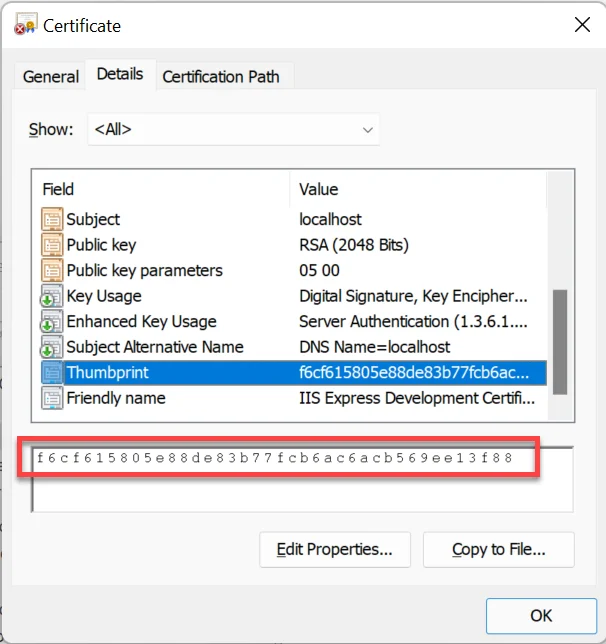

# HTTPS Configuration

Securing your CompuTec AppEngine with HTTPS is essential for protecting data transmission and ensuring secure communication. This guide provides step-by-step instructions to configure HTTPS by importing a valid certificate and updating the necessary settings in the Administration Panel.

---

## Overview

To enable HTTPS, you need to import a valid certificate into the Local Machine store on the server running the CompuTec AppEngine service. After importing the certificate, configure its properties in the Administration Panel to enable secure communication.

## Certificate

Import a certificate used in the HTTPS communication to the Local Machine store on the Windows machine where the CompuTec AppEngine service will run. Start the Local Machine certificate console with the command: **certlm.msc**.

Navigate to Personal → Certificates and import the certificate used for HTTPS communication.

Once imported, go to the Details tab of the certificate and copy the Thumbprint value. This will be required for configuration.

## Configuration

To configure HTTPS, define the port and certificate thumbprint in the CompuTec AppEngine settings.

:::info Path
Administration Panel → Settings → General → Hosting → HttpsPorts
:::

Enter the port number and paste the copied Thumbprint into the CertThumbprint field.

Save the changes and restart the CompuTec AppEngine service to apply the new settings.

## How to Check if the Configuration Works

To confirm that HTTPS is working correctly, open this URL in a web browser and see if the login screen is displayed:

`https://<your_server>:<your_port_from_the_configuration>`

---
