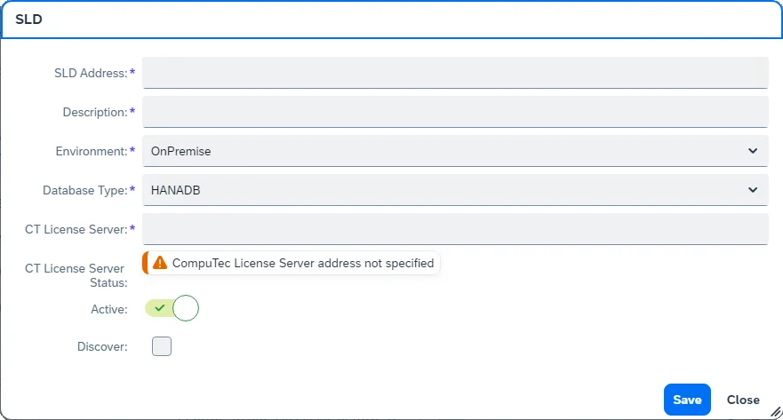
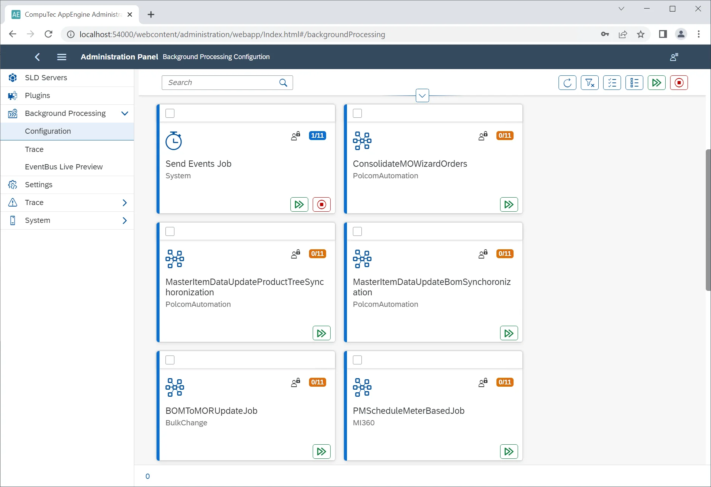
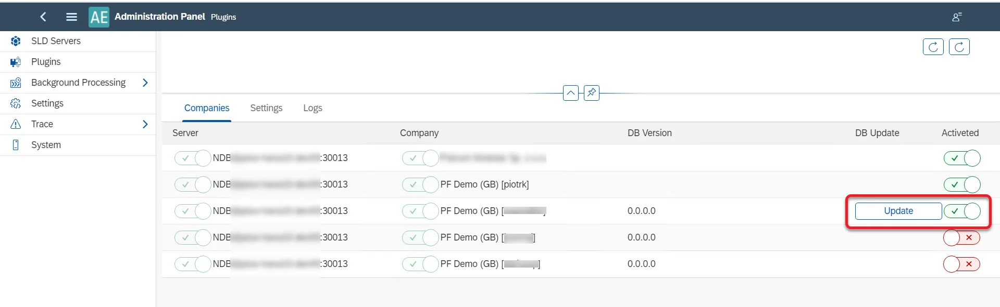
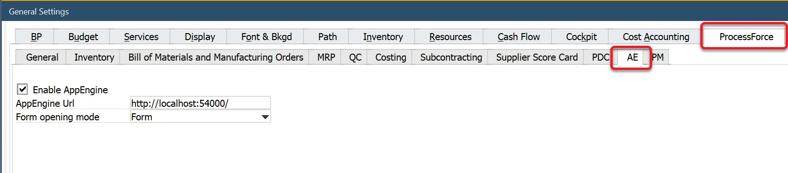

# Overview

:::caution
    After upgrading from any 1.00 version to any 2.00 version, clear your browser cache using the Empty Cache and Hard Reload option to ensure optimal performance in CompuTec AppEngine.
:::

Click here to find out more

**Example on How to Clear Cache in Google Chrome or Microsoft Edge (Chromium)**

1. Open Google Chrome or Microsoft Edge (Chromium) browser and click F12 to open Developers Tools,
2. Right-click on the refresh button,
3. Select Empty Cach and Hard Reload option:

    

This section provides an overview of CompuTec AppEngine’s Administration Panel and step-by-step instructions for configuring the application.

---

1. Download the installer from [here](../../releases/appengine/download.md) and run it.
2. Open a web browser and go to `localhost:54000` - 54000 is the default connection port; you can change it in the [Settings section](#settings).
3. After logging in, click the Administration Panel button and log in using the default log in details:

        - Administrator ID: CTSiteUser
        - Password: 12qw!@QW

    The default password can be changed in the [System section](#system)

## SLD Servers

To configure connections to specific companies, navigate to the SLD Servers section from the left-hand menu.

- **SLD Servers**: SAP Business One license servers (default port: 40000)
- **Servers**: database servers
- **Companies**: specific databases

Click the plus (+) icon in the upper-right corner to add a new connection.

**Required Fields**:

- **SLD Address**: enter the SAP Business One SLD server address (found in SAP Business One under License Administration).

        
- **Description**: provide a descriptive name for the current configuration.
- **Environment**: select either On-Premise or Cloud.
- **Database Type**: choose your database type (HANA or a specific MS SQL version)
- **CT License Server**: Enter the CompuTec License Server address (found in ProcessForce License Administration in SAP Business One).

    
- **CT License Server Status**: displays the connection status to the CompuTec License Server.
- **Active**: a switch to mark if the current settings are active and ready to use or not
- **Discover**: enabling this checkbox adds two fields: **SAP Business One username and password**. After filling in the fields, the companies (on the given servers) to which the user has access will be displayed (the same option is available in the main form, upper-right corner, and can be used later to refresh the list).

Click "Save" to store the settings. Click the added line in the SLD Servers section to display related servers. Click any server line in the Servers section to display related companies:

Once the configuration is completed, log in to the [Launchpad](../../appengine-users-guide/launchpad.md)

## Background Processing

CompuTec AppEngine plugins are designed to be used on users' actions: e.g. a user opens it, changes settings, adds or updates data. But it is also possible to configure actions (jobs) to be performed in the background (independently from any user, even when no one is logged in): upon a specific event or at a specific time (e.g. every 5 minutes).

### Activation

To enable background processing, toggle the switch in the Background Processing State column on the [SLD Servers tab](#sld-servers) (refer to the previous screenshot) and log in using SAP Business One credentials. Upon first activation, the following message will appear:

Perform the procedure described in the message.

    
Click here to find out more

    

<u>For HANA</u>
- Go to HANA Studio.
- Choose the required database.
- Find the SBO_SP_POSTTRANSACTIONNOTICE procedure (right-click on the Procedures under the database, choose- Filters... and put SBO_SP_POSTTRANSACTIONNOTICE there).
- Right-click on the found procedure and choose Open Definition.
- In the right window go to the Create Statement tab.
- Copy to clipboard the whole content of the tab.
- Click the 'Open SQL console for selected system' icon in the left window.
- Paste the copied content from the clipboard.
- Change CREATE to ALTER and add the code under the – ADD YOUR CODE HERE line (if there are other pieces of- code there, please put this piece at the end of the section).
- Click the "Execute "icon in the right window (or click F8).
- Confirm by clicking "OK" in the message window.

Click the Close button and switch the Background Processing State back to ON for the required database.

In the User column, specify the user responsible for running background processing.

### Configuration

**Send Events Job**: The Send Events Job is pre-installed with CompuTec AppEngine and continuously monitors the designated database table every 10 seconds for new events, forwarding them to the appropriate plugin-related jobs.

Clicking on a job tile provides detailed insights, including:

- **Recent calls**: start/end date and time, company and user, exceptions (if there are any). Jobs other than SEventJob have an additional column: EventBus message. It holds information on what was sent to the specific job (what event).
- **Companies**: lists databases where the job is active, along with the associated user (default is the user set in the [SLD Servers tab](overview.md#sld-servers)), but this can be customized per job.
- **Logs**: log files, also available in the [Trace tab](#trace-1).

#### Jobs Description

|                                                               Plugin                                                               |                                                                                                                                                                                                                    Content                                                                                                                                                                                                                    |                                                                                                                                                                                                                                                                                                                                                                                                                  Description                                                                                                                                                                                                                                                                                                                                                                                                                   |                                                                                                                                                                                                                                                                                                                                                                                                                                               |
| :--------------------------------------------------------------------------------------------------------------------------------: | :-------------------------------------------------------------------------------------------------------------------------------------------------------------------------------------------------------------------------------------------------------------------------------------------------------------------------------------------------------------------------------------------------------------------------------------------: | :--------------------------------------------------------------------------------------------------------------------------------------------------------------------------------------------------------------------------------------------------------------------------------------------------------------------------------------------------------------------------------------------------------------------------------------------------------------------------------------------------------------------------------------------------------------------------------------------------------------------------------------------------------------------------------------------------------------------------------------------------------------------------------------------------------------------------------------------: | --------------------------------------------------------------------------------------------------------------------------------------------------------------------------------------------------------------------------------------------------------------------------------------------------------------------------------------------------------------------------------------------------------------------------------------------- |
|                                                         **ProcesForcePlugin**                                                          |                                                                                    [RecurringJob( JobId = "**CostRollUpScheduledRecurringJob_01**", CronExpression = "0 0 1 * * *", Description = "Scheduled Based Job. Default setup as each day at 1 am. Job runs Cost Roll-Up according to CostRollUpScheduledRecurringJob_01 configuration parameters." )]                                                                                    | Automatically runs Cost Roll-Up upon selected Item/s based on parameters defined in the [Settings](#settings) → Components → ProcessForce (that reflects options available in the [Cost Roll-Up](/docs/processforce/user-guide/costing-material-and-resources/cost-categories#cost-roll-up) form) in the given time. You can configure three different automation of this kind by using CostRollUpScheduledRecurringJob_01, CostRollUpScheduledRecurringJob_02, and CostRollUpScheduledRecurringJob_03 job. Please note that four checkboxes on the Cost Roll-Up form (from “Use final-goods’s batch[…]” to “Calculate and Save Costed BOM data”) are available to use after checking the Perform the roll-up over structure checkbox. They should be used in the same matter in CompuTec AppEngine, even though they are available even when the Perform the roll-up over structure checkbox is not checked in CompuTec AppEngine Settings (due to CompuTec AppEngine limitations). | Please note that four checkboxes on the Cost Roll-Up form (from “Use final-goods’s batch[…]” to “Calculate and Save Costed BOM data”) are available to use after checking the Perform the roll-up over structure checkbox. They should be used in the same matter in CompuTec AppEngine, even though they are available even when the Perform the roll-up over structure checkbox is not checked in CompuTec AppEngine Settings (due to CompuTec AppEngine limitations). |
|                                                                                                                                    | Please note that four checkboxes on the Cost Roll-Up form (from “Use final-goods’s batch[…]” to “Calculate and Save Costed BOM data”) are available to use after checking the Perform the roll-up over structure checkbox. They should be used in the same matter in CompuTec AppEngine, even though they are available even when the Perform the roll-up over structure checkbox is not checked in CompuTec AppEngine Settings (due to CompuTec AppEngine limitations). |                                                                                                                                                                                                                                                                                                                                                                                                                                                                                                                                                                                                                                                                                                                                                                                                                                                |                                                                                                                                                                                                                                                                                                                                                                                                                                               |
|                                                                                                                                    |                                                                                    [RecurringJob( JobId = "**CostRollUpScheduledRecurringJob_02**", CronExpression = "0 0 1 * * *", Description = "Scheduled Based Job. Default setup as each day at 1 am. Job runs Cost Roll-Up according to CostRollUpScheduledRecurringJob_01 configuration parameters." )]                                                                                    |                                                                                                                                                                                                                                                                                                                                                                                                                                                                                                                                                                                                                                                                                                                                                                                                                                                |                                                                                                                                                                                                                                                                                                                                                                                                                                               |
|                                                                                                                                    |                                                                                    [RecurringJob( JobId = "**CostRollUpScheduledRecurringJob_03**", CronExpression = "0 0 1 * * *", Description = "Scheduled Based Job. Default setup as each day at 1 am. Job runs Cost Roll-Up according to CostRollUpScheduledRecurringJob_01 configuration parameters." )]                                                                                    |                                                                                                                                                                                                                                                                                                                                                                                                                                                                                                                                                                                                                                                                                                                                                                                                                                                |                                                                                                                                                                                                                                                                                                                                                                                                                                               |
|                                                                                                                                    |                                                                                                                                [EventBusJob( JobId = "**QCRefillBatchesAndSerialNumbersJob**", Description = "Job refills batches and serial numbers in QC Test documents", ContentType = "59", ActionType = "A")]                                                                                                                                |                                                                                                                                                                                                                                            Fills in Batches and Serial Numbers in appropriate Quality Control Tests. After adding a Goods Receipt, Batches and Serial Numbers are created in a database and can be added to Quality Control Tests, which were created when the related Batches and Serial Numbers were still not present in a database. **This job improves ProcessForce performance**.                                                                                                                                                                                                                                            |                                                                                                                                                                                                                                                                                                                                                                                                                                               |
|                                                                                                                                    |                                                                                                           [EventBusJob( JobId = "**QCTestDocumentsGeneratorJob**", Description = "Job generating QC Test documents", ContentType = "*", ActionType = "A", Publisher = "AppEngine", PublisherApp = "SAPB1", EventType = "SAPB1Object")]                                                                                                            |                                                                                                                                                                                                                                                                                                                                                  Based on specific settings, automatically generates Quality Control Test when adding documents. **This job improves ProcessForce performance**.                                                                                                                                                                                                                                                                                                                                                   |                                                                                                                                                                                                                                                                                                                                                                                                                                               |
|                                                                                                                                    |                                                                                                                                                  [RecurringJob(JobId = "**RestoreAditionalBatchDetails**",Description = "Restore Batch Details",Editable = true,CronExpression = "0 */2 * * *")]                                                                                                                                                  |                                                                                                                                                                                                                                                                                                                                                                      Every second hour it calls a method that Creates Batch Master Data for all missing Batches in system                                                                                                                                                                                                                                                                                                                                                                      |                                                                                                                                                                                                                                                                                                                                                                                                                                               |
|                                                                                                                                    |                                                                                                                                             [EventBusJob( JobId = "**RestoreItemDetailsJob**", Description = "Restore Item Details", Editable = true, ContentType = "4", // OITM ActionType = "U" )]                                                                                                                                              |                                                                                                                                                                                                                                                                                                                                                       This job synchronizes data in ItemDetails object upon updating data in the OITM table. **This job improves ProcessForce performance**.                                                                                                                                                                                                                                                                                                                                                       |                                                                                                                                                                                                                                                                                                                                                                                                                                               |
|                                                                                                                                    |                                                                                                                                  [EventBusJob( JobId = "**SynchronizeBillOfMaterialsJob**", Description = "Synchronize Bill Of Materials", Editable = true, ContentType = "CT_PF_OBOMCode", ActionType = "*" )]                                                                                                                                   |                                                                                                                                                                                                                                                                                                                                          This job synchronizes data with SAP Business One Bill of Materials upon updating ProcessForce Bill of Materials. **This job improves ProcessForce performance**.                                                                                                                                                                                                                                                                                                                                           |                                                                                                                                                                                                                                                                                                                                                                                                                                               |
|                                                                                                                                    |                                                                                                                 [EventBusJob( JobId = "**SynchronizeManufacturingOrderJob**", Description = "Job synchronizes Manufacturing Order with Production Order.", Editable = true, ContentType = "CT_PF_ManufacOrd", ActionType = "*" )]                                                                                                                 |                                                                                                                                                                                                                                                                                                                                                         This job synchronizes data with Production Order upon updating Manufacturing Order. **This job improves ProcessForce performance**.                                                                                                                                                                                                                                                                                                                                                         |                                                                                                                                                                                                                                                                                                                                                                                                                                               |
|                                                                                                                                    |                                                                                                               [RecurringJob(JobId = "**SynchronizeManufacturingOrdersRecursiveJob**", CronExpression = "0 */12 * * *", Description = "This job finds all Manufacturing Orders that are unsynchronized and synchronize them back.")]                                                                                                               |                                                                                                                                                                                                                                                                                                                                                                        **This job synchronizes data between Manufacturing Order and Production Order every twelve hours**.                                                                                                                                                                                                                                                                                                                                                                         |                                                                                                                                                                                                                                                                                                                                                                                                                                               |
|                                                                                                                                    |                                                                           [EventBusJob(JobId = "**AdditionalBatchDetailsSynchronizerEB**", Description = "Batch Details update when attributes are changed on Additional Batch ", ContentType = "CT_PF_AdditonalBatch", ActionType = "U", Publisher = "AppEngine", PublisherApp = "SAPB1", EventType = "SAPB1Object")]                                                                            |                                                                                                                                                                                                                                                                                                                                              This job synchronizes data to SAP Business One Additional Batch details upon updating Batch Master Data. **This job improves ProcessForce performance**.                                                                                                                                                                                                                                                                                                                                               |                                                                                                                                                                                                                                                                                                                                                                                                                                               |
|                                                                                                                                    |                                                                                      [EventBusJob(JobId = "**AdditionalBatchDetailsCreatorEB**", Description = "Creates Additional Batch Details when Batch is created in system", ContentType = "10000044", ActionType = "*", Publisher = "AppEngine", PublisherApp = "SAPB1", EventType = "SAPB1Object")]                                                                                       |                                                                                                                                                                                                                                                 This job creates a related Batch Master Data upon creation of a Batch in SAP Business One. If this job is turned on, the Batch Synchronization is performed by CompuTec AppEngine (otherwise, the synchronization is performed by CompuTec WMS service, in context of using CompuTec WMS). **This job improves CompuTec ProcessForce and CompuTec WMS performance**.                                                                                                                                                                                                                                                 |                                                                                                                                                                                                                                                                                                                                                                                                                                               |
| [BackgroundJob(JobId = "**ManufacturingOrderWizardRecoverJob**", Description = "Manufacturing Order Wizard Recover interrupted jobs")] |                                                                                                                                                       This job is started upon a start of CompuTec AppEngine and checks if there are any unfinished Manufacturing Order Wizard tasks to process.                                                                                                                                                       |                                                                                                                                                                                                                                                                                                                                                                                                                                                                                                                                                                                                                                                                                                                                                                                                                                                |                                                                                                                                                                                                                                                                                                                                                                                                                                               |
|                                                                                                                                    |                                                                                                                                                                                                                                                                                                                                                                                                                                               |                                                                                                                                                                                                                                                                                                                                                                                                                                                                                                                                                                                                                                                                                                                                                                                                                                                |                                                                                                                                                                                                                                                                                                                                                                                                                                               |
|                                                               MI360                                                                |                                                                                                                                        [EventBusJob(JobId = "**PMScheduleMeterBasedJob**", Description = "Generator of Maintenance Order documents from PMSchedule", ContentType = "*", ActionType = "U")]                                                                                                                                        |                                                                                                                                                                                                                                                                             After a meter reading (updating the CT_PF_MeterRead object) and updating Maintenance Order (CT_PF_MainOrder), this job checks data in PMSchedule and (if it is needed) creates new Maintenance Orders. Without running this job, automatic Maintenance Orders creation does not work.                                                                                                                                                                                                                                                                             |                                                                                                                                                                                                                                                                                                                                                                                                                                               |
|                                                                                                                                    |                                                                                                                                         [RecurringJob(JobId = "**PMScheduleTimeBasedJob**", CronExpression = "*/10 * * * * *", Description = "Generator of Maintenance Order documents from PMSchedule")]                                                                                                                                         |                                                                                                                                                                                                                                                                                                                           This job checks every ten minutes data in PMSchedule and (if it is needed) creates new Maintenance Orders. **Without running this job, automatic Maintenance Orders creation does not work**.                                                                                                                                                                                                                                                                                                                            |                                                                                                                                                                                                                                                                                                                                                                                                                                               |

### Trace

Log files

### EventBus Live Preview

The EventBus Live Preview displays real-time events from all connected databases.

## Plugins

To install a new plugin, click the Install Plugin button in the upper-right corner and upload the plugin file. You can explore available plugins on the [Plugins page](../../releases/appengine/download.md).
>Note: Plugin files are provided in ZIP format—upload them as-is without extracting.

- After uploading, a system message will prompt you to restart CompuTec AppEngine. You can restart immediately or later, but the plugin will only become available after a restart.
- Once installed, click the plugin tile to configure it as needed.

For more details on the Download SAP WebClient Extension function, click [here](working-with-sap-business-one-web-client.md)

### Companies

Clicking a plugin tile in the Plugins section opens the following view:

To activate a plugin for a specific database, toggle the switch in the "Activate" column. If the plugin requires additional database objects (such as user-defined objects or tables), an Update button will appear after activation. Click "Update" to complete the installation, which will require SAP Business One database credentials.

Once activated, the plugin becomes accessible in the Launchpad:

### SAP Business One Settings

Navigate to the following path to configure settings in SAP Business One with ProcessForce installed:

:::info Path
    SAP Business One (with ProcessForce installed) main menu → Administration → System Initialization → General Settings → ProcessForce tab → AE tab
:::

After activating a plugin, further configuration is required in SAP Business One:

1. Check the configuration checkbox.
2. Enter the server address (default: `http://localhost:54000`).
3. Select the opening mode:

        - **In Form**: within SAP Business One forms.
        - **In Browser**: in the system's default web browser.
        - **Both**: accessible in both forms and browser.
4. Click Save and restart SAP Business One.

### Settings

Plugins may have dedicated settings defined during their development. If available, these settings can be configured in this section.

### Logs

This section allows you to:

- Monitor plugin-related events.
- Search logs.
- Filter messages by type: Error, Warning, or Info.

## Settings

This section provides configuration options for the entire CompuTec AppEngine installation, allowing users to edit specific values.

- **Development**: plugin development-related settings. Check CompuTec AppEngine Developer's Guide to know more about plugin development-related settings.
- **SLD Servers**: includes settings from the [SLD Servers](#sld-servers) section.
- **General**: here, you can modify settings such as the default attachment folder and default ports.
- **Administration**: here, you can check the credentials: CompuTec AppEngine username and password
- **Components**: manage installed plugins and their settings.

## Trace

Here, you can find a log of exceptions regarding CompuTec AppEngine performance.

### Trace Configuration

Users can modify the error logging level from the default Error level.  The levels are as follows (from the one of the broadest range): Trace, Debug, Info, Warn, Error, Fatal, Off. By default, this setting is set to Error.

>Note: Any changes made here are only valid for the duration of an CompuTec AppEngine session. After the application restarts, the setting will revert to its default value.

### Trace

Users can filter the exception logs by time range and by type:

- **CompuTec AppEngine**: general events, also related to plugins
- **Plugin**: events related to plugins' initializations
- **BackgroundProcessing**: events related to jobs.

Click a required log file to check its content;

1. Filter messages by type: Error, Warning, or Info.
2. Download log files if needed:

    

## System

### System Details

1. Restart the CompuTec AppEngine installation.
2. Update the CompuTec AppEngine password.
3. Generate and download a configuration file containing installation details such as: CompuTec AppEngine version and Installed plugins and versions

This configuration file can be attached to support tickets for faster issue resolution.

### Active Connections

A list of active sessions is displayed in this section. To manage active connections:

1. Select a session from the Active Sessions table.
2. View session details.
3. Click Log Out to terminate the session if necessary.

---
