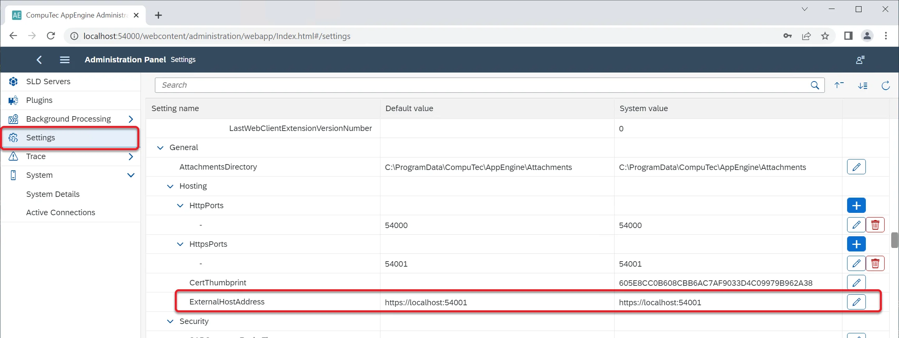
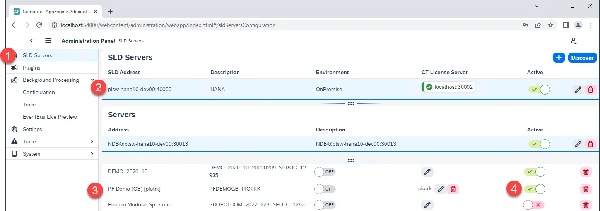
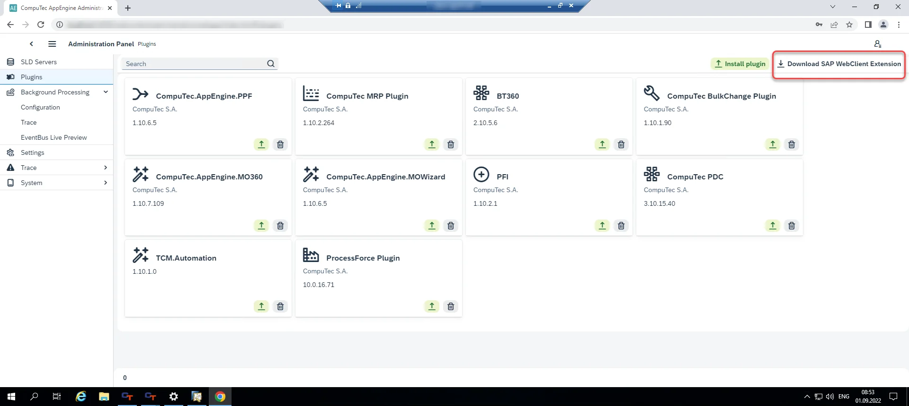
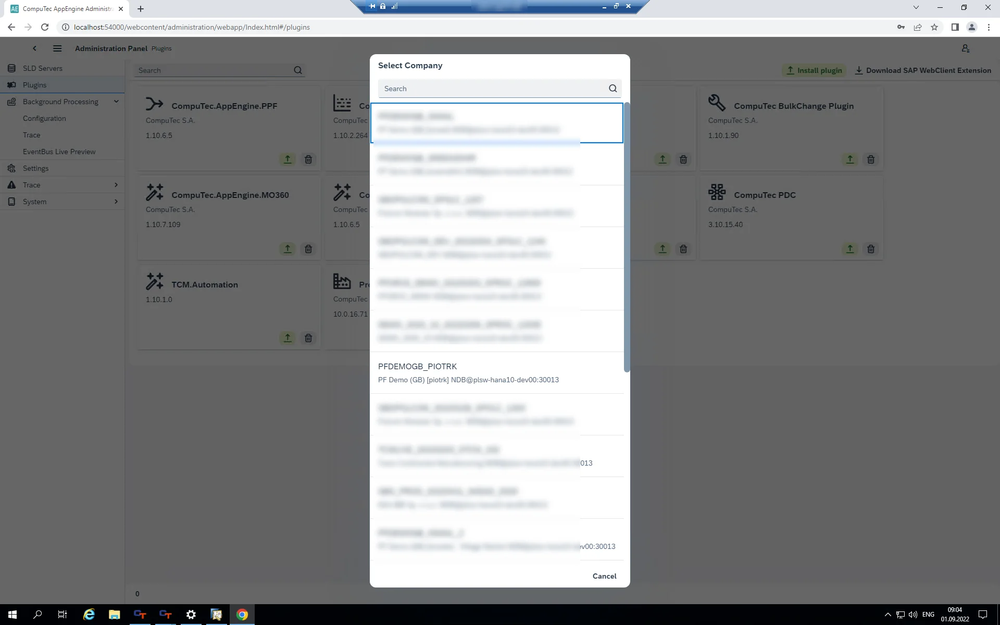
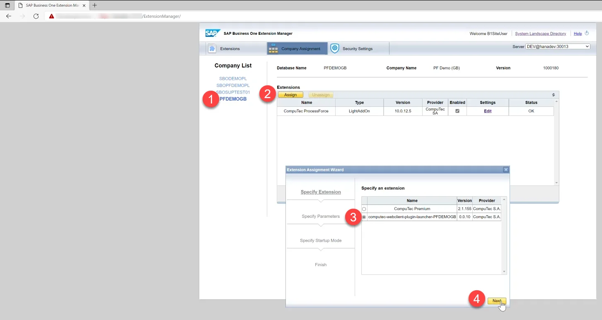
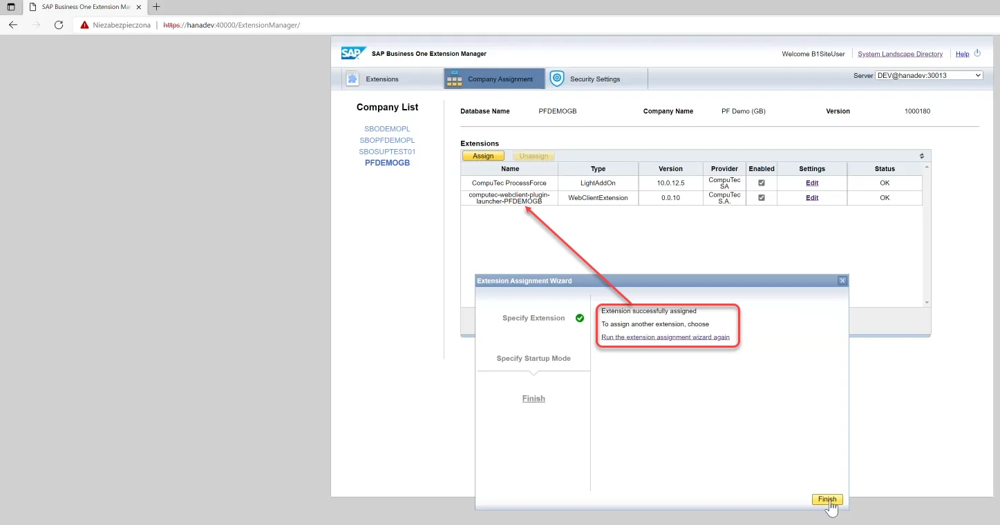
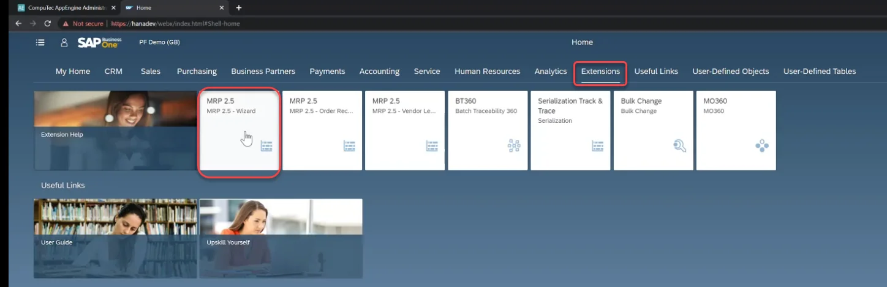
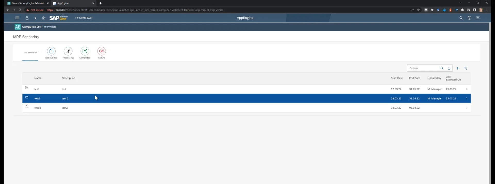

# Working with SAP Business One Web Client

SAP Business One Web Client provides a modern, browser-based interface that enhances the user experience and streamlines business operations. This guide outlines the configuration steps necessary to integrate CompuTec AppEngine plugins within the Web Client, ensuring seamless functionality and performance.

---

## Configuration

### External Host Address

To establish communication between the Web Client and the CompuTec AppEngine installation, the external host address must be configured correctly.

:::info Path
    Administration Panel → Settings → General → Hosting → HttpsPorts
:::

The Web Client relies on an HTTPS address to connect to the CompuTec AppEngine. By default, it is set to localhost with a predefined port. If a different address is used, it must be updated accordingly.

Additionally, the Web Client stores this address in an CompuTec AppEngine configuration table within the database. If the CompuTec AppEngine installation is upgraded to version 2.0.7.0, you must activate a Company or deactivate and reactivate it via SLD Servers → Companies.

## Installation Package

### Download

To install plugins for a specific company, download the installation package:

1. Navigate to Administration Panel → Plugins.
2. Click the Download SAP WebClient Extension button in the upper-right corner.
3. Select the required company.

Clicking it causes an installer to download. For example: computec_appengine_webclient_plugins_PFDEMOGB_PIOTRK_0_0_1.mtar.

### Upload

Use the SAP Business One Extension Manager to load the installation package:

### SAP Business One Extension Manager

Choose one of the extensions:

Log in using SAP Business User ID. A plugin is now available in SAP Business One Web Client.

---
