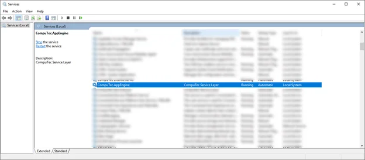

# Installation

This guide will walk you through the installation process for CompuTec ProcessForce AppEngine, ensuring a smooth setup and proper configuration. Follow the steps below to get started.

---

1. Run the installation file (CompuTec ProcessForce AppEngine) from the [Download](../../version-2.0/releases/plugins/processforce/download.md) section and click Install in the opened installation Wizard.
2. Click Close after getting Installation Successfully Completed.
3. Now, the new service should be running:

    
4. Now you can run the platform by using the following web address: `http://{host}:54000 in a browser`.

:::warning
    After upgrading from any 1.00 version to any 2.00, please use the Empty Cache and Hard Reload option in the browser on which you use AppEngine.

    

    
Click here to find out more

    

    **Here is an example for Google Chrome or Microsoft Edge (Chromium)**

    Open Google Chrome or Microsoft Edge (Chromium) browser and click F12 to open Developers Tools (1.). Right-click on the refresh button (2.) and choose the Empty Cach and Hard Reload option (3.):
    
    
    

    

:::

---
