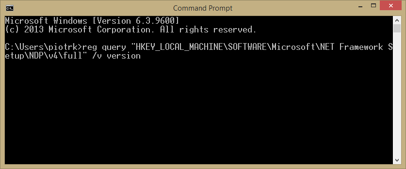
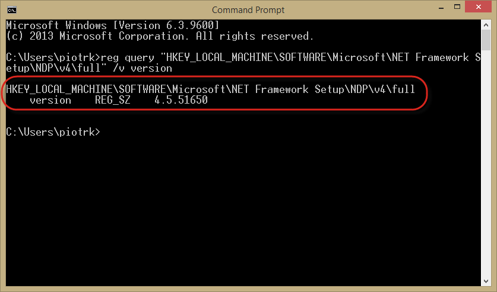

# Requirements

CompuTec AppEngine is a powerful tool designed to enhance SAP Business One functionality. To ensure a smooth installation and optimal performance, it's essential to meet specific system requirements and complete necessary pre-installation steps.

:::warning
CompuTec AppEngine 2.0 does not support Identity Provider (IdP) setup.
:::

:::note
    CompuTec AppEngine requires **.NET** Framework to work correctly. The version of the .NET Framework supported by CompuTec AppEngine is **4.7**.

<details>
<summary>Click to see how to check .NET Framework version</summary>
<div>
    1. Type in the following command in Command Prompt from Windows applications:
    ```reg query "HKEY_LOCAL_MACHINE\SOFTWARE\Microsoft\NET Framework Setup\NDP\v4\full" /v version```
    

        And click enter

    2. The result will show the .NET Framework version

        

    We recommend installing the latest version of the .NET Framework. You can do this using Windows Update or by manually downloading the necessary files from the Microsoft website.

    | Microsoft .NET Framework 4.7 (Web Installer) | [Link](https://support.microsoft.com/en-au/topic/the-net-framework-4-7-web-installer-for-windows-54cca588-519d-5e78-ea54-2ce5bd84a2ab) |
    | --- | --- |
    | **Microsoft .NET Framework 4.7 (Offline Installer)** | [**Link**](https://support.microsoft.com/en-gb/topic/the-net-framework-4-7-offline-installer-for-windows-f32bcb33-5f94-57ce-6120-62c9526a91f2) |
</div>
</details>
:::

:::note
    CompuTec AppEngine does not require a SAP Business One application client.
:::

## Pre-Installation Steps for CompuTec AppEngine

Before installing CompuTec AppEngine, ensure the following components are installed:

1. Install SAP Business One DI API 64-bit on the client machine.
2. Install CompuTec ProcessForce API 64-bit (required for certain plugins). Download it [here](/docs/processforce/releases/download#computec-processforce-api).
3. Microsoft ODBC Driver 17 for SQL Server (installed with SAP Business One Client).
4. Microsoft SQL Server Native Client 11.0 (installed with SAP Business One Client).

## Working with SAP Business One on the HANA Database

For SAP Business One installations using HANA, you must install hdbsetup.exe to enable database access within CompuTec AppEngine (without this, databases are not available from the application Settings level).

The file is available in the b1_shf\SAP_HANA_CLIENT_x64 folder on a machine where SAP Business One is installed:


---
