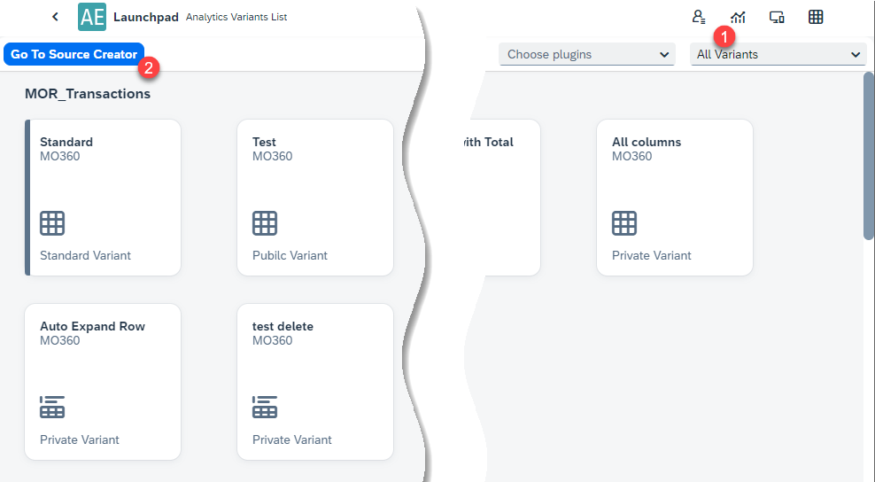
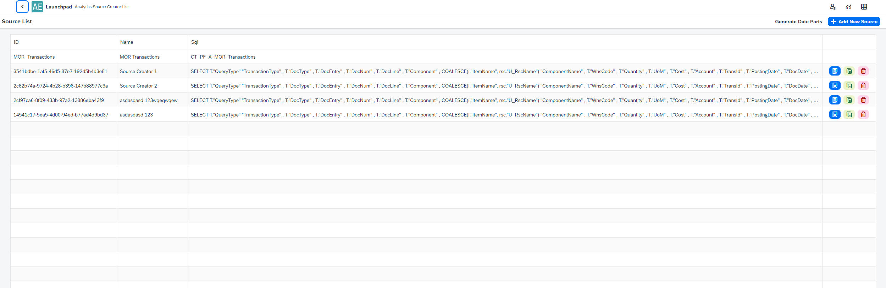
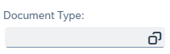
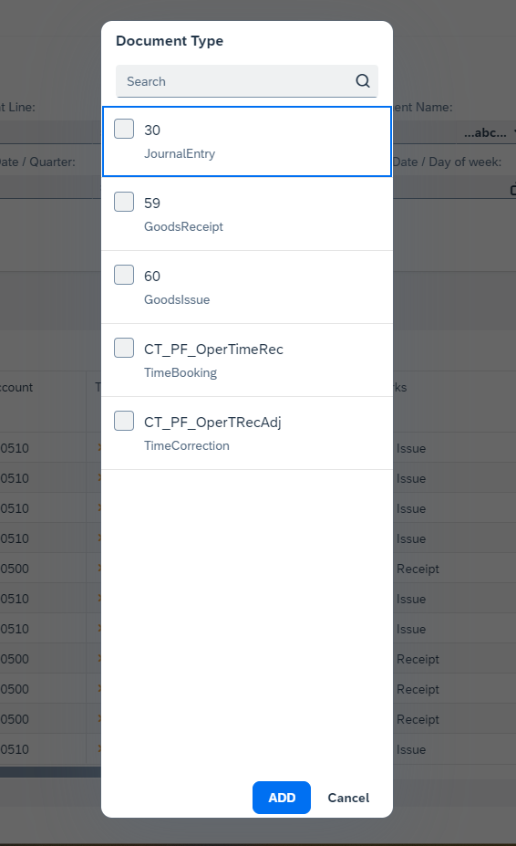
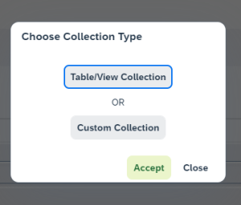
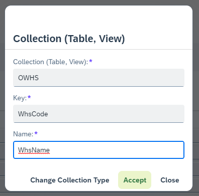
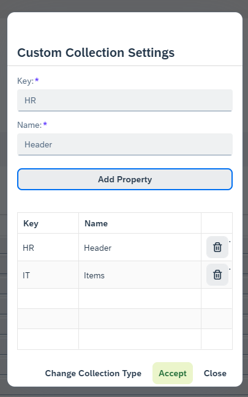
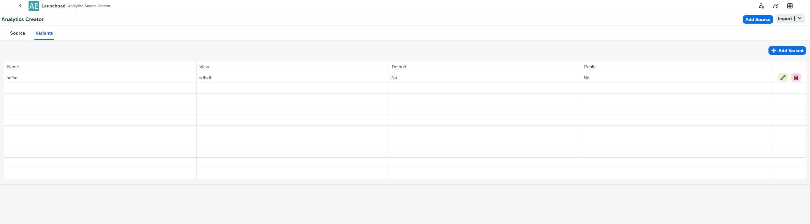
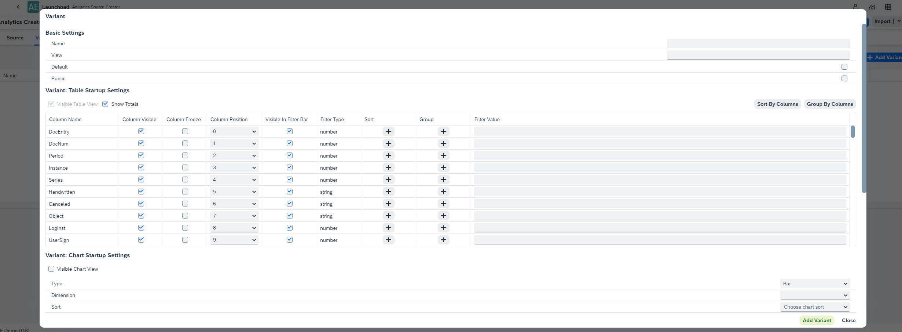

# Source Creator

The Source Creator allows advanced configuration of data used in [custom reports and analytics of the Analytical Page.](../../../version-2.0/appengine-users-guide/analytical-page/overview.md#usage).

---

To access it, click on the Analytical Page button (1.) in the Launchpad, then select Go To Source Creator:

This leads to the Source List:

This is a list of sources currently used in the [Variants](/docs/appengine/appengine-users-guide/analytical-page/overview#variants) used in Analytical views.

You can add a new Variant by clicking the Add New Source button:

## Source tab

Here you can configure:

- the name of the Variant
- the source – an MS SQL query that will be a source of data for the Variant
- available fields (for a specific query) – the list is available after clicking the Show - Preview button after entering a query. Here you can modify the Variant by changing values for specific lines. You can set:

        - Displayed Column Name
        - Column Description
        - Column Type
        - Set a Custom Collection (different than in related Table View)

          

          
Click here to find out more.

          

          A Collection is a predefined set of values for a field - such as "Started", "Closed", etc., used in filters on the Analytical Page. You’ll see a special icon to open the list of available values:

          

          

          You can choose between:

            - **Table/View Collection**: Pulls values directly from the related table or view.
            - **Custom Collection**: Allows you to manually define the list.

              

              The Table/View Collection:

              

              The Custom Collection option:

              
            

            

## Variants tab

In this tab, you can manage all Variants associated with a source - add, edit, or delete them.

To create a new Variant, click + Add Variant:

Here you can define:

- **Basic Settings**: Name, View, Default, Accessibility (Public/Private);
- **Table Startup Settings**: Settings related to the [Table view](../../../version-2.0/appengine-users-guide/analytical-page/overview.md#table-options).
- **Chart Startup Settings**: Settings related to the [Chart view](../../../version-2.0/appengine-users-guide/analytical-page/overview.md#chart-options).
- **Visual Filter Startup Settings**: Settings related to the [charts](../../../version-2.0/appengine-users-guide/analytical-page/overview.md#chart-options).

---
