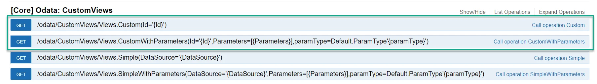

# Custom Views

CompuTec AppEngine Custom Views are a powerful feature designed to simplify data access for both developers and users.

## Key Features

- simplified data consumption in Web API client or UI
- supports OData V4
- supports SAP HANA and Microsoft SQL Server
- supports CompuTec AppEngine Plugins
- The <i>**CustomViews**</i> folder is available in the AE installation directory, and ProgramData/CompuTec/AppEngine.



:::note
    Custom View identifiers are extended with the plugin ID during initialization, using the format:
    `<plugin identifier>:<view identifier>`
:::

### Custom View Definition from Plugin Directory

`<file name>.customview.json`
    ```json
{
  "Id": "<view identifier>",
  "Description": "<view description>",
  "Source": {
    "Hana": "<SAP Hana query>",
    "MsSql": "<MsSQL query>"
  }
}
    ```

### Request

Request URL
    ```text
    http://{ae_url}/odata/CustomViews/Views.Custom(Id='<plugin identifier>:<view identifier>')
    ```

## Example

### View Definition

File: BusinessPartnerPaymentTerms.customview.json

    ```json
{
  "Id": "BusinessPartnerPaymentTerms",
  "Description": "Business Partners and their assigned payment terms",
  "Source": {
    "Hana": "
        SELECT
            \"OCTG\".\"PymntGroup\", \"OCRD\".\"CardCode\", \"OCRD\".\"CardName\"
        FROM OCRD
        LEFT OUTER JOIN OCTG ON \"OCRD\".\"GroupNum\" = \"OCTG\".\"GroupNum\"
        ",
     "MsSql": "
        SELECT
            \"OCTG\".\"PymntGroup\", \"OCRD\".\"CardCode\", \"OCRD\".\"CardName\"
        FROM OCRD
        LEFT OUTER JOIN OCTG ON \"OCRD\".\"GroupNum\" = \"OCTG\".\"GroupNum\"
        "
  }
}
    ```

### Request

Curl

    ```bash
curl -X GET --header 'Accept: application/json' '<http://localhost:54000/odata/CustomViews/Views.Custom(Id='MYPLUGIN:BusinessPartnerPaymentTerms>')'
    ```

Request URL

    ```text
    http://localhost:54000/odata/CustomViews/Views.Custom(Id='MYPLUGIN:BusinessPartnerPaymentTerms')
    ```

Response Body

    ```json
{
  "@odata.context": "<http://localhost:54000/odata/$metadata#Custom>",
  "value": [
    {
      "No": 1,
      "PymntGroup": "- Cash Basic -",
      "CardCode": "00001",
      "CardName": "ABC Inc"
    },
    {
      "No": 2,
      "PymntGroup": "- Cash Basic -",
      "CardCode": "00002",
      "CardName": "Hanks Deliveries"
    },
    {
      "No": 3,
      "PymntGroup": "- Cash Basic -",
      "CardCode": "TEST",
      "CardName": ""
    }
  ]
}
    ```

## Example with Parameters

### View Definition

File: request.customview.json

    ```json
{
  "Id": "RequestView",
  "Description": "Fetch request from database",
  "Source": {
    "Hana": "SELECT *FROM CTLABEL.CT_LP_REQUESTDETAILS WHERE \"REQUESTID\" = @RequestId",
    "MsSql": "SELECT* FROM CTLABEL.dbo.CT_LP_REQUESTDETAILS WHERE REQUESTID = @RequestId"
  }
}
    ```

### Request

Curl

    ```bash
curl -X GET --header 'Accept: application/json' '<http://localhost:54000/odata/CustomViews/Views.CustomWithParameters(Id='CTLabel%3ARequestView>', Parameters=[%22RequestId%3D61%22],paramType=Default.ParamType'Custom')'
    ```

Request URL

    ```bash
    http://localhost:54000/odata/CustomViews/Views.CustomWithParameters(Id='CTLabel%3ARequestView',Parameters=[%22RequestId%3D61%22],paramType=Default.ParamType'Custom')
    ```

Response Body

    ```json
    {
  "@odata.context": "<http://localhost:54000/odata/$metadata#Custom>",
  "value": [{}]
    }
    ```

---
