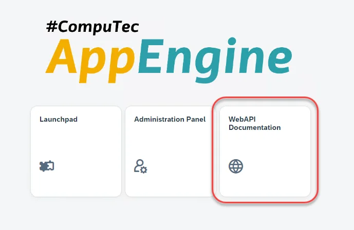
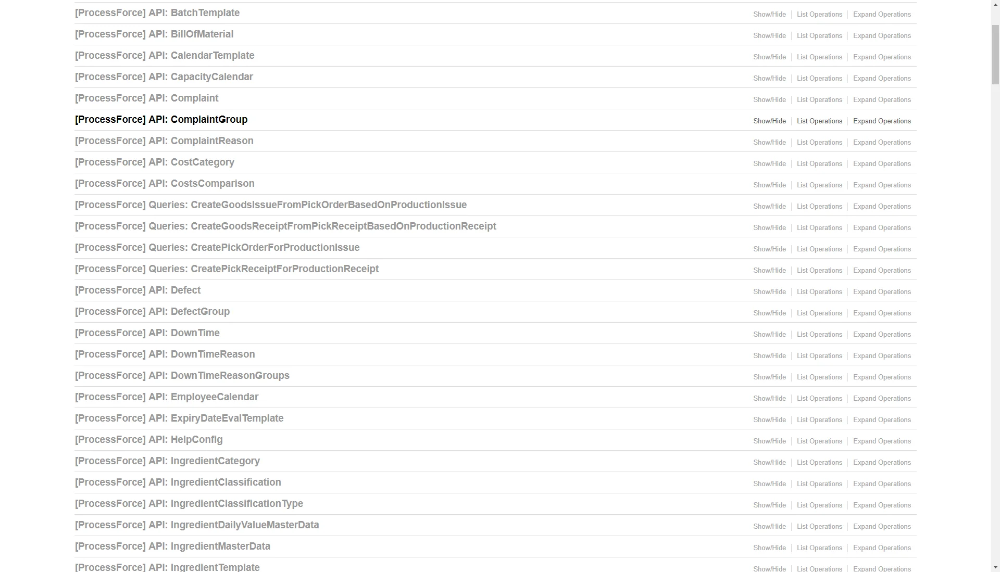
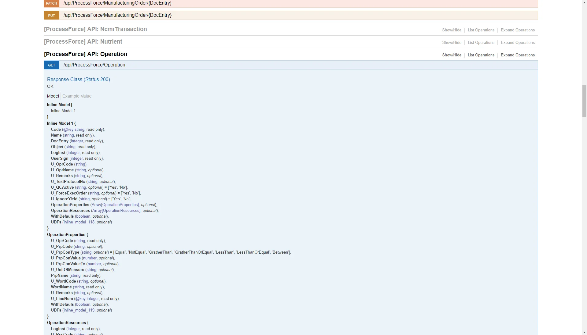
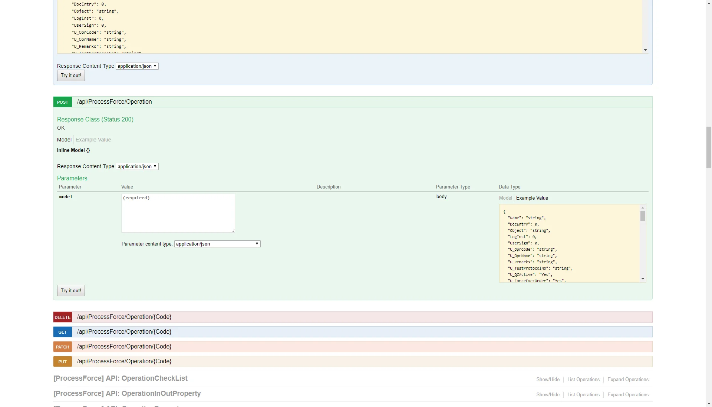

# REST/OData API Documentation

On-demand REST/OData API Swagger documentation is generated by choosing the API documentation panel in the main menu:



An example view of the documentation:







API usage examples in Postman:

<details>
<summary>Click here to Expand</summary>
<div>

</div>
</details>

## Steps to Create Pick Order or Pick Receipt using webAPI Calls

- Create pick order or pick receipt through webAPI requires 2 steps:

        - Create an empty document by calling the end point
        /ProcessForce/CreatePickOrderForProductionIssue and /ProcessForce/CreatePickReceiptForProductionReceipt respectively using method "POST"
        - Update the created document with necessary details using patch

- Create pick order for operation requires user to set operation details while creating document using the below request template

        ```java
        {"IssueType":"Operations","LineNumbers":  {"<MO DocNum>": [
                <U_LineNum of the operation from @CT_PF_MOR12 table>
            ]
        },"ManufacturingOrderDocEntries":
        [ "<MO DocNum>"]
        }
        ```

**API usage examples in Postman**

To learn more, click the link [API usage examples in Postman](https://github.com/CompuTec/appengine-examples/tree/main/postman)
