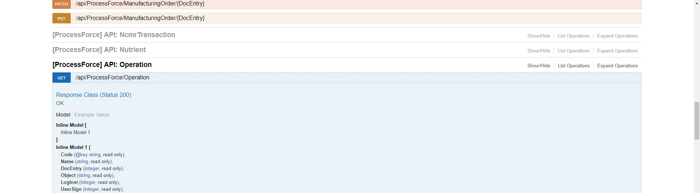

# REST/OData API Documentation

## Overview

**CompuTec AppEngine** provides interactive **REST and OData API documentation** generated using **Swagger**.

To access the API documentation:

1. Open **CompuTec AppEngine** login screen.

2. On the login screen, click the **WebAPI Documentation**.

        

3. The **Swagger** API documentation will open in your browser.

        

**Swagger** allows you to:

- Browse available API endpoints
- View request and response formats
- Test API calls directly from the browser
- Explore endpoints for installed plugins

The list of available API definitions depends on the plugins installed and activated in your CompuTec AppEngine instance.

## Log in to the API

Before sending API requests, you must authenticate using the **/api/login** endpoint.

Example of the login request:

```http
POST http://localhost:54000/api/login HTTP/1.1 
Content-Type: application/json 
 
{ 
  "SLDServer": "plsw-hana10-dev00:40000", 
  "ServerInstance": "NDB@plsw-hana10-dev00:30013", 
  "CompanySchema": "PFDEMOGB_COMPANY", 
  "UserName": "manager", 
  "Password": "1111" 
} 
```

:::note[Info]
The values in the example request are placeholders. Replace them with the correct values from your environment:

- **SLDServer**: Address of the SAP Business One System Landscape Directory (SLD) server
- **ServerInstance**: SAP HANA database server and instance
- **CompanySchema**: Database schema of the SAP Business One company
- **UserName**: SAP Business One user name
- **Password**: Password for the SAP Business One user

:::

## Use API with an external tool

You can test API calls using tools such as Postman, Visual Studio Code REST Client, or any other REST API testing tool.

The general workflow for using the API is:

1. Send a login request to ``/api/login``.
2. After successful authentication, send additional API requests using the same session.

### Create Pick Orders or Pick Receipts Using Web API

Creating a **Pick Order** or **Pick Receipt** using the Web API requires two steps.

#### Step 1: Create an Empty Document

Call the appropriate endpoint using the POST method:

- ``/ProcessForce/CreatePickOrderForProductionIssue``

- ``/ProcessForce/CreatePickReceiptForProductionReceipt``

This creates an empty document.

#### Step 2: Update the Document

After the document is created, update it using a ``PATCH`` request to provide the required item details.

#### Example: Create Pick Order for a Production Operation

When creating a Pick Order for a specific operation, the request must include operation details.

Example request body:

```http
{ 
  "IssueType": "Operations", 
  "LineNumbers": { 
    "<MO DocNum>": [ 
      <U_LineNum of the operation from @CT_PF_MOR12 table> 
    ] 
  }, 
  "ManufacturingOrderDocEntries": [ 
    "<MO DocNum>" 
  ] 
} 
```

:::Info[note]
The values in the example request are placeholders. Replace them with the correct values from your environment:

- **IssueType**: Defines the issue type. For operations use ``Operations``
- **LineNumbers**: Specifies the manufacturing order operation line
- **ManufacturingOrderDocEntries**: Manufacturing order document number

The **operation line number** can be retrieved from the **@CT_PF_MOR12** table.

:::
