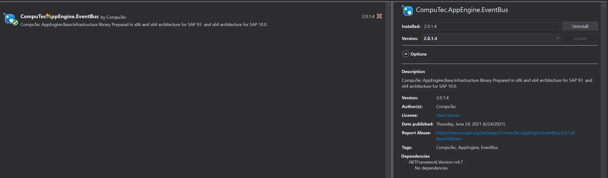

# CompuTec AppEngine Jobs

## Prerequisites

CompuTec AppEngine Jobs are a powerful feature in the CompuTec AppEngine framework that allow developers to execute background logic in response to specific events in SAP Business One. This tutorial demonstrates how to build a custom job that listens for the creation of a new, unapproved Sales Order and automatically generates a To-Do task for follow-up. This kind of automation enhances operational efficiency and ensures timely review of business documents.

Before you begin, ensure background processing is properly configured in your environment. You can refer to the setup guide here: [Configuration and Administration → Background processing](../../../version-2.0/administrators-guide/configuration-and-administration/overview.md).

---

## Adding New Job

1. CompuTec AppEngine Jobs requires CompuTec.AppEngine.EventBus, so we need to add it to our Plugin project.

    
2. IIn the Plugin project, create a new folder named Jobs and a new class within it called SalesOrderToApproveEventJob.cs.

    
3. This class should inherit from CompuTec.AppEngine.Base.Infrastructure.Jobs.EventBusSecureJob.
4. Once we add this inheritance, Visual Studio will notify us that we need to implement the abstract method Call() and provide a parameterized constructor. After doing so, the class will look like this:

    SalesOrderToApproveEventJob.cs

    ```csharp
    using CompuTec.AppEngine.Base.Infrastructure.Jobs;
    using CompuTec.AppEngine.Base.Infrastructure.Security;
    using NLog;
    using StructureMap;

    namespace CompuTec.AppEngine.FirstPlugin.Jobs
    {
        public class SalesOrderToApproveEventJob : EventBusSecureJob
        {
            Logger _logger;
            public SalesOrderToApproveEventJob(Session session, IContainer container, EventBus.Message message) : base(session, container, message)
            {
                _logger = container.GetInstance<Logger>();
            }

            public override void Call()
            {
            }
        }
    }
    ```

5. By adding the Logger, we will be able to log messages that can later be reviewed directly from the CompuTec AppEngine Administration Panel.
6. The final piece we need is the EventBusJob annotation from the CompuTec.AppEngine.Base.Infrastructure.Jobs.Annotations namespace. This annotation will allow us to specify information about our job, including the type of event and action that will trigger it.
7. Let's add an annotation to our job:

    - **JobId**: The unique ID for this job, which will be used by CompuTec AppEngine. It will be visible in the CompuTec AppEngine Administration Panel.
    - **Description**: A brief description of the job, visible in the CompuTec AppEngine Administration Panel.
    - **ContentType**: The ObjectType that the job will react to. This corresponds to the variable object_type used in SBO_SP_TransactionNotification and SBO_SP_PostTransactionNotice.
    - **ActionType**: The action type for the event. For example, "A" for Add, "U" for Update, or "D" for Delete.
    - In our example, since we want the job to react to adding a Sales Order, we set ContentType to "17" and ActionType to "A".

    ```csharp
    [EventBusJob(JobId = "SalesOrderToApproveEventJob", Description = "Crate new To Do Job for Added Sales Orders that are unapproved", ContentType = "17", ActionType = "A")]
    ```

    SalesOrderToApproveEventJob.cs

    ```csharp
    using CompuTec.AppEngine.Base.Infrastructure.Jobs;
    using CompuTec.AppEngine.Base.Infrastructure.Jobs.Annotations;
    using CompuTec.AppEngine.Base.Infrastructure.Security;
    using NLog;
    using StructureMap;

    namespace CompuTec.AppEngine.FirstPlugin.Jobs
    {
        [EventBusJob(JobId = "SalesOrderToApproveEventJob", Description = "Crate new To Do Job for Added Sales Orders that are unapproved", ContentType = "17", ActionType = "A")]
        public class SalesOrderToApproveEventJob : EventBusSecureJob
        {
            Logger _logger;
            public SalesOrderToApproveEventJob(Session session, IContainer container, EventBus.Message message) : base(session, container, message)
            {
                _logger = container.GetInstance<Logger>();
            }

            public override void Call()
            {
            }
        }
    }
    ```

8. After rebuilding, our action will be available in the background processing section of the Administration Panel, and it can be activated. (If you're unsure how to do this, please refer to the [Configuration and Administration](../../../version-2.0/administrators-guide/configuration-and-administration/overview.md#background-processing) guide. When you open the Job configuration, you will see all the details from our annotation, as well as the plugin ID from the plugin manifest.)

    

9. Now lets add logic to our Job.
10. First, we need to retrieve the Sales Order DocEntry from the event message. This can be done by deserializing the message.

    ```csharp
    dynamic json = JsonConvert.DeserializeObject(Message.Body);
    int DocEntry = json.DocEntry;
    ```

11. Now, we can retrieve the Sales Order details using a simple query. We'll create a separate method to handle this.

    GetSalesOrderDetails

    ```csharp
    private CTRecordset GetSalesOrderDetails(int DocEntry)
    {
        var qm = new QueryManager();
        qm.SetSimpleResultFields("DocEntry", "DocNum", "CardCode", "Confirmed");
        qm.SimpleTableName = "ORDR";
        qm.SetSimpleWhereFields("DocEntry");

        return qm.ExecuteSimpleParameters(Session.Token, DocEntry);
    }
    ```

12. Finally, we can add a new To-Do task.

    AddNewToDoTask

    ```csharp
    private void AddNewToDoTask(int DocNum)
    {
        IToDo toDoTask = CompuTec.Core2.CoreManager.GetUDO(Session.Token, "SAMPLE_TO_DO");
        toDoTask.U_TaskName = $"Confirmation";
        toDoTask.U_Description = $"Review Sales Order number {DocNum}";
        toDoTask.U_Priority = API.Enums.ToDoPriority.Medium;
        if (toDoTask.Add() != 0)
            throw new Exception($"Exception while adding ToDo task: {Session.Company.GetLastErrorDescription()}");
    }
    ```

13. Finally, the SalesOrderToApproveEventJob.cs file will look like this:

    SalesOrderToApproveEventJob.cs

    ```csharp
    using CompuTec.AppEngine.Base.Infrastructure.Jobs;
    using CompuTec.AppEngine.Base.Infrastructure.Jobs.Annotations;
    using CompuTec.AppEngine.Base.Infrastructure.Security;
    using CompuTec.AppEngine.FirstPlugin.API.BusinessObjects.ToDo;
    using CompuTec.BaseLayer.DI;
    using CompuTec.Core2.DI.Database;
    using Newtonsoft.Json;
    using NLog;
    using StructureMap;
    using System;

    namespace CompuTec.AppEngine.FirstPlugin.Jobs
    {
        [EventBusJob(JobId = "SalesOrderToApproveEventJob", Description = "Crate new To Do Job for Added Sales Orders that are unapproved", ContentType = "17", ActionType = "A")]
        public class SalesOrderToApproveEventJob : EventBusSecureJob
        {
            Logger _logger;
            public SalesOrderToApproveEventJob(Session session, IContainer container, EventBus.Message message) : base(session, container, message)
            {
                _logger = container.GetInstance<Logger>();
            }

            public override void Call()
            {
                try
                {
                    _logger.Trace($"Job :SalesOrderToApproveEventJob Started for :{Message.Body}");
                    dynamic json = JsonConvert.DeserializeObject(Message.Body);
                    int DocEntry = json.DocEntry;

                    bool approved;
                    int DocNum;
                    using (CTRecordset rs = this.GetSalesOrderDetails(DocEntry))
                    {
                        DocNum = rs.Fields.Item("DocNum").Value;
                        string Confirmed = rs.Fields.Item("Confirmed").Value;
                        approved = Confirmed == "Y" ? true : false;
                    }

                    if (!approved)
                    {
                        AddNewToDoTask(DocNum);
                        _logger.Trace($"Job :SalesOrderToApproveEventJob finished successfully. To Do Task added");
                    }
                    else
                    {
                        _logger.Trace($"Job :SalesOrderToApproveEventJob finished successfully - Nothing to do, Sales Order already approved.");
                    }
                }
                catch (Exception e)
                {
                    _logger.Error(e, $"Job :SalesOrderToApproveEventJob failed:{e.Message}");
                    throw;
                }

            }
            private void AddNewToDoTask(int DocNum)
            {

                IToDo toDoTask = CompuTec.Core2.CoreManager.GetUDO(Session.Token, "SAMPLE_TO_DO");
                toDoTask.U_TaskName = $"Confirmation";
                toDoTask.U_Description = $"Review Sales Order number {DocNum}";
                toDoTask.U_Priority = API.Enums.ToDoPriority.Medium;
                if (toDoTask.Add() != 0)
                    throw new Exception($"Exception while adding ToDo task: {Session.Company.GetLastErrorDescription()}");
            }

            private CTRecordset GetSalesOrderDetails(int DocEntry)
            {
                var qm = new QueryManager();
                qm.SetSimpleResultFields("DocEntry", "DocNum", "CardCode", "Confirmed");
                qm.SimpleTableName = "ORDR";
                qm.SetSimpleWhereFields("DocEntry");

                return qm.ExecuteSimpleParameters(Session.Token, DocEntry);
            }
        }
    }
    ```

## Results

To test the job, add a new Sales Order that is not marked as approved.

### Optional

There is a setting in SAP that determines whether a newly added Sales Order should require approval. You can locate this setting here:


1. Create a new Sales Order and ensure that it remains unapproved.

    

    

2. This action will trigger our job, and its current status can be monitored under Recent Calls in the CompuTec AppEngine Administration Panel.

    

3. Once the job is completed, a new To-Do task should appear in the list.

    

---
