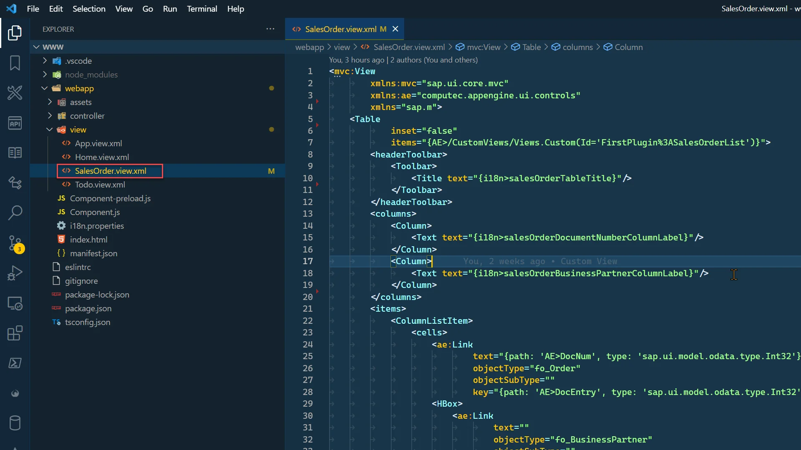
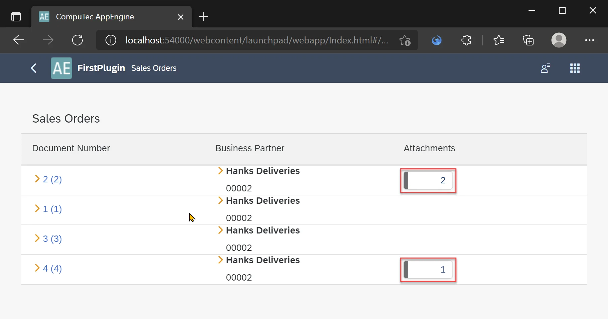
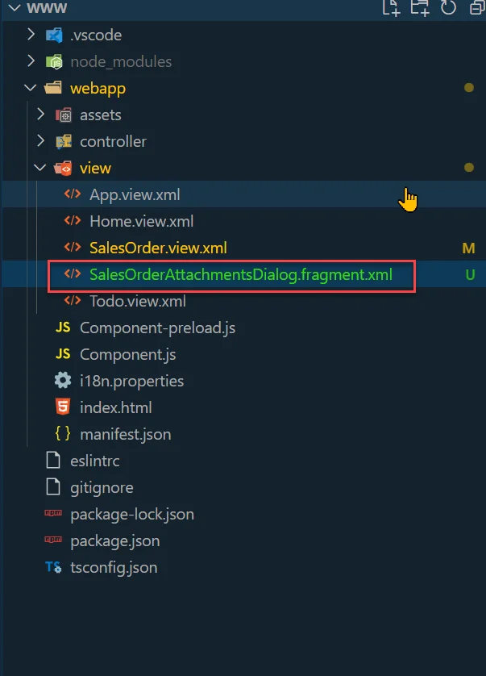
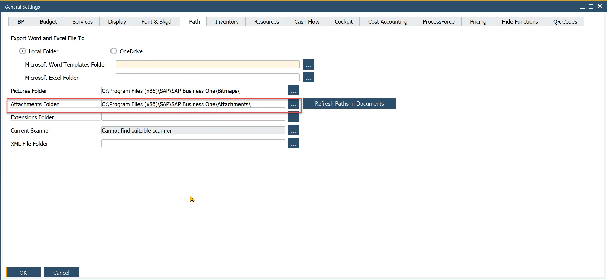

# Attachments

## Description

AppEngine comes with built-in, handy controllers for managing attachments in SAP Business One. If you open Documentation (swagger)...


...you can find description of the controllers.


Below is an example of receiving and adding attachments from and to Sales Orders.

## Getting Attachments from Sales Order

We will extend the Sales Orders list example by adding a button that opens a dialog displaying the attachments for a selected Sales Order.

### Adding Attachment Information to Sales Orders List

1. Open SalesOrder.view.xml

    
2. Add new column Attachments.

    ```xml
    <Column>
        <Text text="{i18n>salesOrderAttachmentsColumnLabel}"/>
    </Column>
    ```

3. Add translation as described [here](./translations-from-backend.md).

    ```xml
    <Message id="salesOrderAttachmentsColumnLabel" param="0">
        <translation lang="Default" Date="2011-08-09T15:55:59">Attachments</translation>
        <translation lang="ln_English" Date="2011-08-09T15:55:59">Attachments</translation>
        <translation lang="ln_Polish" Date="2011-08-09T15:55:59">Załączniki</translation>
    </Message>
    ```

4. Add the GenericTag control with ObjectNumber to display the number of attachments for each Sales Order.

    - Start by including the attachment information in the custom view used to list Sales Orders:

        
    - Update the custom view to include the NumberOfAttachments field. For detailed instructions on creating and modifying custom views, refer to the documentation [here](./creating-a-custom-view.md).

        SalesOrderList.customview.json

    - Next, add the control and bind it to the NumberOfAttachments field as shown below. Also, attach custom data app:AtcEntry, which will be used in the event handler to retrieve the relevant attachments.

        ```xml
        <GenericTag
            design="StatusIconHidden"
            visible="{= %{path: 'AE>NumberOfAttachments', type: 'sap.ui.model.odata.type.Int32'} > 0}"
            press=".onAttachmentsButtonPress">
            <ObjectNumber
                state="Information"
                emphasized="false"
                number="{path: 'AE>NumberOfAttachments', type: 'sap.ui.model.odata.type.Int32'}"
                unit=""/>
        </GenericTag>
        ```

    - Finally, the SalesOrder.view.xml should look like this:

        SalesOrder.view.xml

        ```xml
        <mvc:View
                xmlns:mvc="sap.ui.core.mvc"
                xmlns:ae="computec.appengine.ui.controls"
                xmlns:app="http://schemas.sap.com/sapui5/extension/sap.ui.core.CustomData/1"
                xmlns="sap.m">
            <Table
                    inset="true"
                    items="{AE>/CustomViews/Views.Custom(Id='FirstPlugin%3ASalesOrderList')}">
                <headerToolbar>
                    <Toolbar>
                        <Title text="{i18n>salesOrderTableTitle}"/>
                    </Toolbar>
                </headerToolbar>
                <columns>
                    <Column>
                        <Text text="{i18n>salesOrderDocumentNumberColumnLabel}"/>
                    </Column>
                    <Column>
                        <Text text="{i18n>salesOrderBusinessPartnerColumnLabel}"/>
                    </Column>
                    <Column>
                        <Text text="{i18n>salesOrderAttachmentsColumnLabel}"/>
                    </Column>
                </columns>
                <items>
                    <ColumnListItem>
                        <cells>
                            <ae:Link
                                    text="{path: 'AE>DocNum', type: 'sap.ui.model.odata.type.Int32'} ({path: 'AE>DocEntry', type: 'sap.ui.model.odata.type.Int32'})"
                                    objectType="fo_Order"
                                    objectSubType=""
                                    key="{path: 'AE>DocEntry', type: 'sap.ui.model.odata.type.Int32'}"/>
                            <HBox>
                                <ae:Link
                                        text=""
                                        objectType="fo_BusinessPartner"
                                        objectSubType=""
                                        key="{path: 'AE>CardCode', type: 'sap.ui.model.odata.type.String'}"/>
                                <ObjectIdentifier
                                        title="{path: 'AE>CardName', type: 'sap.ui.model.odata.type.String'}"
                                        text="{path: 'AE>CardCode', type: 'sap.ui.model.odata.type.String'}"/>
                            </HBox>
                            <GenericTag
            ="{path: 'AE>AtcEntry', type: 'sap.ui.model.odata.type.Int32'}"
                                    design="StatusIconHidden"
                                    visible="{= %{path: 'AE>NumberOfAttachments', type: 'sap.ui.model.odata.type.Int32'} > 0}"
                                    press=".onAttachmentsButtonPress">
                                <ObjectNumber
                                        state="Information"
                                        emphasized="false"
                                        number="{path: 'AE>NumberOfAttachments', type: 'sap.ui.model.odata.type.Int32'}"
                                        unit=""/>
                            </GenericTag>
                        </cells>
                    </ColumnListItem>
                </items>
            </Table>
        </mvc:View>
        ```

#### Results

FFor Sales Orders that have attachments, the GenericTag will be displayed showing the number of attachments.



### Creating Dialog for Attachments

#### Creating Controller for Sales Orders View

To handle the onAttachmentsButtonPress event triggered when a user clicks the GenericTag, we need to create a controller for the Sales Orders view.

1. Create a new file in controllers folder and name it SalesOrder.controller.js

    

2. Implement a basic controller by creating a new file called SalesOrder.controller.js within the controllers folder.

    SalesOrder.controller.js

    ```js
    sap.ui.define(
    ["computec/appengine/core/BaseController"],
    /**
     *
     * @param {typeof computec.appengine.core.BaseController} BaseController
     * @returns
     */
    function (BaseController) {
        "use strict";

        return BaseController.extend(
        "computec.appengine.firstPlugin.controller.SalesOrder",
        {
            onInit: function () {
            BaseController.prototype.onInit.call(this);
            this.setPageName("Sales Orders");
            },
        }
        );
    }
    );
    ```

3. Now, we need to add controller information into our view.

    ```xml
    <mvc:View
            controllerName="computec.appengine.firstplugin.controller.SalesOrder"
            xmlns:mvc="sap.ui.core.mvc"
            xmlns:ae="computec.appengine.ui.controls"
            xmlns="sap.m">
    ```

#### Creating View for Attachments Dialog

Here, we’ll create a new view fragment that will later be used in our controller.

1. Create a new view fragment for the Attachments Dialog named SalesOrderAttachmentsDialog.fragment.xml. For simplicity, place it directly in the view folder.

    
2. This will be a simple dialog displaying a list of attachments for the selected Sales Order.

    SalesOrderAttachmentsDialog.fragment.xml

    ```xml
    <core:FragmentDefinition
            xmlns="sap.m"
            xmlns:core="sap.ui.core"
            xmlns:app="http://schemas.sap.com/sapui5/extension/sap.ui.core.CustomData/1">
        <Dialog title="Attachments">
            <Table
                    growing="true"
                    growingThreshold="10"
                    inset="false"
                    items="{AT>/}"
                    fixedLayout="false">
                <columns>
                    <Column>
                        <Text text="Attachment Name"/>
                    </Column>
                    <Column>
                        <Text text="Download"/>
                    </Column>
                </columns>
                <items>
                    <ColumnListItem>
                        <cells>
                            <Text text="{path: 'AT>FileName'}"/>
                            <Button
                                    icon="sap-icon://download"
                                    press=".onAttachmentsDialogDownloadInNewTab"
                                    app:AbsEntry="{path: 'AT>AbsEntry'}"
                                    app:Line="{path: 'AT>Line'}"/>
                        </cells>
                    </ColumnListItem>
                </items>
            </Table>
            <endButton>
                <Button
                        text="Close"
                        press=".onAttachmentsDialogCloseFragment"/>
            </endButton>
        </Dialog>
    </core:FragmentDefinition>
    ```

#### Adding Custom View for Attachments

We’ll create a parameterized custom view that returns the attachments for the selected Sales Order.

1. Create a new custom view in your Plugin Project and name it Attachments.customview.json

    Attachments.customview.json

    ```json
    {
    "Id": "Attachments",
    "Description": "getting attachments of sales order",
    "Source": {
        "Hana": "SELECT \"FileName\", \"FileExt\",\"AbsEntry\",\"Line\" FROM ATC1 WHERE \"AbsEntry\" = @AbsEntry",
        "MsSql": "SELECT FileName, FileExt, AbsEntry, Line FROM ATC1 WHERE AbsEntry = @AbsEntry"
    }
    }
    ```

#### Opening Dialog

The Attachments dialog will be triggered when the user clicks on the GenericTag. Therefore, we need to implement the logic in SalesOrders.controller.js. In SalesOrders.view.xml, set the press event to onAttachmentsButtonPress, and create a function with that exact name in the controller.


1. Open SalesOrders.controller.js and add sap.ui.core.Fragment, sap.ui.model.json.JSONModel, computec.appengine.ui.model.http.Http to sap.ui.define:

    ```js
    sap.ui.define([
        "computec/appengine/core/BaseController",
        "sap/ui/core/Fragment",
        "sap/ui/model/json/JSONModel",
        "computec/appengine/ui/model/http/Http"
    ],
        /**
         *
         * @param {typeof computec.appengine.core.BaseController} BaseController
         * @param {typeof sap.ui.core.Fragment} Fragment
         * @param {typeof sap.ui.model.json.JSONModel} JSONModel
         * @param {typeof computec.appengine.ui.model.http.Http} Http
         * @returns
         */
        function (BaseController, Fragment, JSONModel, Http) {
    ```

2. Now let's create the handler. In it, we need to retrieve attachments for given Order, load fragment, bind attachments to it and then open it.

    - \_get – function that sends GET request to backend:

        ```js
        _get: function (sUrl) {
                        return new Promise((resolve, reject) => {
                            Http.request({
                                method: 'GET',
                                withAuth: true,
                                url: sUrl,
                                done: resolve,
                                fail: reject
                            });
                        });
                    },
        ```

    - getAttachmentsByDocEntry – this function calls _get with the appropriate URL. The URL targets the Attachments custom view we created earlier and includes the AbsEntry parameter to fetch the relevant data.

        ```js
        getAttachmentsByDocEntry: function (sDocNum) {
                        const sUrl = encodeURIComponent(`odata/CustomViews/Views.CustomWithParameters(Id='FirstPlugin:Attachments',Parameters=["AbsEntry=${sDocNum}"],paramType=Default.ParamType'Custom')`);
                        return this._get(sUrl);
                    },
        ```

    - getCustomDataForElement – this function retrieves the AtcEntry value, which is defined as a custom data attribute on the element.

        

        ```js
        getCustomDataForElement: function (oElement, sCustomDataCode) {
                        let oCustomData = oElement.getCustomData().find(x => x.getKey() === sCustomDataCode);
                        if (oCustomData)
                            return oCustomData.getValue();
                        return null;
                    },
        ```

    - onOpenDialog – this function loads the defined Attachments Dialog fragment, sets the retrieved attachments data to it, and then opens the dialog.

        ```js
        onOpenDialog: async function (data) {
                        const that = this;
                        const oView = this.getView();

                        if (!this._attachmentsDialog) {
                            this._attachmentsDialog = await Fragment.load({
                                id: oView.getId(),
                                name: "computec.appengine.firstplugin.view.SalesOrderAttachmentsDialog",
                                controller: this
                            });
                            oView.addDependent(this._attachmentsDialog);
                        }

                        this._attachmentsDialog.setModel(new JSONModel(data), "AT");
                        this._attachmentsDialog.open();
                    },
        ```

    - onAttachmentsButtonPress – this function is triggered when the user clicks on the Attachments GenericTag.

        ```js
        onAttachmentsButtonPress: async function (oEvent) {
            /** @type {sap.m.GenericTag} */
            const oGenericTag = oEvent.getSource();

            const nAtcEntry = this.getCustomDataForElement(oGenericTag, "AtcEntry");
            const data = await this.getAttachmentsByDocEntry(nAtcEntry);
            this.onOpenDialog(data.value);
        },
        ```

    - onAttachmentsDialogCloseFragment – this function is triggered when the user clicks the Close button in the Attachments Dialog.

        ```js
        onAttachmentsDialogCloseFragment: function () {
            this._attachmentsDialog.close();
        },
        ```

    - Finally the SalesOrder.controller.js should look like this:

        SalesOrder.controller.js

        ```js
        sap.ui.define([
            "computec/appengine/core/BaseController",
            "sap/ui/core/Fragment",
            "sap/ui/model/json/JSONModel",
            "computec/appengine/ui/model/http/Http"
        ],
            /**
            *
            * @param {typeof computec.appengine.core.BaseController} BaseController
            * @param {typeof sap.ui.core.Fragment} Fragment
            * @param {typeof sap.ui.model.json.JSONModel} JSONModel
            * @param {typeof computec.appengine.ui.model.http.Http} Http
            * @returns
            */
            function (BaseController, Fragment, JSONModel, Http) {
                "use strict";

                return BaseController.extend("computec.appengine.firstPlugin.controller.SalesOrder", {
                    _attachmentsDialog: null,
                    onInit: function () {
                        BaseController.prototype.onInit.call(this);
                        this.setPageName("Sales Orders");
                    },
                    onAttachmentsButtonPress: async function (oEvent) {
                        /** @type {sap.m.GenericTag} */
                        const oGenericTag = oEvent.getSource();

                        const nAtcEntry = this.getCustomDataForElement(oGenericTag, "AtcEntry");
                        const data = await this.getAttachmentsByDocEntry(nAtcEntry);
                        this.onOpenDialog(data.value);
                    },


                    onOpenDialog: async function (data) {
                        const that = this;
                        const oView = this.getView();

                        if (!this._attachmentsDialog) {
                            this._attachmentsDialog = await Fragment.load({
                                id: oView.getId(),
                                name: "computec.appengine.firstplugin.view.SalesOrderAttachmentsDialog",
                                controller: this
                            });
                            oView.addDependent(this._attachmentsDialog);
                        }

                        this._attachmentsDialog.setModel(new JSONModel(data), "AT");
                        this._attachmentsDialog.open();
                    },
                    onAttachmentsDialogCloseFragment: function () {
                        this._attachmentsDialog.close();
                    },
                    // #region INTERNAL
                    getCustomDataForElement: function (oElement, sCustomDataCode) {
                        let oCustomData = oElement.getCustomData().find(x => x.getKey() === sCustomDataCode);
                        if (oCustomData)
                            return oCustomData.getValue();
                        return null;
                    },
                    getAttachmentsByDocEntry: function (sDocNum) {
                        const sUrl = encodeURIComponent(`odata/CustomViews/Views.CustomWithParameters(Id='FirstPlugin:Attachments',Parameters=["AbsEntry=${sDocNum}"],paramType=Default.ParamType'Custom')`);
                        return this._get(sUrl);
                    },

                    _get: function (sUrl) {
                        return new Promise((resolve, reject) => {
                            Http.request({
                                method: 'GET',
                                withAuth: true,
                                url: sUrl,
                                done: resolve,
                                fail: reject
                            });
                        });
                    },

                    //#endregion

                });
            });
        ```

### Results {#results-2}

At this point, we can display the number of attachments in the Sales Orders list and view the attachments themselves.


### Downloading Attachment

With the attachments list dialog in place, it's time to add a function to handle attachment downloads. To achieve this, use the core APIAttachments controller, specifically the following GET method:

```text
/api/Attachments/GetAttachmentByCustomKey/{attachmentSource}/{keyName}/{key}/{attachmentField}/{lineNum}
```

Open SalesOrder.controller.js.

Add a new function called onAttachmentsDialogDownloadInNewTab - this name should match the one specified in the press attribute of the Download button in the Attachments Dialog.


```js
onAttachmentsDialogDownloadInNewTab: function (oEvent) {
    const oSource = oEvent.getSource();
    const AbsEntry = this.getCustomDataForElement(oSource, "AbsEntry");
    const Line = this.getCustomDataForElement(oSource, "Line");
    const sUrl = `${window.location.origin}/api/Attachments/GetAttachmentByCustomKey/ORDR/DocEntry/${AbsEntry}/null/${Line}`;
    window.open(sUrl, '_blank');
},
```

This method prepares a URL comprising 5 parameters:

- **attachmentSource**: The name of the table for the document, which in this example is ORDR (Sales Order)
- **keyName**: The key name of the table. For Sales Order - it is DocEntry
- **key**: The actual value of the key field; in the case of a Sales Order, it's the DocEntry value of the document
- **attachmentField**: This field is used when retrieving an attachment from a custom field. In our case, this can be set to null as it's not required,
- **lineNum** – Line number (Line column in ATC1) value of required attachment.

#### Result

When the user clicks the download button, the file will be downloaded via our REST API Attachment controller.


## Adding Attachments

Finally, we can complete the example by enabling the functionality to add attachments. Below is a step-by-step guide on how to implement this.

### Adding New File Upload Dialog

To allow file selection, we will add a new dialog: SalesOrderAttachmentsDialogAdd.fragment.xml.

SalesOrderAttachmentsDialogAdd.fragment.xml

```xml
<core:FragmentDefinition
        xmlns="sap.m"
        xmlns:core="sap.ui.core"
        xmlns:app="http://schemas.sap.com/sapui5/extension/sap.ui.core.CustomData/1"
        xmlns:u="sap.ui.unified">
    <Dialog title="Add Attachment">
        <u:FileUploader
                id="FileUploader"
                fileType="txt"
                placeholder="Upload File"
                class="sapUiSmallMargin"
                width="20em"/>
        <beginButton>
            <Button
                    width="10em"
                    text="Add Attachment"
                    press=".onAddAttachmentSubmit"></Button>
        </beginButton>
        <endButton>
            <Button
                    text="Close"
                    press=".onAddAttachmentDialogClose"/>
        </endButton>
    </Dialog>
</core:FragmentDefinition>
```

### Extending Attachments Dialog

We need to add a button to our Attachments Dialog that will open the newly created File Upload Dialog.

```xml
<customHeader>
    <OverflowToolbar>
        <Title text="Attachments"/>
        <ToolbarSpacer/>
        <Button
                icon="sap-icon://add-document"
                text="Add Attachment"
                press=".onAttachmentDialogAddAttachment"></Button>
    </OverflowToolbar>
</customHeader>
```

Finally SalesOrderAttachmentsDialog.fragment.xml should look like this.

SalesOrderAttachmentsDialog.fragment.xml

```xml
<core:FragmentDefinition
        xmlns="sap.m"
        xmlns:core="sap.ui.core"
        xmlns:app="http://schemas.sap.com/sapui5/extension/sap.ui.core.CustomData/1">
    <Dialog title="Attachments">
        <customHeader>
            <OverflowToolbar>
                <Title text="Attachments"/>
                <ToolbarSpacer/>
                <Button
                        icon="sap-icon://add-document"
                        text="Add Attachment"
                        press=".onAttachmentDialogAddAttachment"></Button>
            </OverflowToolbar>
        </customHeader>
        <Table
                growing="true"
                growingThreshold="10"
                inset="false"
                items="{AT>/}"
                fixedLayout="false">
            <columns>
                <Column>
                    <Text text="Attachment Name"/>
                </Column>
                <Column>
                    <Text text="Download"/>
                </Column>
            </columns>
            <items>
                <ColumnListItem>
                    <cells>
                        <Text text="{path: 'AT>FileName'}"/>
                        <Button
                                icon="sap-icon://download"
                                press=".onAttachmentsDialogDownloadInNewTab"
                                app:AbsEntry="{path: 'AT>AbsEntry'}"
                                app:Line="{path: 'AT>Line'}"/>
                    </cells>
                </ColumnListItem>
            </items>
        </Table>
        <endButton>
            <Button
                    text="Close"
                    press=".onAttachmentsDialogCloseFragment"/>
        </endButton>
    </Dialog>
</core:FragmentDefinition>
```

### Adding Logic to SalesOrder.controller.js

1. Having all views ready, we can now implement all the missing parts in the controller.
2. Open SalesOrder.controller.js.
3. Add the following functions to it:

    - onAttachmentDialogAddAttachment event handler for newly added Add Attachment button that will run onOpenAddAttachmentDialog function:

        ```js
        onAttachmentDialogAddAttachment: async function (oEvent) {
            await this.onOpenAddAttachmentDialog();
        },
        ```

    - onOpenAddAttachmentDialog – Opens SalesOrderAttachmentsDialogAdd Dialog:

        ```js
        onOpenAddAttachmentDialog: async function (data) {
            const oView = this.getView();
            if (!this._attachmentsAddDialog) {
                this._attachmentsAddDialog = await Fragment.load({
                    id: oView.getId(),
                    name: "computec.appengine.firstplugin.view.SalesOrderAttachmentsDialogAdd",
                    controller: this
                });
                oView.addDependent(this._attachmentsAddDialog);
            }
            this._attachmentsAddDialog.open();
        },
        ```

    - onAddAttachmentSubmit is the event handler for the Add Attachment button on the SalesOrderAttachmentsDialogAdd Dialog. If a file is selected, it will be uploaded and sent to the backend using the Attachment controller's POST method: `/api/Attachments/SetAttachment/{isPicture}/{overwrite}`. After the upload, the file name is added to the attachments view so it appears in the list. However, downloading the file won't be functional at this stage.

        ```js
        onAddAttachmentSubmit: async function () {
            /** @type {sap.ui.unified.FileUploader} */
            const oFileUploader = this.byId("FileUploader");
            let domRef = oFileUploader.getFocusDomRef(),
                file = domRef.files[0];
            if (!file) {
                alert("No File Uploaded!");
                return;
            }
            const fromData = new FormData();
            fromData.append("file", file);
            const sUrl = `${window.location.origin}/api/Attachments/SetAttachment/false/false`;

            try {
                const response = await fetch(sUrl, {
                    method: 'POST',
                    body: fromData
                });
                console.log(response);
                const oATModel = this._attachmentsDialog.getModel("AT");
                const aAttachments = oATModel.getProperty("/");
                aAttachments.push({
                    FileName: file.name
                });
                oATModel.refresh();

            } catch (oError) {
                console.log(oError);
            } finally {
                this.onAddAttachmentDialogClose();
            }
        },
        ```

    - onAddAttachmentDialogClose – close SalesOrderAttachmentsDialogAdd dialog

        ```js
        onAddAttachmentDialogClose: function () {
            this._attachmentsAddDialog.close();
        },
        ```

4. Finally, SalesOrder.controller.js should look like this.

    SalesOrder.controller.js

    ```js
    sap.ui.define([
        "computec/appengine/core/BaseController",
        "sap/ui/core/Fragment",
        "sap/ui/model/json/JSONModel",
        "computec/appengine/ui/model/http/Http"
    ],
        /**
         *
         * @param {typeof computec.appengine.core.BaseController} BaseController
         * @param {typeof sap.ui.core.Fragment} Fragment
         * @param {typeof sap.ui.model.json.JSONModel} JSONModel
         * @param {typeof computec.appengine.ui.model.http.Http} Http
         * @returns
         */
        function (BaseController, Fragment, JSONModel, Http) {
            "use strict";

            return BaseController.extend("computec.appengine.firstPlugin.controller.SalesOrder", {
                _attachmentsAddDialog: null,
                onInit: function () {
                    BaseController.prototype.onInit.call(this);
                    this.setPageName("Sales Orders");
                },
                onAttachmentsButtonPress: async function (oEvent) {
                    /** @type {sap.m.GenericTag} */
                    const oGenericTag = oEvent.getSource();

                    const nAtcEntry = this.getCustomDataForElement(oGenericTag, "AtcEntry");
                    const data = await this.getAttachmentsByDocEntry(nAtcEntry);
                    this.onOpenDialog(data.value);
                },


                onOpenDialog: async function (data) {
                    const oView = this.getView();

                    if (!this._attachmentsDialog) {
                        this._attachmentsDialog = await Fragment.load({
                            id: oView.getId(),
                            name: "computec.appengine.firstplugin.view.SalesOrderAttachmentsDialog",
                            controller: this
                        });
                        oView.addDependent(this._attachmentsDialog);
                    }

                    this._attachmentsDialog.setModel(new JSONModel(data), "AT");
                    this._attachmentsDialog.open();
                },
                onAttachmentsDialogCloseFragment: function () {
                    this._attachmentsDialog.close();
                },
                onAttachmentsDialogDownloadInNewTab: function (oEvent) {
                    const oSource = oEvent.getSource();
                    const AbsEntry = this.getCustomDataForElement(oSource, "AbsEntry");
                    const Line = this.getCustomDataForElement(oSource, "Line");
                    const sUrl = `${window.location.origin}/api/Attachments/GetAttachmentByCustomKey/ORDR/DocEntry/${AbsEntry}/null/${Line}`;
                    window.open(sUrl, '_blank');
                },


                //#region ADD ATTACHMENTS DIALOG
                onAttachmentDialogAddAttachment: async function (oEvent) {
                    await this.onOpenAddAttachmentDialog();
                },
                onOpenAddAttachmentDialog: async function (data) {
                    const oView = this.getView();
                    if (!this._attachmentsAddDialog) {
                        this._attachmentsAddDialog = await Fragment.load({
                            id: oView.getId(),
                            name: "computec.appengine.firstplugin.view.SalesOrderAttachmentsDialogAdd",
                            controller: this
                        });
                        oView.addDependent(this._attachmentsAddDialog);
                    }
                    this._attachmentsAddDialog.open();
                },
                onAddAttachmentSubmit: async function () {
                    /** @type {sap.ui.unified.FileUploader} */
                    const oFileUploader = this.byId("FileUploader");
                    let domRef = oFileUploader.getFocusDomRef(),
                        file = domRef.files[0];
                    if (!file) {
                        alert("No File Uploaded!");
                        return;
                    }
                    const fromData = new FormData();
                    fromData.append("file", file);
                    const sUrl = `${window.location.origin}/api/Attachments/SetAttachment/false/false`;

                    try {
                        const response = await fetch(sUrl, {
                            method: 'POST',
                            body: fromData
                        });
                        console.log(response);
                        const oATModel = this._attachmentsDialog.getModel("AT");
                        const aAttachments = oATModel.getProperty("/");
                        aAttachments.push({
                            FileName: file.name
                        });
                        oATModel.refresh();

                    } catch (oError) {
                        console.log(oError);
                    } finally {
                        this.onAddAttachmentDialogClose();
                    }
                },
                onAddAttachmentDialogClose: function () {
                    this._attachmentsAddDialog.close();
                },
                //#endregion

                // #region INTERNAL
                getCustomDataForElement: function (oElement, sCustomDataCode) {
                    let oCustomData = oElement.getCustomData().find(x => x.getKey() === sCustomDataCode);
                    if (oCustomData)
                        return oCustomData.getValue();
                    return null;
                },
                findElementByCustomId: function (oDialog, sCustomId) {
                    const oCtr = oDialog.findElements(true).find(
                        el => {
                            let sElId = this.getCustomDataForElement(el, "id");
                            return sElId == sCustomId;
                        }
                    );
                    return oCtr;
                },
                getAttachmentsByDocEntry: function (sDocNum) {
                    const sUrl = encodeURIComponent(`odata/CustomViews/Views.CustomWithParameters(Id='FirstPlugin:Attachments',Parameters=["AbsEntry=${sDocNum}"],paramType=Default.ParamType'Custom')`);
                    return this._get(sUrl);
                },

                _get: function (sUrl) {
                    return new Promise((resolve, reject) => {
                        Http.request({
                            method: 'GET',
                            withAuth: true,
                            url: sUrl,
                            done: resolve,
                            fail: reject
                        });
                    });
                },

                //#endregion

            });
        });
    ```

### Results

Finally, the application not only displays the list of attachments for a given Sales Order, but also enables users to upload new attachments. In this example, the attachments are uploaded to the backend and stored in the designated SAP attachments location.



:::caution
In this example, we are only uploading the attachment to the backend without linking it to a Sales Order. The association with a Sales Order is handled separately in a custom controller, as explained in the [Custom controller](./custom-controller.md) tutorial.
:::

#### Final Look of Application


---
