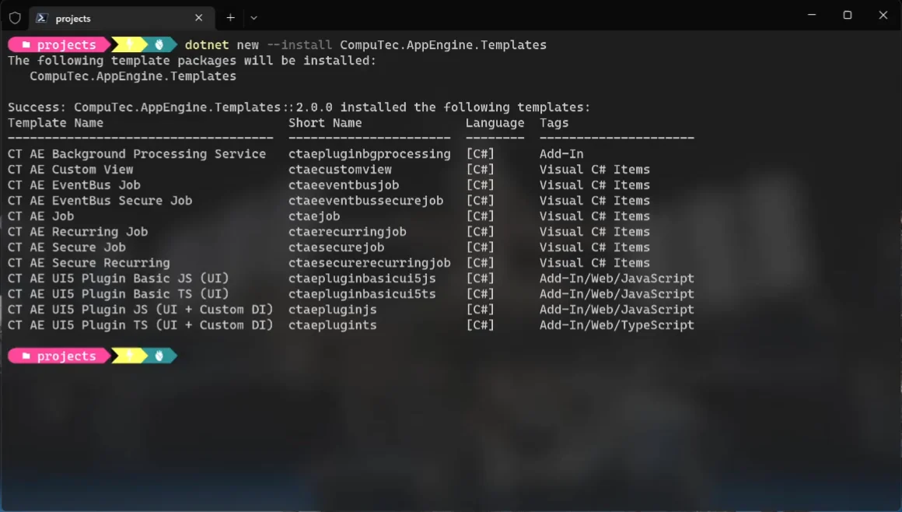
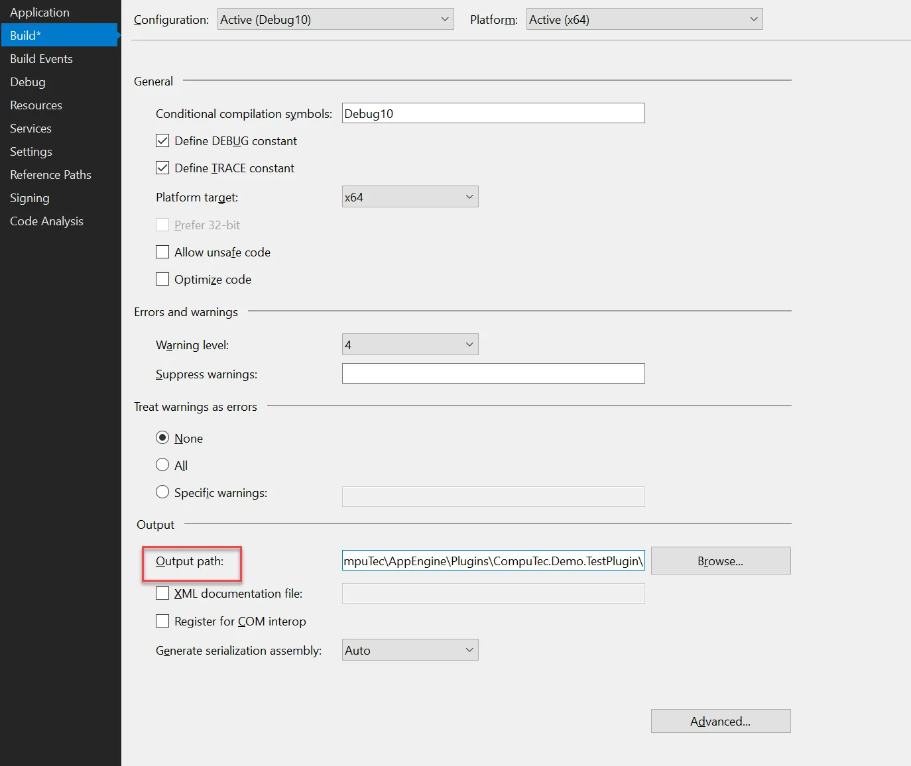
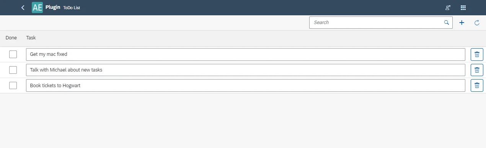

# CompuTec AppEngine Plugin Template for TypeScript

CompuTec AppEngine is a powerful extension framework designed to help developers build custom plugins for SAP Business One. With the TypeScript plugin template, you can create scalable and maintainable plugins using modern technologies like TypeScript and UI5.

This guide walks you through the steps to set up your development environment, create a new plugin using the CompuTec AppEngine template, and configure your project for a streamlined development workflow.

---

## Prerequisites

Before you begin, ensure the following software is installed on your machine: Node.js version 12 or higher.

## Create New Plugin Project

### Download

Navigate to the following address: [https://www.nuget.org/packages?q=computec](https://www.nuget.org/packages?q=computec), and download the CompuTec.AppEngine.Templates package.

### Adding

:::note
    In the following example, we’ll be using a template designed for an CompuTec AppEngine plugin that features a UI5 and JavaScript frontend.
:::

To install the template package, open Windows Terminal and run the following command:

    ```bash
dotnet new --install CompuTec.AppEngine.Templates::2.0.0
    ```

After installation, you'll see a confirmation message along with a list of installed templates. Currently, the package includes five ready-to-use plugin solution templates (tagged as 'Add-In' or 'Add-In/Web/Javascript'—these can be identified by the word 'plugin' in their names and short names), as well as seven plugin item templates (tagged as "Visual C# Items").



Once the package is installed, you can check the list again using the following command:

    ```bash
dotnet new --list AE
    ```

- Create a new folder for your plugin project (e.g., FirstPlugin):
- Go to the folder (cd .\FirstPlugin).
- Next, use the following command to generate a new plugin project using the desired template (in this case, ctaeplugints). Make sure to include the two required parameters:RoutePrefix (testPlugin in this example) and PluginID (Compu:Tec.AppEngine.Plugin.Test in this example):

        ```bash
    dotnet new ctaeplugints --RoutePrefix testPlugin --PluginId CompuTec.AppEngine.Plugin.Test
        ```

## Visual Studio – Configure Project Build and Debug

1. It's recommended to configure your project to build directly into the CompuTec AppEngine plugins directory, eliminating the need to manually copy files after each build.

    1. To do this, right-click on the plugin project and select properties.
    2. Open the Build tab, set up the Output path as shown below. CompuTec AppEngine stores all plugins in ProgramData/Computec/AppEngine/Plugins. Within this location, create a new folder named exactly as your plugin’s RoutePrefix (defined in the manifest.json file).

    

2. Once the build is complete, you can activate your plugin through the CompuTec AppEngine Administration Panel. For detailed instructions on this process, refer to the official documentation [here](../../../version-2.0/administrators-guide/configuration-and-administration/overview.md). After activation, your plugin will be available and accessible via the CompuTec AppEngine Launchpad.

    

---
