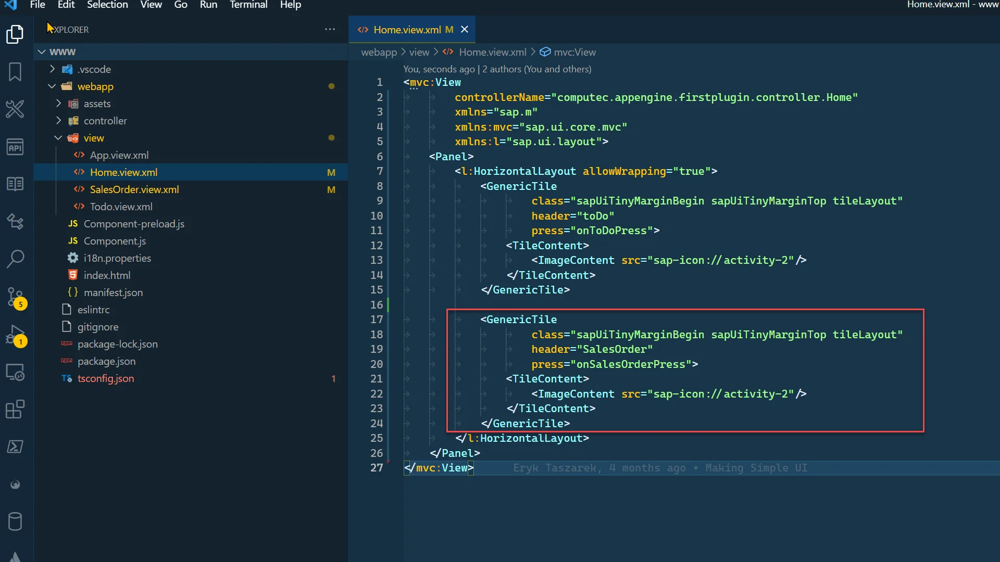

# Creating a Custom View

CompuTec AppEngine provides a mechanism for encapsulating complex database queries as simple structures and exposing them as REST API and OData.

---

## Features

- simplified data consumption in Web API client or UI
- supports OData V4
- supports SAP HANA and Microsoft SQL Server
- supports CompuTec AppEngine plugins
- the <i>**CustomViews**</i> folder is available in the CompuTec AppEngine installation directory, and ProgramData/CompuTec/AppEngine

## Usage

### Create a Custom View

1. Open your plugin project in Visual Studio.
2. Create a new folder (e.g., CustomView) by right-clicking on the project and selecting New Folder, then navigate into it.
3. Open the Terminal via View → Terminal.
4. Navigate to the newly created folder.
5. Create a new custom view by using the following command in Terminal (named SalesOrderList in the following example):

    ```javascript
    dotnet new ctaecustomview --name SalesOrderList
    ```

    
6. Open the properties of the added file and set up the following values:

    - Build Action to Content
    - Copy to Output Directory to "Copy if newer."

    
7. Open the created file and define queries for HANA and MSSQL in the following structure:

   - **ID**: A unique identifier for the Custom View. This will be used to fetch data from the view.
   - **Description**: A meaningful description to help developers understand the purpose of the view.
   - **Source**:
        - **Hana**: SQL Query for HANA server type.
        - **MsSql**: SQL Query for MSSQL server type.
8. Below is an example of how a view is defined:

    SalesOrderList.customview.json

    ```json
    {
    "Id": "SalesOrderList",
    "Description": "Sales Order List",
    "Source": {
        "Hana": "SELECT \"DocEntry\", \"DocNum\", \"CardCode\", \"CardName\" FROM ORDR",
        "MsSql": "SELECT DocEntry, DocNum, CardCode, CardName  FROM ORDR"
    }
    }
    ```

### Bind Custom View to Control in UI5

1. To bind the custom view we created to our control, use the following syntax:

    ```text
    AE>/CustomViews/Views.Custom(Id='<PluginId>:<ViewId>')
    ```

2. Open the www folder in your preferred IDE. In the examples below, we’ll be using Visual Studio Code.
3. Navigate to the view folder and create a new file named SalesOrder.view.xml.

    
4. Add View definition and table definition in it:

    SalesOrder.view.xml

    ```xml
    <mvc:View
            xmlns:mvc="sap.ui.core.mvc"
            xmlns="sap.m">
        <Table items="{AE>/CustomViews/Views.Custom(Id='FirstPlugin%3ASalesOrderList')}">
            <headerToolbar>
                <Toolbar>
                    <Title text="Sales Orders List"/>
                </Toolbar>
            </headerToolbar>
            <columns>
                <Column>
                    <Text text="Document Number"/>
                </Column>
                <Column>
                    <Text text="Business Partner"/>
                </Column>
            </columns>
            <items>
                <ColumnListItem>
                    <cells>
                        <ObjectIdentifier
                                title="{path: 'AE>DocNum', type: 'sap.ui.model.odata.type.Int32'}"
                                text="{path: 'AE>DocEntry', type: 'sap.ui.model.odata.type.Int32'}"/>
                        <ObjectIdentifier
                                title="{path: 'AE>CardName', type: 'sap.ui.model.odata.type.String'}"
                                text="{path: 'AE>CardCode', type: 'sap.ui.model.odata.type.String'}"/>
                    </cells>
                </ColumnListItem>
            </items>
        </Table>
    </mvc:View>
    ```

5. As you can see, we bind our custom view to the items aggregation of the Table control. The alias AE refers to the model available when your plugin runs inside the Launchpad environment (ensure your plugin’s Component extends Computec.AppEngine.ui.core.Component).

    Important: When specifying the Custom View ID, replace the colon (:) with its URL-encoded equivalent %3A, as shown below:

    
6. When binding controls within the table, you must define a data type. This step is essential for Custom Views, as they do not have a $metadata definition available.

    

### Test of Created View

1. To test our view, set up a route to it. To do this, open the manifest.json file.
2. Add a route and target as shown below:

    
3. Now, navigate to this path manually: `http://localhost:54000/webcontent/launchpad/webapp/Index.html#/plugin/computec.appengine.firstplugin&salesorder`
4. Optionally, you can add a tile to the Home view with navigation, as shown below.

#### Adding Navigation to the Sales Orders View

1. Edit Home.view.xml.
2. Add the following Tile inside the Horizontal Layout.

    Home.view.xml

    ```xml
    <GenericTile
        class="sapUiTinyMarginBegin sapUiTinyMarginTop tileLayout"
        header="SalesOrder"
        press="onSalesOrderPress">
        <TileContent>
            <ImageContent src="sap-icon://activity-2"/>
        </TileContent>
    </GenericTile>
    ```

    
3. Now, add the "onSalesOrderPress" function to Home.controller.js.

    Home.controller.js

    ```js
    onSalesOrderPress: function (env) {
        var router = this.  getRouter();
        router.navTo("salesorder");
    },
    ```

    

#### Results

1. Plugin Navigation Tiles.

    
2. Sales Orders view.

    

---
