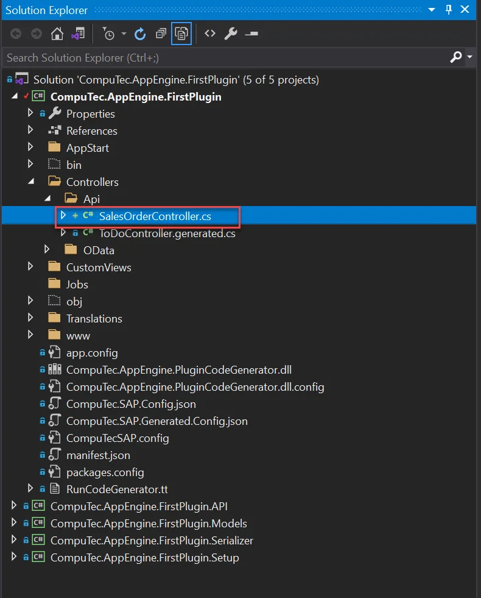
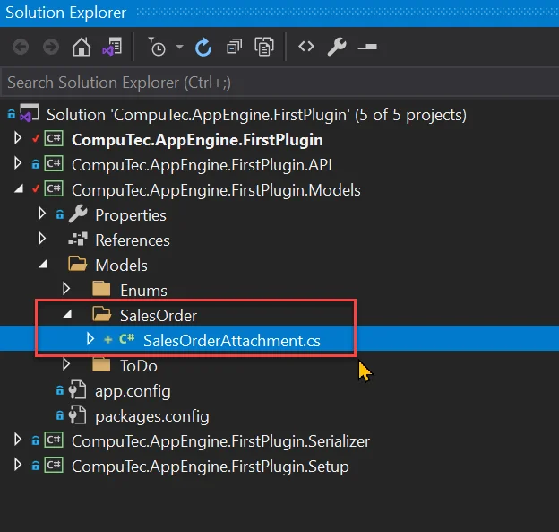
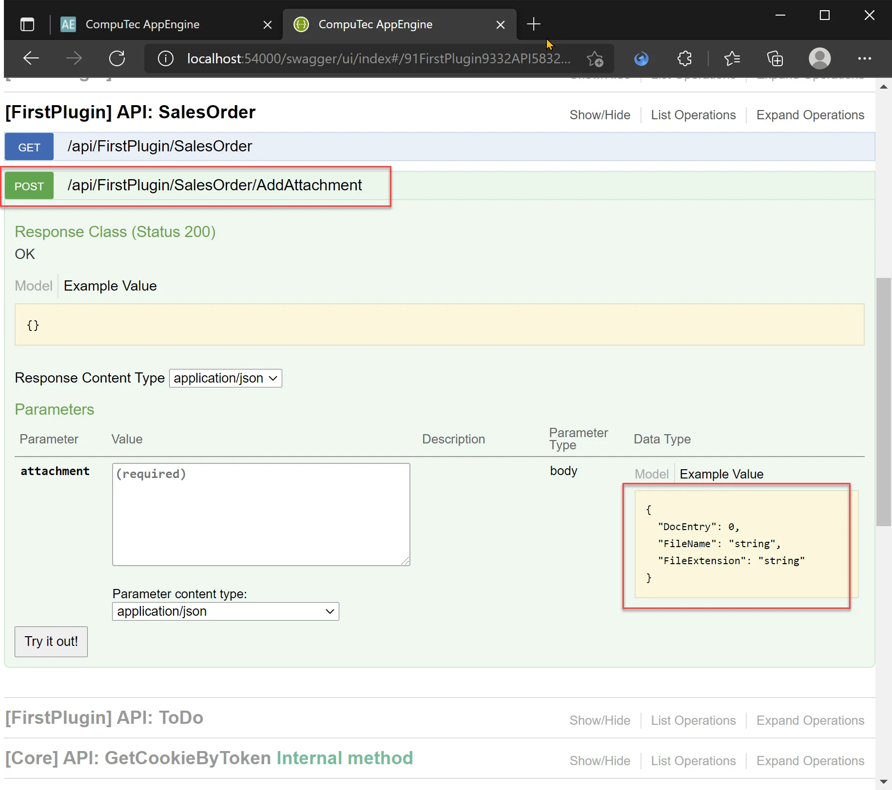
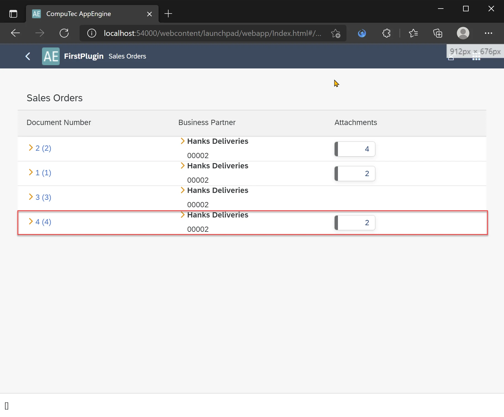
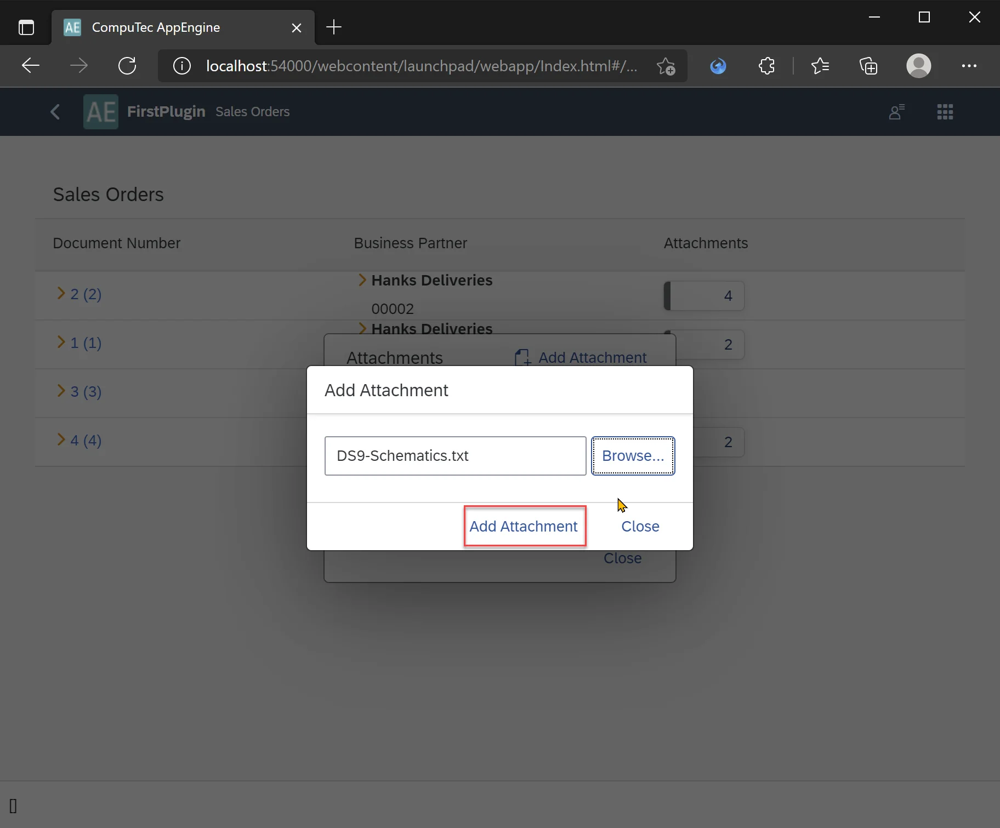
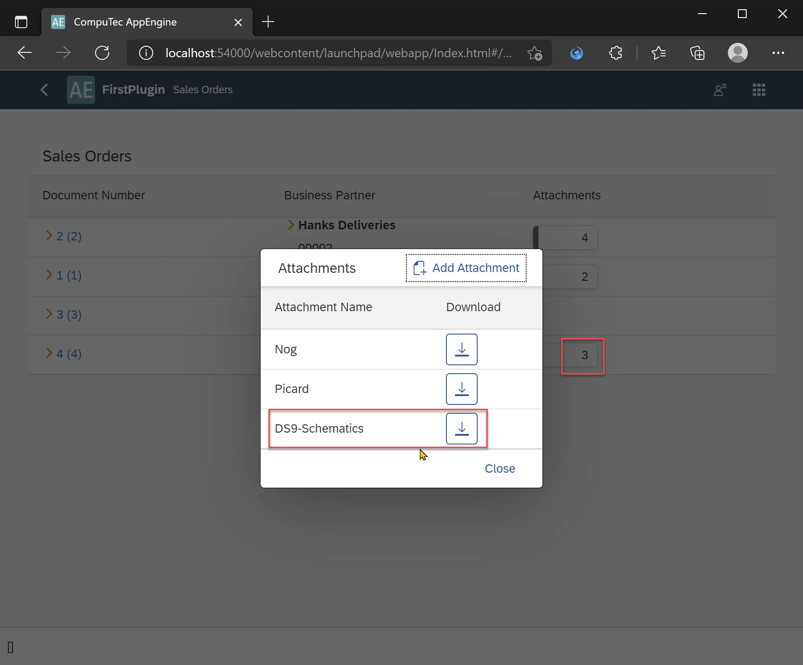
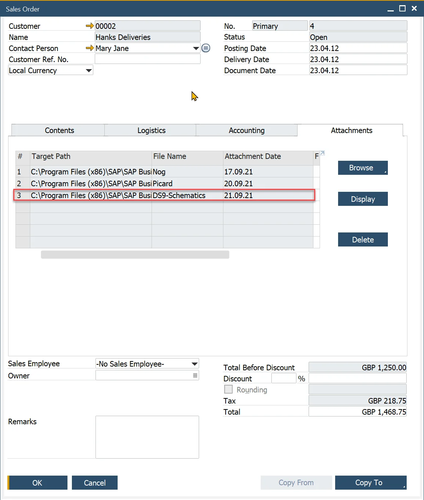

# Custom Controller

In this example, we will demonstrate how to add a custom controller. This tutorial builds upon the previous [Attachments](./attachments.md tutorial. In the previous example, we used the built-in CompuTec AppEngine Attachments controller to upload attachments. In this new example, we will create a custom controller that handles the task of adding an uploaded attachment to a selected Sales Order.

---

## Creating Custom Controller

1. Open your Plugin solution in Visual Studio.
2. Create a new class SalesOrderController.cs inside the Controllers/Api folder.

    
3. This controller should inherit from CompuTec.AppEngine.Base.Infrastructure.Controllers.API.AppEngineSecureController, as user authentication is required to work with SAP documents.

    SalesOrderController.cs

    ```csharp
    using CompuTec.AppEngine.Base.Infrastructure.Controllers.API;

    namespace CompuTec.AppEngine.FirstPlugin.Controllers.Api
    {
        public class SalesOrderController : AppEngineSecureController
        {

        }
    }
    ```

4. Now, we will add a simple model to pass parameters. First, create a new folder in your plugin model project called SalesOrder.
5. Inside this folder, add a new file named SalesOrderAttachment.cs and define it as follows:

    

    SalesOrderAttachment.cs

    ```csharp
    namespace CompuTec.AppEngine.FirstPlugin.Models.Models.SalesOrder
    {
        public class SalesOrderAttachment
        {
            public int DocEntry { get; set; }
            public string FileName { get; set; }
            public string FileExtension { get; set; }

        }
    }
    ```

6. We will need two methods to retrieve Objects from SAP.

    - GetSalesOrder – this metod will load SalesOrder.

        ```csharp
        private Documents GetSalesOrder(int DocEntry)
                {
                    Documents SalesOrder = Company.GetBusinessObject(BaseLayer.DI.BoObjectTypes.oOrders);
                    if (!SalesOrder.GetByKey(DocEntry))
                        throw new System.Exception($"Couldn't load Sales Order with DocEntry: {DocEntry}");

                    return SalesOrder;
                }
        ```

    - **GetAttachment** – This method will create a new Attachments object and load it from the database if it already exists for the given Sales Order.

        ```csharp
        private Attachments2 GetAttachment(int AtcEntry)
                {
                    Attachments2 atc = Company.GetBusinessObject(BaseLayer.DI.BoObjectTypes.oAttachments2);
                    if (AtcEntry > 0)
                    {
                        if (!atc.GetByKey(AtcEntry))
                        {
                            throw new System.Exception($"Fatal error. Couldn't load Attachment witch AbsoluteEntry: {AtcEntry}");
                        }
                    }
                    return atc;
                }
        ```

    - **GetAttachmentsPath** – This method will return the attachment path based on the SAP configuration. We will need this path as the source for our attachment, and it will also be the location where the CompuTec AppEngine Attachments controller will upload the attachments.

        ```chsarp
        public string GetAttachmentsPath()
                {
                    var result = "";

                    var qm = new QueryManager();
                    qm.CommandText = "select \"AttachPath\" from \"OADP\" ";

                    using (var rs = qm.Execute(Session.Token))
                    {
                        result = rs.Fields.Item("AttachPath").Value.ToString();
                    }

                    return result;
                }
        ```

    - **AddAttachment** – this is controller method that will add attachment information to Sales Order
    - The HttpPost annotation signifies that this is a POST method.
    - The route specifies the path to our method.
    - For the input parameter, we are using a simple model created earlie – SalesOrderAttachment

        AddAttachment

        ```csharp
        [HttpPost]
        [Route("AddAttachment")]
        public IHttpActionResult AddAttachment([FromBody] SalesOrderAttachment attachment)
        {
            Documents so = GetSalesOrder(attachment.DocEntry);
            Attachments2 atc = GetAttachment(so.AttachmentEntry);

            bool firstAttachment = false;

            if (atc.AbsoluteEntry == 0)
                firstAttachment = true;

            string AtcPath = GetAttachmentsPath();

            atc.Lines.SetCurrentLine(atc.Lines.Count - 1);
            if (!string.IsNullOrWhiteSpace(atc.Lines.FileName))
                atc.Lines.Add();
            atc.Lines.SourcePath = AtcPath.TrimEnd('\\');
            atc.Lines.FileName = attachment.FileName;
            atc.Lines.FileExtension = attachment.FileExtension;

            int res;
            if (firstAttachment)
                res = atc.Add();
            else
                res = atc.Update();

            if (res != 0)
                throw new Exception($"Adding attachment failed: {Company.GetLastErrorDescription()}");

            if (firstAttachment)
            {
                so.AttachmentEntry = Int32.Parse(Company.GetNewObjectKey());
                if (so.Update() != 0)
                    throw new Exception($"Exception while updating attachment info to Sales Order: {Company.GetLastErrorDescription()}");
            }
            return Ok("");
        }
        ```

    - Finally, SalesOrderController.cs should look like this:

        SalesOrderController.cs

        ```csharp
        using CompuTec.AppEngine.Base.Infrastructure.Controllers.API;
        using CompuTec.AppEngine.Base.Infrastructure.Security;
        using CompuTec.AppEngine.FirstPlugin.Models.Models.SalesOrder;
        using CompuTec.BaseLayer.DI;
        using CompuTec.Core2.DI.Database;
        using System;
        using System.Web.Http;

        namespace CompuTec.AppEngine.FirstPlugin.Controllers.Api
        {
            public class SalesOrderController : AppEngineSecureController
            {


                [HttpPost]
                [Route("AddAttachment")]
                public IHttpActionResult AddAttachment([FromBody] SalesOrderAttachment attachment)
                {
                    Documents so = GetSalesOrder(attachment.DocEntry);
                    Attachments2 atc = GetAttachment(so.AttachmentEntry);

                    bool firstAttachment = false;

                    if (atc.AbsoluteEntry == 0)
                        firstAttachment = true;

                    string AtcPath = GetAttachmentsPath();

                    atc.Lines.SetCurrentLine(atc.Lines.Count - 1);
                    if (!string.IsNullOrWhiteSpace(atc.Lines.FileName))
                        atc.Lines.Add();
                    atc.Lines.SourcePath = AtcPath.TrimEnd('\\');
                    atc.Lines.FileName = attachment.FileName;
                    atc.Lines.FileExtension = attachment.FileExtension;

                    int res;
                    if (firstAttachment)
                        res = atc.Add();
                    else
                        res = atc.Update();

                    if (res != 0)
                        throw new Exception($"Adding attachment failed: {Company.GetLastErrorDescription()}");

                    if (firstAttachment)
                    {
                        so.AttachmentEntry = Int32.Parse(Company.GetNewObjectKey());
                        if (so.Update() != 0)
                            throw new Exception($"Exception while updating attachment info to Sales Order: {Company.GetLastErrorDescription()}");
                    }
                    return Ok("");
                }


                private Attachments2 GetAttachment(int AtcEntry)
                {
                    Attachments2 atc = Company.GetBusinessObject(BaseLayer.DI.BoObjectTypes.oAttachments2);
                    if (AtcEntry > 0)
                    {
                        if (!atc.GetByKey(AtcEntry))
                        {
                            throw new System.Exception($"Fatal error. Couldn't load Attachment witch AbsoluteEntry: {AtcEntry}");
                        }
                    }
                    return atc;
                }

                private Documents GetSalesOrder(int DocEntry)
                {
                    Documents SalesOrder = Company.GetBusinessObject(BaseLayer.DI.BoObjectTypes.oOrders);
                    if (!SalesOrder.GetByKey(DocEntry))
                        throw new System.Exception($"Couldn't load Sales Order with DocEntry: {DocEntry}");

                    return SalesOrder;
                }

                public string GetAttachmentsPath()
                {
                    var result = "";

                    var qm = new QueryManager();
                    qm.CommandText = "select \"AttachPath\" from \"OADP\" ";

                    using (var rs = qm.Execute(Session.Token))
                    {
                        result = rs.Fields.Item("AttachPath").Value.ToString();
                    }

                    return result;
                }
            }
        }
        ```

7. Now, we should see our method in swagger.

    

## Using Custom Controller on Frontend

Having our custom controller in place, we cannot use it in our UI5 application. After uploading files using the CompuTec AppEngine Attachments controller, we will call the newly created api/FirstPlugin/SalesOrder/AddAttachment method to add an attachment to Sales Order. After that, we will refresh the attachment's information on our dialog and list.

1. First, we will modify our AttachmentsDialog view to include SalesOrder DocEntry and AtcEntry that we will use later. Open SalesOrder.controller.js and change method onAttachmentsButtonPress:

    - Retrieve the DocEntry from the GenericTag.
    - Update the model for the view to include AtcEntry and DocEntry.
    - Ensure the attachments array is now stored in the Attachments field.

    onAttachmentsButtonPress

    ```js
    onAttachmentsButtonPress: async function (oEvent) {
        /** @type {sap.m.GenericTag} */
        const oGenericTag = oEvent.getSource();

        const nAtcEntry = this.getCustomDataForElement(oGenericTag, "AtcEntry");

        const nDocEntry = this.getCustomDataForElement(oGenericTag, "DocEntry");

        const result = await this.getAttachmentsByDocEntry(nAtcEntry);
        const data = {
            Attachmnets: result.value,
            DocEntry: nDocEntry,
            AtcEntry: nAtcEntry
        };
        this.onOpenDialog(data);
    },
    ```

2. Add DocEntry attribute to our GenericTag.

    - Open SalesOrder.view.xml and add attribute DocEntry custom data:

        ```xml
        app:DocEntry="{path: 'AE>DocEntry', type: 'sap.ui.model.odata.type.Int32'}"
        ```

    - Add id attribute to Table and set it to salesOrdersTable. We will need it to refresh data in table later in code.
    - Finaly your SalesOrder.view.xml should look like this:

        SalesOrder.view.xml

        ```xml
        <mvc:View
                controllerName="computec.appengine.firstplugin.controller.SalesOrder"
                xmlns:mvc="sap.ui.core.mvc"
                xmlns:ae="computec.appengine.ui.controls"
                xmlns:app="http://schemas.sap.com/sapui5/extension/sap.ui.core.CustomData/1"
                xmlns="sap.m">
            <Table
                    id="salesOrdersTable"
                    inset="true"
                    items="{AE>/CustomViews/Views.Custom(Id='FirstPlugin%3ASalesOrderList')}">
                <headerToolbar>
                    <Toolbar>
                        <Title text="{i18n>salesOrderTableTitle}"/>
                    </Toolbar>
                </headerToolbar>
                <columns>
                    <Column>
                        <Text text="{i18n>salesOrderDocumentNumberColumnLabel}"/>
                    </Column>
                    <Column>
                        <Text text="{i18n>salesOrderBusinessPartnerColumnLabel}"/>
                    </Column>
                    <Column>
                        <Text text="{i18n>salesOrderAttachmentsColumnLabel}"/>
                    </Column>
                </columns>
                <items>
                    <ColumnListItem>
                        <cells>
                            <ae:Link
                                    text="{path: 'AE>DocNum', type: 'sap.ui.model.odata.type.Int32'} ({path: 'AE>DocEntry', type: 'sap.ui.model.odata.type.Int32'})"
                                    objectType="fo_Order"
                                    objectSubType=""
                                    key="{path: 'AE>DocEntry', type: 'sap.ui.model.odata.type.Int32'}"/>
                            <HBox>
                                <ae:Link
                                        text=""
                                        objectType="fo_BusinessPartner"
                                        objectSubType=""
                                        key="{path: 'AE>CardCode', type: 'sap.ui.model.odata.type.String'}"/>
                                <ObjectIdentifier
                                        title="{path: 'AE>CardName', type: 'sap.ui.model.odata.type.String'}"
                                        text="{path: 'AE>CardCode', type: 'sap.ui.model.odata.type.String'}"/>
                            </HBox>
                            <GenericTag
                                    app:AtcEntry="{path: 'AE>AtcEntry', type: 'sap.ui.model.odata.type.Int32'}"
                                    app:DocEntry="{path: 'AE>DocEntry', type: 'sap.ui.model.odata.type.Int32'}"
                                    design="StatusIconHidden"
                                    visible="{= %{path: 'AE>NumberOfAttachments', type: 'sap.ui.model.odata.type.Int32'} > 0}"
                                    press=".onAttachmentsButtonPress">
                                <ObjectNumber
                                        state="Information"
                                        emphasized="false"
                                        number="{path: 'AE>NumberOfAttachments', type: 'sap.ui.model.odata.type.Int32'}"
                                        unit=""/>
                            </GenericTag>
                        </cells>
                    </ColumnListItem>
                </items>
            </Table>
        </mvc:View>
        ```

3. Because we changed our Attachmnets Dialog model, we need to fix binding in SalesOrderAttachmentsDialog.fragment.xml. We only need to change Table items binding from `"{AT>/}" to "{AT>/Attachmnets}"`.

    SalesOrderAttachmentsDialog.fragment.xml

    ```xml
    <core:FragmentDefinition
            xmlns="sap.m"
            xmlns:core="sap.ui.core"
            xmlns:app="http://schemas.sap.com/sapui5/extension/sap.ui.core.CustomData/1">
        <Dialog title="Attachments">
            <customHeader>
                <OverflowToolbar>
                    <Title text="Attachments"/>
                    <ToolbarSpacer/>
                    <Button
                            icon="sap-icon://add-document"
                            text="Add Attachment"
                            press=".onAttachmentDialogAddAttachment"></Button>
                </OverflowToolbar>
            </customHeader>
            <Table
                    growing="true"
                    growingThreshold="10"
                    inset="false"
                    items="{AT>/Attachmnets}"
                    fixedLayout="false">
                <columns>
                    <Column>
                        <Text text="Attachment Name"/>
                    </Column>
                    <Column>
                        <Text text="Download"/>
                    </Column>
                </columns>
                <items>
                    <ColumnListItem>
                        <cells>
                            <Text text="{path: 'AT>FileName'}"/>
                            <Button
                                    icon="sap-icon://download"
                                    press=".onAttachmentsDialogDownloadInNewTab"
                                    app:AbsEntry="{path: 'AT>AbsEntry'}"
                                    app:Line="{path: 'AT>Line'}"/>
                        </cells>
                    </ColumnListItem>
                </items>
            </Table>
            <endButton>
                <Button
                        text="Close"
                        press=".onAttachmentsDialogCloseFragment"/>
            </endButton>
        </Dialog>
    </core:FragmentDefinition>
    ```

4. Lastly, Add logic to SalesOrder.controller.js

    - \_post function will allow as to run REST POST method

        ```js
        _post: function (sData, sUrl) {
            return new Promise((resolve, reject) => {
                Http.request({
                    method: 'POST',
                    withAuth: true,
                    url: sUrl,
                    data: sData,
                    done: resolve,
                    fail: reject
                });
            });
        },
        ```

    - \_addAttachmentToSalesOrder – This function adds the information about the uploaded attachment to the specified Sales Order. To do this, we need to provide the Sales Order's DocEntry and the name of the uploaded file. Inside the function, we prepare a parameters model that matches the SalesOrderAttachment model on the backend. Finally, we call the api/FirstPlugin/SalesOrder/AddAttachment POST method and wait for its completion.

        ```js
        _addAttachmentToSalesOrder: async function (nSalesOrderDocEntry, sFileName) {
            const sUrl = `api/FirstPlugin/SalesOrder/AddAttachment`;
            const aNameParts = sFileName.split(".");
            let sExtension = null;
            if (aNameParts.length > 1)
                sExtension = aNameParts.pop();

            const sName = aNameParts.join(".");

            const oParams = {
                "DocEntry": nSalesOrderDocEntry,
                "FileName": sName,
                "FileExtension": sExtension
            };

            try {
                const res = await this._post(JSON.stringify(oParams), sUrl);
                return;
            } catch (error) {
                throw error;
            }
        },
        ```

    - \_refreshAttachments – this function refresh attachments in our dialog. Here we need AtcEntry.

        ```js
        _refreshAttachments: async function () {
            const oATModel = this._attachmentsDialog.getModel("AT");
            const nAtcEntry = oATModel.getProperty("/AtcEntry");

            const result = await this.getAttachmentsByDocEntry(nAtcEntry);

            oATModel.setProperty("/Attachmnets", result.value);
            oATModel.refresh();
        },
        ```

    - onSalesOrderRefresh – This function is responsible for refreshing the data in the Sales Orders table. It's essential to call this after adding an attachment to ensure the updated attachment count is accurately reflected in the table.

        ```js
        onSalesOrderRefresh: function () {
            this.byId('salesOrdersTable').getModel("AE").refresh();
        },
        ```

    - Finally, we can trigger our newly implemented logic by updating the onAddAttachmentSubmit function. To do this, we will replace the existing code with our custom logic.

        old:

        ```js
        const aAttachments = oATModel.getProperty("/");
        aAttachments.push({
            FileName: file.name
        });
        oATModel.refresh();
        ```

        with new:

        ```js
        const DocEntry = oATModel.getProperty("/DocEntry");
        await this._addAttachmentToSalesOrder(DocEntry, file.name);
        this._refreshAttachments();
        this.onSalesOrderRefresh();

        ```

        As you can see we are retrieveing DocEntry from Attachment Dialog model and using it to call \_addAttachmentToSalesOrder. After this is done we run \_refreshAttachments() and onSalesOrderRefresh() to refresh data inside dialog and table.

    - SalesOrder.controller.js implementation after changes:

        ```js
        sap.ui.define([
            "computec/appengine/core/BaseController",
            "sap/ui/core/Fragment",
            "sap/ui/model/json/JSONModel",
            "computec/appengine/ui/model/http/Http"
        ],
            /**
             *
            * @param {typeof computec.appengine.core.BaseController} BaseController
            * @param {typeof sap.ui.core.Fragment} Fragment
            * @param {typeof sap.ui.model.json.JSONModel} JSONModel
            * @param {typeof computec.appengine.ui.model.http.Http} Http
            * @returns
            */
            function (BaseController, Fragment, JSONModel, Http) {
                "use strict";

                return BaseController.extend("computec.appengine.firstPlugin.controller.SalesOrder", {
                    _attachmentsAddDialog: null,
                    onInit: function () {
                        BaseController.prototype.onInit.call(this);
                        this.setPageName("Sales Orders");
                    },
                    onAttachmentsButtonPress: async function (oEvent) {
                        /** @type {sap.m.GenericTag} */
                        const oGenericTag = oEvent.getSource();

                        const nAtcEntry = this.getCustomDataForElement(oGenericTag, "AtcEntry");
                        const nDocEntry = this.getCustomDataForElement(oGenericTag, "DocEntry");


                        const result = await this.getAttachmentsByDocEntry(nAtcEntry);
                        const data = {
                            Attachmnets: result.value,
                            DocEntry: nDocEntry,
                            AtcEntry: nAtcEntry
                        };
                        this.onOpenDialog(data);
                    },

                    onSalesOrderRefresh: function () {
                        this.byId('salesOrdersTable').getModel("AE").refresh();
                    },

                    onOpenDialog: async function (data) {
                        const oView = this.getView();

                        if (!this._attachmentsDialog) {
                            this._attachmentsDialog = await Fragment.load({
                                id: oView.getId(),
                                name: "computec.appengine.firstplugin.view.SalesOrderAttachmentsDialog",
                                controller: this
                            });
                            oView.addDependent(this._attachmentsDialog);
                        }

                        this._attachmentsDialog.setModel(new JSONModel(data), "AT");
                        this._attachmentsDialog.open();
                    },
                    onAttachmentsDialogCloseFragment: function () {
                        this._attachmentsDialog.close();
                    },
                    onAttachmentsDialogDownloadInNewTab: function (oEvent) {
                        const oSource = oEvent.getSource();
                        const AbsEntry = this.getCustomDataForElement(oSource, "AbsEntry");
                        const Line = this.getCustomDataForElement(oSource, "Line");
                        const sUrl = `${window.location.origin}/api/Attachments/GetAttachmentByCustomKey/ORDR/DocEntry/${AbsEntry}/null/${Line}`;
                        window.open(sUrl, '_blank');
                    },


                    //#region ADD ATTACHMENTS DIALOG
                    onAttachmentDialogAddAttachment: async function (oEvent) {
                        await this.onOpenAddAttachmentDialog();
                    },
                    onOpenAddAttachmentDialog: async function (data) {
                        const oView = this.getView();
                        if (!this._attachmentsAddDialog) {
                            this._attachmentsAddDialog = await Fragment.load({
                                id: oView.getId(),
                                name: "computec.appengine.firstplugin.view.SalesOrderAttachmentsDialogAdd",
                                controller: this
                            });
                            oView.addDependent(this._attachmentsAddDialog);
                        }
                        this._attachmentsAddDialog.open();
                    },
                    onAddAttachmentSubmit: async function () {
                        /** @type {sap.ui.unified.FileUploader} */
                        const oFileUploader = this.byId("FileUploader");
                        let domRef = oFileUploader.getFocusDomRef(),
                            file = domRef.files[0];
                        if (!file) {
                            alert("No File Uploaded!");
                            return;
                        }
                        const fromData = new FormData();
                        fromData.append("file", file);
                        const sUrl = `${window.location.origin}/api/Attachments/SetAttachment/false/false`;

                        try {
                            const response = await fetch(sUrl, {
                                method: 'POST',
                                body: fromData
                            });
                            console.log(response);
                            const oATModel = this._attachmentsDialog.getModel("AT");
                            const DocEntry = oATModel.getProperty("/DocEntry");
                            await this._addAttachmentToSalesOrder(DocEntry, file.name);
                            this._refreshAttachments();
                            this.onSalesOrderRefresh();
                        } catch (oError) {
                            console.log(oError);
                        } finally {
                            this.onAddAttachmentDialogClose();
                        }
                    },
                    onAddAttachmentDialogClose: function () {
                        this._attachmentsAddDialog.close();
                    },
                    //#endregion

                    // #region INTERNAL
                    getCustomDataForElement: function (oElement, sCustomDataCode) {
                        let oCustomData = oElement.getCustomData().find(x => x.getKey() === sCustomDataCode);
                        if (oCustomData)
                            return oCustomData.getValue();
                        return null;
                    },
                    findElementByCustomId: function (oDialog, sCustomId) {
                        const oCtr = oDialog.findElements(true).find(
                            el => {
                                let sElId = this.getCustomDataForElement(el, "id");
                                return sElId == sCustomId;
                            }
                        );
                        return oCtr;
                    },
                    getAttachmentsByDocEntry: function (sDocNum) {
                        const sUrl = encodeURIComponent(`odata/CustomViews/Views.CustomWithParameters(Id='FirstPlugin:Attachments',Parameters=["AbsEntry=${sDocNum}"],paramType=Default.ParamType'Custom')`);
                        return this._get(sUrl);
                    },

                    _refreshAttachments: async function () {
                        const oATModel = this._attachmentsDialog.getModel("AT");
                        const nAtcEntry = oATModel.getProperty("/AtcEntry");

                        const result = await this.getAttachmentsByDocEntry(nAtcEntry);

                        oATModel.setProperty("/Attachmnets", result.value);
                        oATModel.refresh();
                    },

                    _addAttachmentToSalesOrder: async function (nSalesOrderDocEntry, sFileName) {
                        const sUrl = `api/FirstPlugin/SalesOrder/AddAttachment`;
                        const aNameParts = sFileName.split(".");
                        let sExtension = null;
                        if (aNameParts.length > 1)
                            sExtension = aNameParts.pop();

                        const sName = aNameParts.join(".");

                        const oParams = {
                            "DocEntry": nSalesOrderDocEntry,
                            "FileName": sName,
                            "FileExtension": sExtension
                        };

                        try {
                            const res = await this._post(JSON.stringify(oParams), sUrl);
                            return;
                        } catch (error) {
                            throw error;
                        }
                    },

                    _get: function (sUrl) {
                        return new Promise((resolve, reject) => {
                            Http.request({
                                method: 'GET',
                                withAuth: true,
                                url: sUrl,
                                done: resolve,
                                fail: reject
                            });
                        });
                    },

                    _post: function (sData, sUrl) {
                        return new Promise((resolve, reject) => {
                            Http.request({
                                method: 'POST',
                                withAuth: true,
                                url: sUrl,
                                data: sData,
                                done: resolve,
                                fail: reject
                            });
                        });
                    },

                    //#endregion


                });
            });
        ```

## Results

To validate our solution, we tested it by adding an attachment to Sales Order number 4, which already had two existing attachments.



We selected a new file and confirmed our selection by clicking the Add Attachment button.



Once the attachment was uploaded and linked to the Sales Order, the Add Attachment dialog closed and the Sales Orders list refreshed automatically. The newly added attachment appeared in the Attachments dialog, where it could be downloaded. The attachment count in the background list also updated accordingly.



Finally, we verified the changes directly in SAP. The new attachment was successfully visible under the Attachments tab of the Sales Order document.



---
