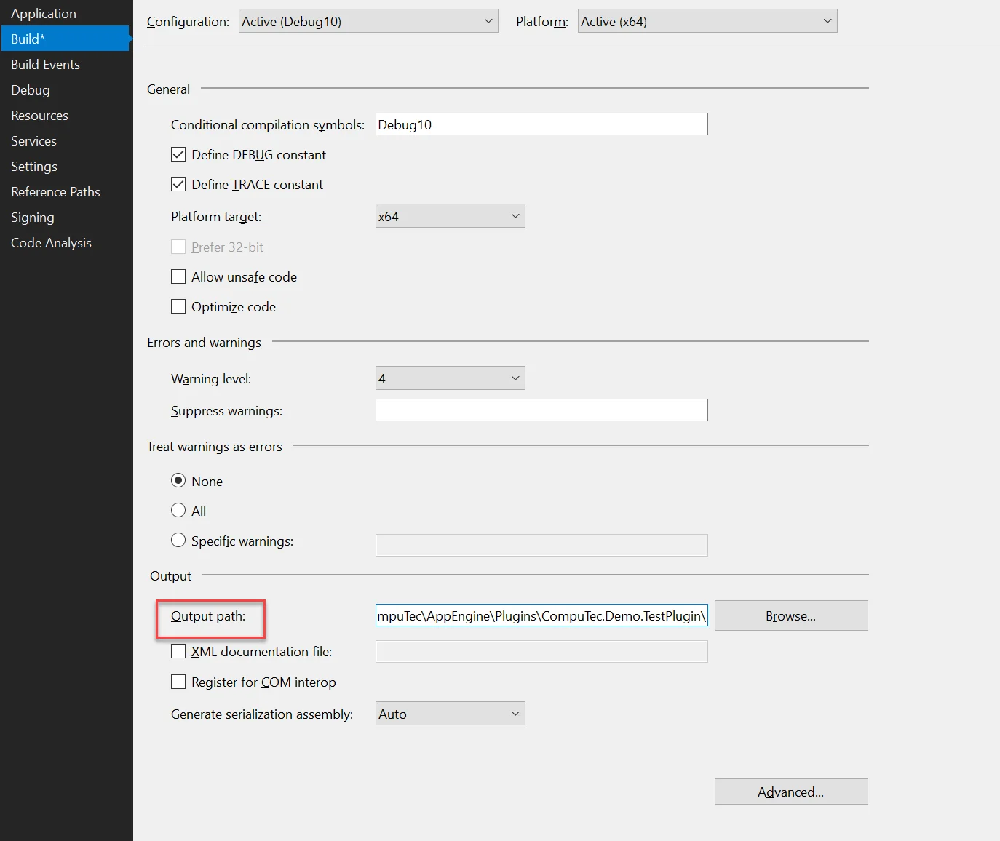
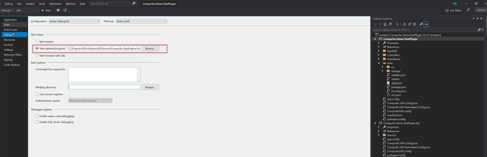

# Development Tips for CompuTec AppEngine and UI5 TypeScript

Developing plugins for CompuTec AppEngine with UI5 and TypeScript can be greatly streamlined by configuring your development environment for efficient build and debug cycles. This guide provides key setup tips for Visual Studio and Visual Studio Code, helping you speed up plugin development, testing, and deployment.

---

## Prerequisites

Ensure the following software is installed before starting: Node.js version 12 or higher

## Visual Studio Code Recommended Extensions

- SAP Fiori tools - Extension Pack
- UI5 Language Assistant
- XML Toolkit
- ESLint

## Recommended Configuration for Build and Debug

1. Set up build path for the Plugin project. Thanks to that, files will be build to the location where CompuTec AppEngine keeps all plugins.

    1. Open your Plugin Solution in Visual Studio
    2. Open Properties for Plugin Project.
    3. Open Build tab and set up Output path as shown below. CompuTec AppEngine stores all plugins in ProgramData/Computec/AppEngine/Plugins. There you can create a new folder with a name that is the same as Plugin Route (RoutePrefix in CompuTec AppEngine manifest.json).

    

    :::warning
        To run plugins without going through the installation procedure, CompuTec AppEngine must be set to DevMode. Instructions for configuring DevMode are provided in section III.
    :::

2. Set up debug in Visual Studio to enable running CompuTec AppEngine and your plugin in Debug mode.

    1. Open your Plugin Solution in Visual Studio.
    2. Open Properties for Plugin Project.
    3. Open Debug tab.
    4. Under Start Action, choose Start external program, and provide the path to CompuTec.AppEngine.Host.ConsoleApp.exe in installation directory. If you’re using the default installation, this file will be located in: Program Files\CompuTec\CompuTec AppEngine\CompuTec.AppEngine.Host.ConsoleApp.exe.

    

3. Configure CompuTec AppEngine to serve frontend files directly from your project directory. This allows you to make changes to the UI5 application and see them immediately without rebuilding each time.

    1. Start CompuTec.AppEngine.Host.ConsoleApp.exe either by debugging your plugin or from the command line. On the first run, CompuTec AppEngine will generate dedicated configuration files for debug mode in the ProgramData\Computec\AppEngine directory:

        1. dev_appengine.config
        2. dev_backgroundProcessing.config
    2. Stop the CompuTec.AppEngine.Host.ConsoleApp.exe process.
    3. To turn on debug mode on frontend, edit dev_appengine.config file.
    4. Update the following settings:

        1. Set DevMode to True
        2. Set UIDevMode to True
        3. Define DevUIMapping to point to your UI5 application’s source directory using the format `<PluginId>:<PluginPath>`. This tells CompuTec AppEngine to load frontend files directly from your development path rather than the default plugin directory.
    5. Path mapping example:

            ```json
            "DevMode": "True",
                "UIDevMode": "True",
                "DevUIMapping": {
                    "CompuTec.Demo.TestPlugin": "C:/Users/maciejp/source/repos/CompuTec.Demo.TestPlugin/CompuTec.Demo.TestPlugin/www"
                },
            ```

    6. Launch CompuTec.AppEngine.Host.ConsoleApp.exe to verify your configuration settings in the console output.

        
    7. Open the www folder of your plugin project in Visual Studio.
    8. In the terminal, run the build script in watch mode to automatically compile changes:

            ```bash
            npm run "watch:ts"
            ```

    9. Open the CompuTec AppEngine Administration Panel and activate your plugin if it hasn't been activated already.
    10. Navigate to CompuTec AppEngine Launchpad and launch your plugin.
    11. To verify that path mapping is configured correctly, make a small change in your UI5 application and refresh the browser to see if the update is reflected.

---
