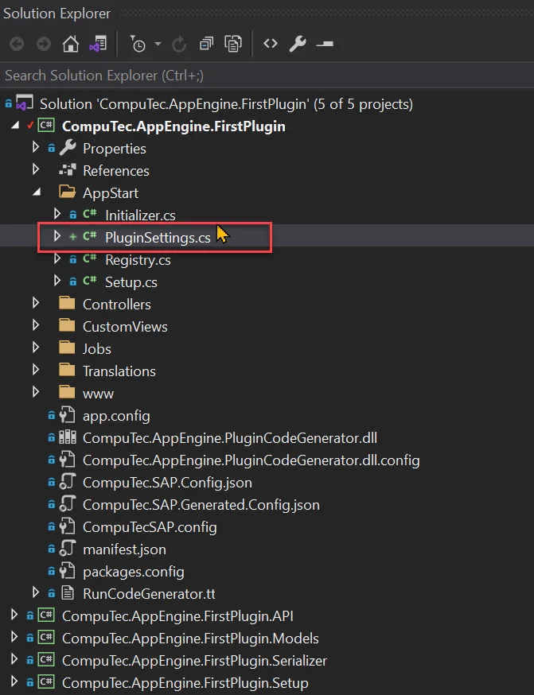
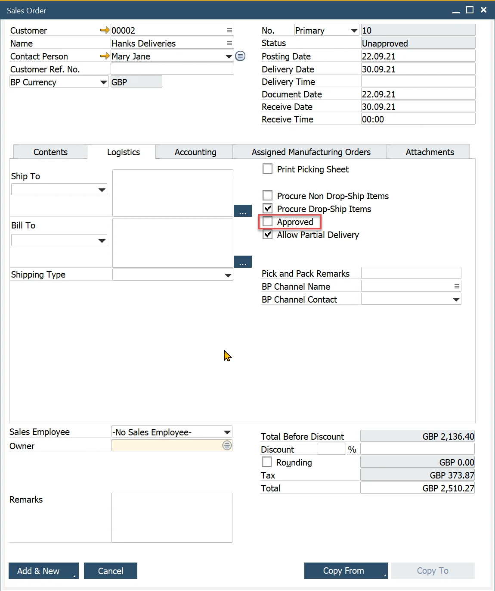

# Plugin Configuration

CompuTec AppEngine provides a powerful and flexible way to extend its capabilities using plugins. One essential feature of plugins is the ability to expose configurable settings that can be managed directly through the CompuTec AppEngine Administration Panel. These settings allow developers and administrators to dynamically control the behavior of their plugins without altering the codebase.

In this tutorial, we’ll walk through how to add custom configuration settings to a plugin - FirstPlugin and utilize those settings in a job called SalesOrderToApproveEventJob that we created in the previous tutorial.


---

## Adding Configuration to Plugin

1. Create new class PluginSettings.cs that implement abstract class `CompuTec.AppEngine.Base.Infrastructure.Configuration.SettingsCollection<IPluginConfiguration>`

    
2. You need to implement the GetSettings method, which is responsible for returning the configuration settings of the plugin.

    PluginSettings.cs

    ```csharp
    using CompuTec.AppEngine.Base.Infrastructure.Configuration;
    using CompuTec.AppEngine.Base.Infrastructure.Plugins;
    using System;
    using System.Collections.Generic;

    namespace CompuTec.AppEngine.FirstPlugin.AppStart
    {
        public class PluginSettings : SettingsCollection<IPluginConfiguration>
        {
            public override List<SettingDefinition> GetSettings()
            {
                throw new NotImplementedException();
            }
        }
    }
    ```

3. Let's add a simple configuration that allows us to set the priority for the Task created within the SalesOrderToApproveEventJob job.

    - Create new SettingDefinition lists

        `List<SettingDefinition> settings = new List<SettingDefinition>();`
    - Add new configuration node named SalesOrderToApproveEventJob

        `settings.Add(new SettingDefinition<Dictionary<string, object>>("SalesOrderToApproveEventJob", new Dictionary<string, object>(), false, true));`
    - Add TaskPriority setting inside this node. Notice that to do this you need to set Key as `<parentName>:<childName>`. Below we are defining also default value for this setting to Medium. You can also see that there is validationFunc declared - PriorityValidation.
        - key – setting name
        - defautlValue – setting a default value
        - validationFunc - function that will be used for validaton
        - secure – determines whether you will be able to see your setting in Administration Panel or not
        - editable – determines whether you can edit once made setting

        `settings.Add(new SettingDefinition<string>($"SalesOrderToApproveEventJob:TaskPriority", ToDoPriority.Medium.ToString(), PriorityValidation, null, false, true));`

    - Add validation function - PriorityValidation. Here we are just checking if value exists in ToDoPriority enumerator and if not we are displaying list of possible values.

        ```csharp
        public static void PriorityValidation(string key, string newStatus, IConfiguration configuration)
        {
            if (!Enum.TryParse<ToDoPriority>(newStatus, out var a))
            {
                List<string> allowedPriorities = new List<string>();
                foreach(var e in (typeof(ToDoPriority).GetEnumValues())) {
                    allowedPriorities.Add(e.ToString());
                }

                throw new AppEngineException($"Incorrect value for Priority: {newStatus}. Allowed values: {string.Join(",", allowedPriorities)}");
            }

        }
        ```

4. Finally, the PluginSettings.cs file should look like this:

    PluginSettings.cs

    ```csharp
    using CompuTec.AppEngine.Base.Infrastructure.Configuration;
    using CompuTec.AppEngine.Base.Infrastructure.Exceptions;
    using CompuTec.AppEngine.Base.Infrastructure.Plugins;
    using CompuTec.AppEngine.FirstPlugin.API.Enums;
    using System;
    using System.Collections.Generic;

    namespace CompuTec.AppEngine.FirstPlugin.AppStart
    {
        public class PluginSettings : SettingsCollection<IPluginConfiguration>
        {
            public override List<SettingDefinition> GetSettings()
            {
                List<SettingDefinition> settings = new List<SettingDefinition>();

                #region  SalesOrderToApproveEventJob node
                settings.Add(new SettingDefinition<Dictionary<string, object>>("SalesOrderToApproveEventJob", new Dictionary<string, object>(), false, true));

                settings.Add(new SettingDefinition<string>($"SalesOrderToApproveEventJob:TaskPriority", ToDoPriority.Medium.ToString(), PriorityValidation, null, false, true));
                #endregion

                return settings;
            }

            public static void PriorityValidation(string key, string newStatus, IConfiguration configuration)
            {
                if (!Enum.TryParse<ToDoPriority>(newStatus, out var a))
                {
                    List<string> allowedPriorities = new List<string>();
                    foreach (var e in (typeof(ToDoPriority).GetEnumValues()))
                    {
                        allowedPriorities.Add(e.ToString());
                    }

                    throw new AppEngineException($"Incorrect value for Priority: {newStatus}. Allowed values: {string.Join(",", allowedPriorities)}");
                }

            }
        }
    }
    ```

### Results

Once you rebuild and launch CompuTec AppEngine, your plugin configuration will be incorporated into CompuTec AppEngine configuration files (appengine.config or dev_appengine.config, depending on your environment). You can verify this by navigating to the Plugin Settings section in the Administration Panel.


The configuration is also reflected in the global CompuTec AppEngine settings:


You can check if validation works by trying to set incorrect value.


## Using Configuration Value Inside Job

Now that the plugin configuration has been added, it’s time to put it to use. We'll retrieve the configured value and apply it within the SalesOrderToApproveEventJob job.

1. Open configuration in Administration Panel and set Priority to Huge

    

2. Open the SalesOrderToApproveEventJob.cs file in Visual Studio and add a method named GetDefaultPriority. To retrieve the configured value, use the Get method on the configuration object with the appropriate key (the same key defined in the plugin configuration).  Then return the corresponding enumerator value.

    ```csharp
    private ToDoPriority GetDefaultPriority()
    {
        var configuration = Container.GetInstance<IPluginConfiguration>();
        string priority = configuration.Get<string>($"SalesOrderToApproveEventJob:TaskPriority");
        return (ToDoPriority)Enum.Parse(typeof(ToDoPriority), priority);
    }
    ```

3. Next, simply replace the line where the Task priority is set with the following:

    ```csharp
    toDoTask.U_Priority = GetDefaultPriority();
    ```

4. Finally after Job class should look like the following:

    SalesOrderToApproveEventJob.cs

    ```csharp
    using CompuTec.AppEngine.Base.Infrastructure.Jobs;
    using CompuTec.AppEngine.Base.Infrastructure.Jobs.Annotations;
    using CompuTec.AppEngine.Base.Infrastructure.Plugins;
    using CompuTec.AppEngine.Base.Infrastructure.Security;
    using CompuTec.AppEngine.FirstPlugin.API.BusinessObjects.ToDo;
    using CompuTec.AppEngine.FirstPlugin.API.Enums;
    using CompuTec.BaseLayer.DI;
    using CompuTec.Core2.DI.Database;
    using Newtonsoft.Json;
    using NLog;
    using StructureMap;
    using System;

    namespace CompuTec.AppEngine.FirstPlugin.Jobs
    {
        [EventBusJob(JobId = "SalesOrderToApproveEventJob", Description = "Crate new To Do Job for Added Sales Orders that are unapproved", ContentType = "17", ActionType = "A")]
        public class SalesOrderToApproveEventJob : EventBusSecureJob
        {
            Logger _logger;
            public SalesOrderToApproveEventJob(Session session, IContainer container, EventBus.Message message) : base(session, container, message)
            {
                _logger = container.GetInstance<Logger>();
            }

            public override void Call()
            {
                try
                {
                    _logger.Trace($"Job :SalesOrderToApproveEventJob Started for :{Message.Body}");
                    dynamic json = JsonConvert.DeserializeObject(Message.Body);
                    int DocEntry = json.DocEntry;

                    bool approved;
                    int DocNum;
                    using (CTRecordset rs = this.GetSalesOrderDetails(DocEntry))
                    {
                        DocNum = rs.Fields.Item("DocNum").Value;
                        string Confirmed = rs.Fields.Item("Confirmed").Value;
                        approved = Confirmed == "Y" ? true : false;
                    }

                    if (!approved)
                    {
                        AddNewToDoTask(DocNum);
                        _logger.Trace($"Job :SalesOrderToApproveEventJob finished successfully. To Do Task added");
                    }
                    else
                    {
                        _logger.Trace($"Job :SalesOrderToApproveEventJob finished successfully - Nothing to do, Sales Order already approved.");
                    }
                }
                catch (Exception e)
                {
                    _logger.Error(e, $"Job :SalesOrderToApproveEventJob failed:{e.Message}");
                    throw;
                }

            }

            private ToDoPriority GetDefaultPriority()
            {
                var configuration = Container.GetInstance<IPluginConfiguration>();
                string priority = configuration.Get<string>($"SalesOrderToApproveEventJob:TaskPriority");
                return (ToDoPriority)Enum.Parse(typeof(ToDoPriority), priority);
            }

            private void AddNewToDoTask(int DocNum)
            {
                IToDo toDoTask = CompuTec.Core2.CoreManager.GetUDO(Session.Token, "SAMPLE_TO_DO");
                toDoTask.U_TaskName = $"Confirmation";
                toDoTask.U_Description = $"Review Sales Order number {DocNum}";
                toDoTask.U_Priority = GetDefaultPriority();
                if (toDoTask.Add() != 0)
                    throw new Exception($"Exception while adding ToDo task: {Session.Company.GetLastErrorDescription()}");
            }

            private CTRecordset GetSalesOrderDetails(int DocEntry)
            {
                var qm = new QueryManager();
                qm.SetSimpleResultFields("DocEntry", "DocNum", "CardCode", "Confirmed");
                qm.SimpleTableName = "ORDR";
                qm.SetSimpleWhereFields("DocEntry");

                return qm.ExecuteSimpleParameters(Session.Token, DocEntry);
            }
        }
    }
    ```

## Results

Now, when a new unapproved Sales Order is added, a corresponding task with the priority set to Huge should be created.




---
