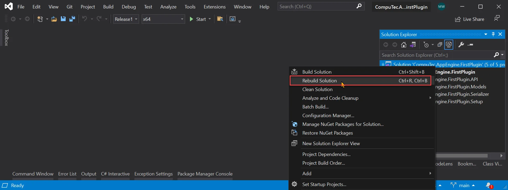
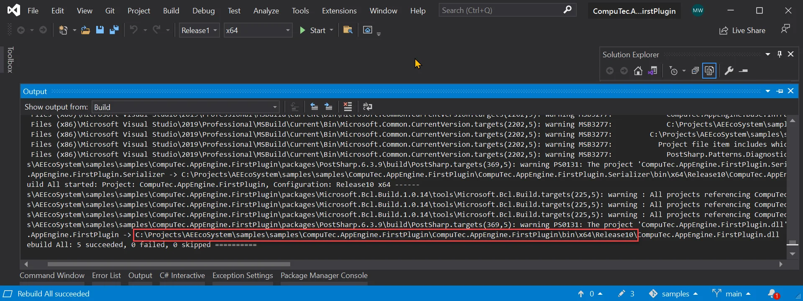

# Plugin Deployment

Creating a deployment package is a straightforward process. Simply compile the plugin in Release mode and package the resulting build output into a ZIP file. This ZIP file can then be used for plugin installation, as outlined in the[Configuration and Administration](../../../version-2.0/administrators-guide/configuration-and-administration/overview.md#plugins) guide.

## Creating Deployment Package

Follow these steps to prepare your plugin for deployment:

1. Open the solution in Visual Studio.

    

2. Change the build configuration to either Release or Release10, depending on your target SAP Business One version.

    >Note: Release10 is used for SAP Business One version 10.

    

3. Rebuild the solution.

    
4. Now, we need to pack build content of Plugin Project. You can find path of your build in build output (or in your project properties - build - output path).

    
5. Finally we just need to pack content of build into zip archive.

    
6. Only the created zip file is required to install plugin into AppEngine.

    

---
