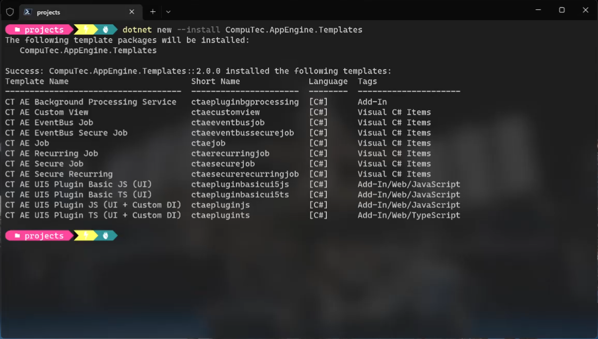

# Plugin Templates

CompuTec AppEngine plugin templates help streamline the development of custom plugins by providing pre-configured, ready-to-use project structures. Whether you're building a backend-only plugin or one with a UI5-based frontend, these templates act as a solid starting point—saving time and enforcing consistency.

---

## Download

Navigate to the following address: [https://www.nuget.org/packages?q=computec](https://www.nuget.org/packages?q=computec), and download the CompuTec.AppEngine.Templates package.

## Usage

In this example, we'll use a template designed for an CompuTec AppEngine plugin that includes a UI5 frontend with JavaScript.

Open Windows Terminal and run the following command to install the templates:

```dotnet
dotnet new --install CompuTec.AppEngine.Templates
```

After successful installation, you’ll receive a confirmation message displaying a list of installed components. Currently, the package includes:

- Five plugin solution templates (tagged as Add-In or Add-In/Web/Javascript; identifiable by the word “plugin” in their names and short names)
- Seven plugin item templates (tagged as Visual C# Items)



Once the package is installed, you can check the list again using the following command:

```dotnet
dotnet new --list AE
```

- Create a new folder for your plugin project (e.g., FirstPlugin):
- Create a new folder - named named FirstPlugin in this example (mkdir FirstPlugin).
- Go to the folder (cd .\FirstPlugin).

Use the following command to create a new template to work on it later (ctaepluginjs in this example). It has to be created along with two mandatory parameters: RoutePrefix (testPlugin in this example) and PluginID (Compu:Tec.AppEngine.Plugin.Test) in this example:

```dotnet
dotnet new ctaepluginjs --RoutePrefix testPlugin --PluginId CompuTec.AppEngine.Plugin.Test
```

---
