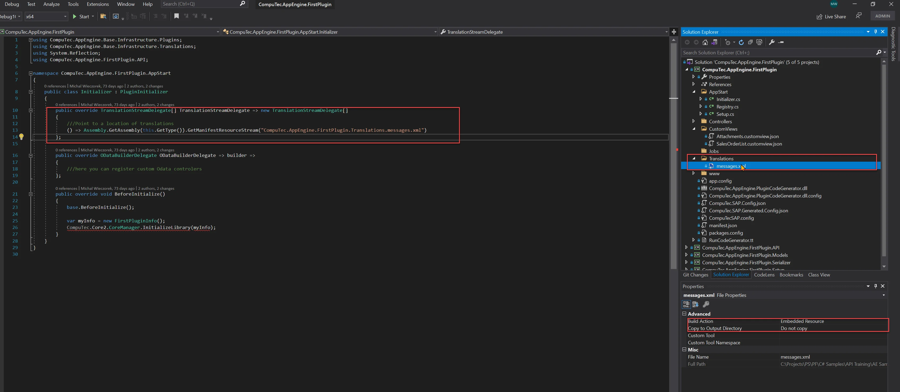
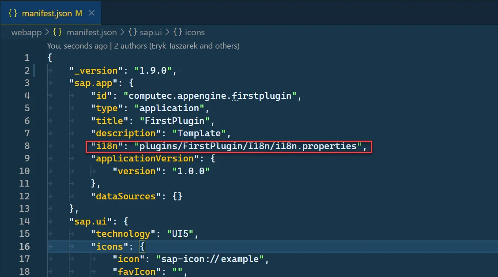
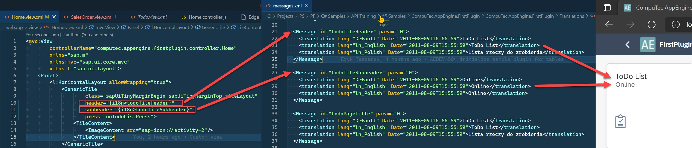
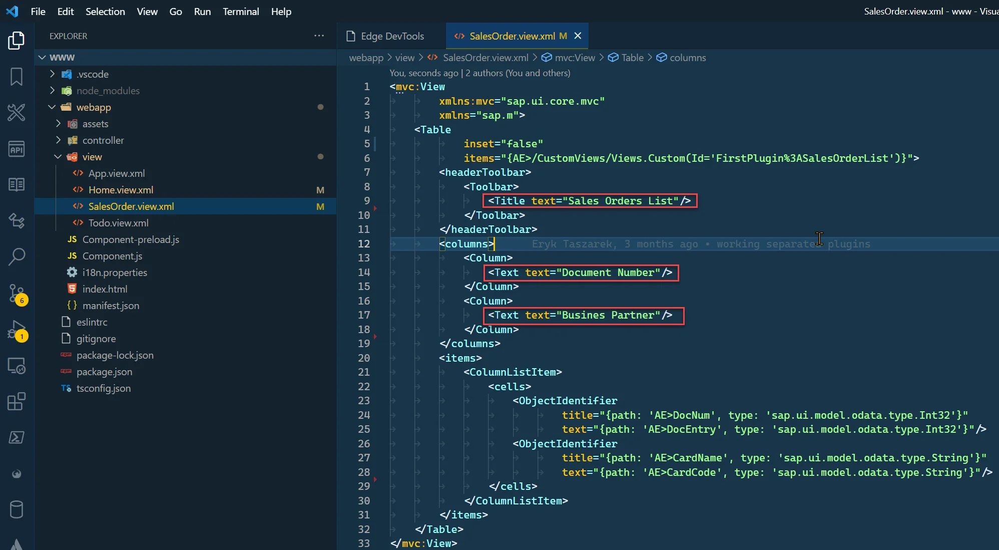

# Translations from Backend

CompuTec AppEngine allows developers to build plugins with internationalization support, making applications accessible in multiple languages. This is particularly useful when deploying plugins in global environments.

---

## Description

AppEngine allows you to manage translation resources directly within your plugin. If you’ve created your plugin using the [CompuTec AppEngine Plugin Template](./plugin-templates.md), a translation file is already included and registered by default.

To implement translations in your AppEngine plugin, follow the steps below:

1. Translations are stored in an XML file with the following structure:

    Translations file structure

    ```xml
    <?xml version="1.0" encoding="utf-8"?>
    <messageTranslations xmlns:xsi="http://www.w3.org/2001/XMLSchema-instance" xmlns:xsd="http://www.w3.org/2001/XMLSchema">

    <Message id="[translationID]" param="0">
        <translation lang="[language]" Date="[Translation Adding date]">[Translated text for given Language]</translation>
        <translation lang="[language2]" Date="[YYYY-MM-DDThh:mm:ss]">[Translated text for given Language]</translation>
    </Message>

    <Message id="[translationID2]" param="0">
        <translation lang="[language]" Date="[Translation Adding date]">[Translated text for given Language]</translation>
        <translation lang="[language2]" Date="[Translation Adding date]">[Translated text for given Language]</translation>
    </Message>

    </messageTranslations>
    ```

    - **id (translationID)**: Id that will be used in the UI5 app.
    - **lang (language)**: A translation element for a given language.

        <details>
        <summary>List of possible languages</summary>
        <div>
        Default
        ln_Polish
        ln_English
        ln_German
        ln_Arabic
        ln_Chinese
        ln_Czech_Cz
        ln_Danish
        ln_Dutch
        ln_Finnish
        ln_French
        ln_Greek
        ln_Hebrew
        ln_Hungarian
        ln_Italian
        ln_Japanese_Jp
        ln_Korean_Kr
        ln_Norwegian
        ln_Portuguese
        ln_Portuguese_Br
        ln_Russian
        ln_Serbian
        ln_Slovak_Sk
        ln_Spanish
        ln_Spanish_Ar
        ln_Spanish_La
        ln_Spanish_Pa
        ln_Swedish
        ln_TrdtnlChinese_Hk
        ln_Turkish_Tr
        ln_Ukrainian
        </div>
        </details>

    - **date (Translation adding date)**: Date when the translation was added in XSD DateTime format: `<YYYY-MM-DDThh:mm:ss>`
2. Definition of TranslationStreamDelegate in PluginInitializer.

    
3. Pointing to backend translation in Plugin manifest.json by adding an i18n element to the sap.app.

    ```json
    "i18n": "plugins/<Plugin Route>/I18n/i18n.properties"
    ```

    - **Plugin Route**: The Plugin Route is defined when creating a Plugin from the wizard. You can find this value in the AppEngine plugin manifest.json.

        
    - Example

        

## Using Internationalization in UI5 Applications

If you created a Plugin Project using the template, you can already see how translations work in the Home.view.xml file. The screenshot below illustrates this.

- In Home.view.xml file, we’ve defined the binding for the Generic Tile header as `{i18n>todoTileHeader}` and subheder o `{i18n>todoTileSubheader}`. This is the standard way of defining translations in UI5.
- Translations IDs (todoTileHeader, todoTileSubheader) are defined in messages.xml. Based on the selected language (English, in this case), AppEngine retrieves and displays the appropriate text.



### Example of Adding a Translation to the Sales Orders List

In this example, we’ll add translations to the custom view we created in the Creating a Custom View tutorial.

1. Open SalesOrder.view.xml.
2. Change the Table Title text and column Texts to use translations:

    
3. To do this, simply bind the properties to i18n and assign the corresponding translation IDs.

    - `<Title text="Sales Orders List"/>` to `<Title text="{i18n>salesOrderTableTitle}"/>`
    - `<Text text="Document Number"/>` to `<Text text="{i18n>salesOrderDocumentNumberColumnLabel}"/>`
    - `<Text text="Busines Partner"/>` to `<Text text="{i18n>salesOrderBusinessPartnerColumnLabel}"/>`

    

4. Now, we need to add translations for the newly added translation IDs in the messages.xml file.

    messages.xml

    ```xml
    <Message id="salesOrderTableTitle" param="0">
    <translation lang="Default" Date="2011-08-09T15:55:59">Sales Orders</translation>
    <translation lang="ln_English" Date="2011-08-09T15:55:59">Sales Orders</translation>
    <translation lang="ln_Polish" Date="2011-08-09T15:55:59">Zlecenia sprzedaży</translation>
    </Message>
    <Message id="salesOrderDocumentNumberColumnLabel" param="0">
    <translation lang="Default" Date="2011-08-09T15:55:59">Document Number</translation>
    <translation lang="ln_English" Date="2011-08-09T15:55:59">Document Number</translation>
    <translation lang="ln_Polish" Date="2011-08-09T15:55:59">Number dokumentu</translation>
    </Message>
    <Message id="salesOrderBusinessPartnerColumnLabel" param="0">
    <translation lang="Default" Date="2011-08-09T15:55:59">Business Partner</translation>
    <translation lang="ln_English" Date="2011-08-09T15:55:59">Business Partner</translation>
    <translation lang="ln_Polish" Date="2011-08-09T15:55:59">Business Partner</translation>
    </Message>
    ```

5. Now, rebuild the plugin project. Then, start AppEngine and refresh the plugin to apply the changes. (A restart is only required if you've made changes to the messages.xml file.)

    

---
