# User-Defined Object (UDO) in AppEngine Plugin Project

AppEngine offers out-of-the-box support for User Defined Objects. This allows a developer to easily define User Defined Tables, Fields, and Objects. These definitions will be used during the plugin update process on the selected database.

To streamline development further, you can use the [CompuTec AppEngine Plugin Code Generator](https://www.nuget.org/packages/CompuTec.AppEngine.PluginCodeGenerator/) to generate models, serializers and controllers (REST API and OData v4) for your UDOs. This guide walks you through the steps to define and implement UDOs.

---

## Structure Definition

The following steps illustrate examples of creating User Defined Tables, Fields, and Objects.

### Adding a New Project to the Solution

1. To keep your solution organized, it's a best practice to separate UDO definitions into their own project.
2. Right-click on the solution and select Add → New Project...

    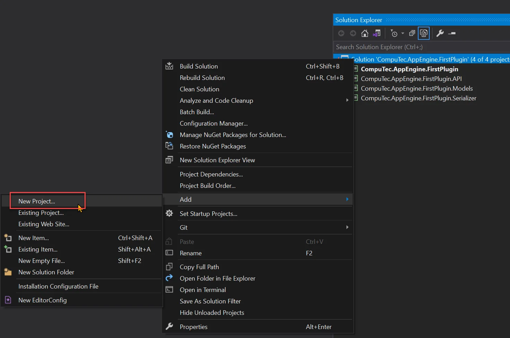
3. Choose Class Library (.NET Framework) as the project type.

    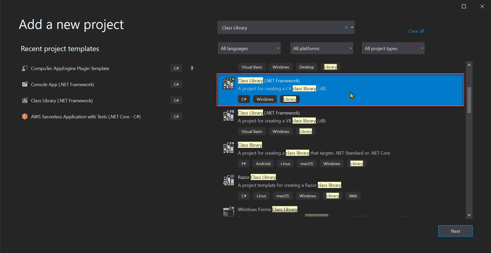
4. Specify name and location. In our case, this will be CompuTec.AppEngine.FirstPlugin.Setup.

    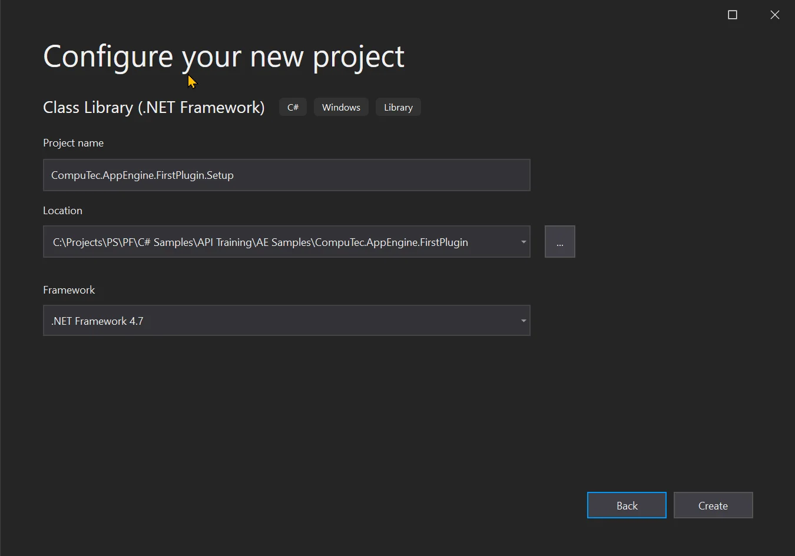
5. After adding a new project, it is necessary to set up the configuration.

    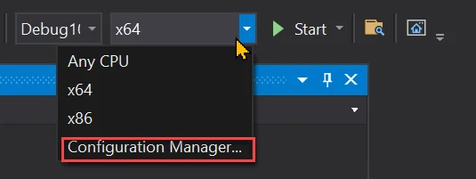

    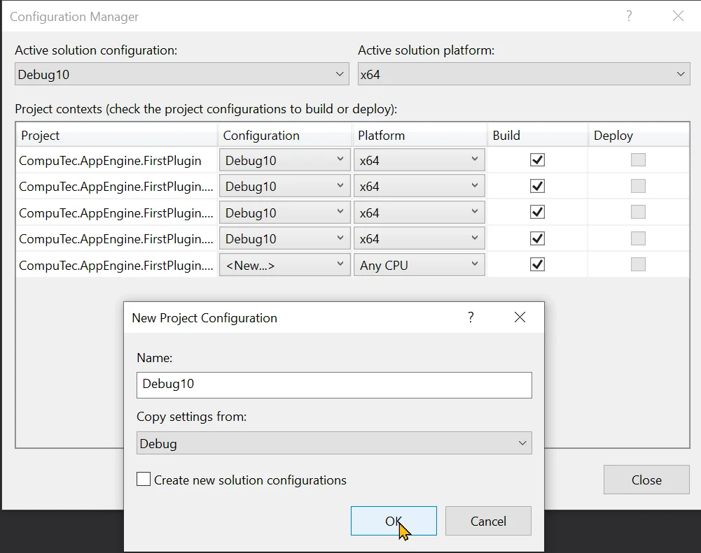

    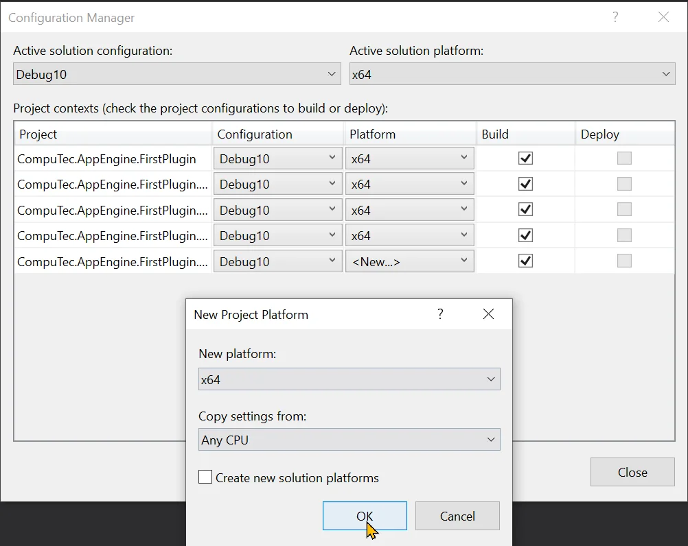

### Adding UDO Definitions

#### Defining ToDo and ToDoRequirements User-Defined Tables

1. Create a new folder and name it Tables to set up the structure for the Setup project.
2. In this example, we'll create a UDO (User-Defined Object) of the Master Data type to manage a To-Do List. This UDO will include Master Data Lines for storing individual items associated with each To-Do entry.
3. In the Table folder, add a new Folder named "ToDo" and add a new class to its "ToDoTable".

    
4. The ToDoTable class must extend the CompuTec.Core2.DI.Setup.UDO.Model.UDOManager class and be annotated with the CompuTec.Core2.DI.Setup.Attributes.TableInstall attribute. Before proceeding, you’ll need to add the CompuTec.Core2 package to your project.
5. To do this, Open the NuGet Manager for the Setup project.

    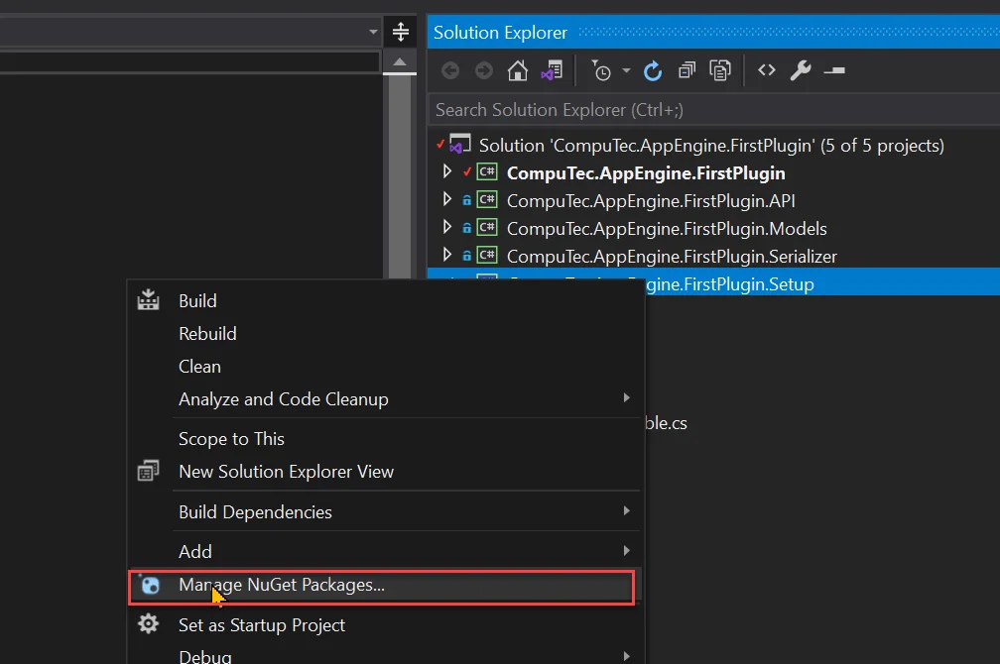
6. Search for CompuTec.Core2 and install it.
7. If CompuTec.Core2 is not visible after installation, reopen the solution.
8. Now we can implement our ToDoTable class:

    - Add TableInstall annotation
    - Extend UDOManager
    - Implement constructor with IDIConnection parameter
    - Implement the CreateUDOTable method that will return the definition of our custom table. Here we define:
    - Object Code
    - Table Name
    - Fields (CreateFieldsForHeaderTable)
    - Table Type
    - Details regarding UDO.

    ToDoTable.cs

    ```csharp
    using CompuTec.BaseLayer.Connection;
    using CompuTec.BaseLayer.DI;
    using CompuTec.Core2.DI.Setup.Attributes;
    using CompuTec.Core2.DI.Setup.UDO.Model;
    using System;
    using System.Collections.Generic;

    namespace CompuTec.AppEngine.FirstPlugin.Setup.Tables.ToDo
    {
    [TableInstall]
    public class ToDoTable : UDOManager
    {
        public const String OBJECT_CODE = "SAMPLE_TO_DO";
        public const String TABLE_NAME = "SAMPLE_OTDO";
        public const String TABLE_DESCRIPTION = "Sample To Do"; // max 30 characters
        public const String ARCHIVE_TABLE_NAME = "SAMPLE_ATDO";

        public ToDoTable(IDIConnection connection) : base(connection) { }

        protected override IUDOTable CreateUDOTable()
        {
            List<IUDOField> fields = this.CreateFieldsForHeaderTable();
            List<IUDOFindColumn> findColumns = this.CreateFindColumnsList();
            var UdoTable = new UDOTable(fields, findColumns, TABLE_NAME, TABLE_DESCRIPTION, BoUTBTableType.bott_MasterData, this.CreateKeys())
            {
                RegisteredUDOName = TABLE_NAME,
                RegisteredUDOCode = OBJECT_CODE,
                CanArchive = BoYesNoEnum.tYES,
                CanCancel = BoYesNoEnum.tNO,
                CanClose = BoYesNoEnum.tYES,
                CanCreateDefaultForm = BoYesNoEnum.tYES,
                CanDelete = BoYesNoEnum.tYES,
                CanFind = BoYesNoEnum.tYES,
                CanLog = BoYesNoEnum.tYES,
                CanYearTransfer = BoYesNoEnum.tYES,
                ArchiveTableName = ARCHIVE_TABLE_NAME
            };
            return UdoTable;
        }

        private List<IUDOFindColumn> CreateFindColumnsList()
        {
            List<IUDOFindColumn> findList = new List<IUDOFindColumn>();

            var taskName = new UDOFindColumn();
            taskName.SetColumnAlias("U_TaskName");
            taskName.SetColumnDescription("Task Name");
            findList.Add(taskName);

            return findList;
        }

        private List<IUDOField> CreateFieldsForHeaderTable()
        {
            var fields = new List<IUDOField>();

            //adding task name column
            var TaskName = new UDOTableField();
            TaskName.SetName("TaskName");
            TaskName.SetDescription("Task Name"); // max 80 characters
            TaskName.SetType(BoFieldTypes.db_Alpha);
            TaskName.SetEditSize(100);
            fields.Add(TaskName);


            //description column
            var TaskDescription = new UDOTableField();
            TaskDescription.SetName("Description");
            TaskDescription.SetDescription("Task description");
            TaskDescription.SetType(BoFieldTypes.db_Alpha);
            TaskDescription.SetEditSize(254);
            fields.Add(TaskDescription);

            //priority column
            var TaskPriority = new UDOTableField();
            TaskPriority.SetName("Priority");
            TaskPriority.SetDescription("Priority");
            TaskPriority.SetType(BoFieldTypes.db_Alpha);
            TaskPriority.ValidValuesMD = new Dictionary<string, string>()
            {
                { "L","Low Priority" },
                { "M", "Medium Priority" },
                { "H", "High Priority" }
            };
            TaskPriority.DefaultValue = "L";
            TaskPriority.SetEditSize(1);
            fields.Add(TaskPriority);


            //deadline column
            var TaskDeadline = new UDOTableField();
            TaskDeadline.SetName("Deadline");
            TaskDeadline.SetDescription("Deadline");
            TaskDeadline.SetType(BoFieldTypes.db_Date);
            TaskDeadline.SetEditSize(10);
            fields.Add(TaskDeadline);  var Done = new UDOTableField();

            Done.SetName("Done");
            Done.SetDescription("Done");
            Done.SetType(BoFieldTypes.db_Alpha);
            Done.ValidValuesMD = new Dictionary<string, string>()
            {
                { "Y","Yes" },
                { "N", "No" }
            };
            Done.DefaultValue = "N";
            Done.SetEditSize(1);
            fields.Add(Done);

            return fields;

        }
        private List<IUDOTableKey> CreateKeys()
        {
            List<IUDOTableKey> list = new List<IUDOTableKey>();
            return list;
        }
        protected override void SetChildTables(){ }
    }
    }
    ```

    :::note
    Make sure to use only **uppercase letters** and **no spaces** for the Table Name. Using lowercase letters currently leads to the following exception: "This entry already exists in following tables..."
    :::

9. In the same manner, we will add ToDoTableRequirementsTable:

    ToDoTableRequirementsTable.cs

    ```csharp
    using CompuTec.BaseLayer.Connection;
    using CompuTec.BaseLayer.DI;
    using CompuTec.Core2.DI.Setup.Attributes;
    using CompuTec.Core2.DI.Setup.UDO.Model;
    using System;
    using System.Collections.Generic;

    namespace CompuTec.AppEngine.FirstPlugin.Setup.Tables.ToDo
    {
        [TableInstall]
        public class ToDoTableRequirementsTable : UDOManager
        {
            public const String OBJECT_CODE = "SAMPLE_TO_DO_REQ";
            public const String TABLE_NAME = "SAMPLE_TDO1";
            public const String TABLE_DESCRIPTION = "Sample To Do Requirements";
            public const String ARCHIVE_TABLE_NAME = "SAMPLE_ATDO1";

            public ToDoTableRequirementsTable(IDIConnection connection) : base(connection) { }

            protected override IUDOTable CreateUDOTable()
            {
                List<IUDOField> fields = this.DefineChildFields();

                IUDOTable UdoTable = new UDOTable(fields, TABLE_NAME, TABLE_DESCRIPTION, BoUTBTableType.bott_MasterDataLines);

                UdoTable.RegisteredUDOName = TABLE_NAME;
                UdoTable.RegisteredUDOCode = OBJECT_CODE;
                UdoTable.ArchiveTableName = ARCHIVE_TABLE_NAME;

                return UdoTable;
            }

            private List<IUDOField> DefineChildFields()
            {
                var fields = new List<IUDOField>();

                //adding task name column
                var Name = new UDOTableField();
                Name.SetName("Name");
                Name.SetDescription("Name");
                Name.SetType(BoFieldTypes.db_Alpha);
                Name.SetEditSize(100);
                fields.Add(Name);

                //description column
                var Quantity = new UDOTableField();
                Quantity.SetName("Quantity");
                Quantity.SetDescription("Quantity");
                Quantity.SetType(BoFieldTypes.db_Numeric);
                Quantity.SetEditSize(11);
                fields.Add(Quantity);

                return fields;
            }

            protected override void SetChildTables()
            {
            }

        }
    }
    ```

10. It’s important to register the child table within the header table — in our case, the ToDoTable class. To achieve this, you need to add the child table’s class name in the SetChildTables method of the ToDoTable class, like this:

    ```csharp
    protected override void SetChildTables()
    {
        ChildTablesClasses.AddRange(new string[] { "ToDoTableRequirementsTable" });
    }
    ```

#### Adding Custom User-Defined Fields

1. For demonstration purposes, let's also create a User-Defined Field (UDF) for a standard SAP object. In this example, we'll add a sample field called "Field" to the Item Master Data table (OITM).
2. To do this, create a new file named CustomUDOFields.cs inside the Tables folder.

    CustomUDOFields.cs

    ```csharp
    using CompuTec.Core2.DI.Setup.UDO.Model;
    using System.Collections.Generic;

    namespace CompuTec.AppEngine.FirstPlugin.Setup.Tables
    {
        public class CustomUDOFields
        {

            /// <summary>
            /// in this method, you can list all UDF fields that need to be installed with the plugin
            /// </summary>
            /// <returns></returns>
            public static List<ICustomField> getCustomFields()
            {
                var list = new List<ICustomField>();
                ///UDF U_FirstUDF of type alphanumeric with size 20 will be added to the Items object
                var udf = new TableCustomField();
                udf.SetName("FistUDF");
                udf.SetDescription("Fisrst Plugin First UDF");
                udf.SetTableName("OITM");
                udf.SetEditSize(20);
                udf.SetType(BaseLayer.DI.BoFieldTypes.db_Alpha);
                list.Add(udf);

                return list;
            }
        }
    }
    ```

#### Preparing Setup

To allow AppEngine to run this setup, we need to provide a Setup class in our plugin that extends CompuTec.AppEngine.Base.Infrastructure.Plugins.PluginSetup class. If you create a Plugin solution from our CompuTec AppEngine Plugin Template, then in the plugin project, you will already have boiler code that you can use.


1. To do this, right-click on the Plugin project in Solution Explorer and select "Add Reference". Then, choose the Setup project from the list of available projects and click OK to add the reference.

    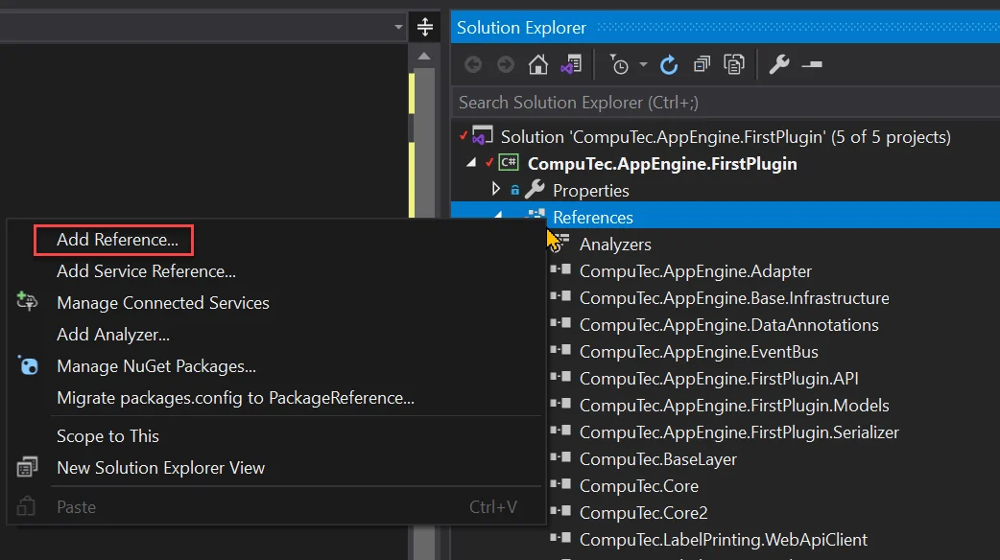
2. On the Projects Tab, select the Setup project and click OK.

    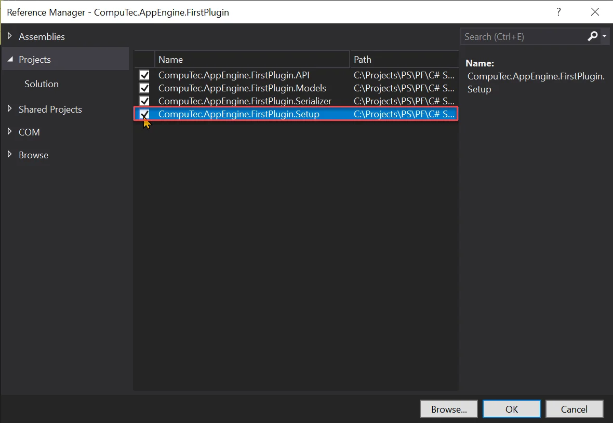
3. Now we can add implementation to our Setup.cs:

   - It should extend CompuTec.AppEngine.Base.Infrastructure.Plugins.PluginSetup
   - CheckUpdate method: should return true to indicate that installation or update should be performed.
   - Update method: this method should run CompuTec.Core2.DI.Setup.UDO.Setup.Udate and return System.Version after successful update.
   - Version method: needs to return System.A version of plugin (not the installed version, but the version of the plugin being executed).

   Setup.cs

    ```csharp
        using System;
    using System.Collections.Generic;
    using System.Text;
    using CompuTec.AppEngine.Base.Infrastructure.Plugins;
    using CompuTec.AppEngine.FirstPlugin.API;
    using CompuTec.AppEngine.FirstPlugin.Setup.Tables;

    namespace CompuTec.AppEngine.FirstPlugin.Plugin.AppStart
    {
        ///Plugin Setup Implementation
        ///here you can implement all logic of plugin installation on a specific database
        public class Setup : PluginSetup
        {
            public override bool CheckUpdate(Version currentVersion)
            {
                return currentVersion < new Version(FirstPluginInfo.NameVersion);
            }

            public override Version Update(string token)
            {

                var info = new FirstPluginInfo();

                Console.WriteLine("Update");

                List<CompuTec.Core2.DI.Setup.UDO.Model.ICustomField> customUdoFieldList = CustomUDOFields.getCustomFields();
                CompuTec.Core2.DI.Setup.UDO.Setup setup = new CompuTec.Core2.DI.Setup.UDO.Setup(token, customUdoFieldList, false, System.Reflection.Assembly
                    .GetAssembly(typeof(FirstPlugin.Setup.Tables.ToDo.ToDoTable)), "CompuTec.AppEngine.FirstPlugin.Setup.Tables", "CompuTec.AppEngine.FirstPlugin.Setup.Tables",
                    "CompuTec.AppEngine.FirstPlugin.Setup.Tables", "CompuTec.AppEngine.FirstPlugin.Setup.Tables", "CompuTec.AppEngine.FirstPlugin.Setup.Tables");

                setup.BaseLibInformation = info;

                if (setup.IsUpdateRequiredNew(true))
                {
                    Console.WriteLine("Instaling...");
                    var updateResult = setup.Update();

                    if (!updateResult.Success)
                    {
                        var message = new StringBuilder();

                        updateResult.Errors.ForEach(e =>
                        {
                            message.Append(e.Message);
                        });

                        throw new Exception(message.ToString());
                    }


                    Console.WriteLine(updateResult.ToString());
                }

                Console.WriteLine("Install finish");

                return Version;
            }

            public override Version Version => new Version(FirstPluginInfo.NameVersion);
        }
    }
    ```

4. The Setup class requires the BaseLibInformation property to point to a class that inherits from the abstract class CompuTec.Core2.CoreInfo.

    To fulfill this requirement:

    - Create a new file named FirstPluginInfo.cs in the CompuTec.AppEngine.FirstPlugin.API project.
    - This class will define version information and provide methods for version retrieval.
    - Additionally, it will be used to declare implemented business objects and bind interfaces to their implementations.

    We will add these details after completing the Business Objects implementation in the second part of this tutorial.

    FirstPluginInfo.cs

    ```csharp
    using CompuTec.AppEngine.FirstPlugin.API.BusinessObjects.ToDo;
    using CompuTec.Core2;
    using System.Collections.Generic;
    namespace CompuTec.AppEngine.FirstPlugin.API {


        /// <summary>
        /// This is a CoreInfo Dependency loader.
        /// This class is responsible for registering all custom UDO Object implementation
        /// </summary>
        public class FirstPluginInfo : CoreInfo
        {
            public const string Name = "FirstPlugin";
            public const string NameVersion = "1.0.0.1";
            public const double DbVersion = 1.1d;
            //List of Business Object types that are implemented in this library
            private readonly List<string> implementedObjects = new List<string>();

            public FirstPluginInfo() : base(Name, NameVersion, DbVersion) {}

            /// <summary>
            /// Factory method that is used to create BusinessObjects based on type
            /// </summary>
            /// <param name="Token"></param>
            /// <param name="ObjectType"></param>
            /// <returns>returns null if this library does not implement this object
            /// returns a new instance of the object for the specified type
            /// </returns>
            public override dynamic CreateObject(string Token, string ObjectType)
            {
                return null;
            }
            /// <summary>
            /// This Function is used to determine the current instation number used in the update to obain if setup needs to be triggered
            /// </summary>
            /// <param name="Token"></param>
            /// <returns></returns>
            public override double GetCurrentDBVersion(string Token)
            {
                return 1.0d;
            }

            /// <summary>
            /// Indicates weather this library implements specific businessObject
            /// </summary>
            /// <param name="ObjectType"></param>
            /// <returns>true if implements</returns>
            public override bool ImplementObject(string ObjectType)
            {
                bool implemented = implementedObjects.Contains(ObjectType);
                return implemented;
            }
        }
    }
    ```

### Results

Now that the User-Defined Objects have been defined, we can test the setup by running it from the CompuTec AppEngine Administration Panel:

1. Open the Administration Panel in your browser and navigate to the Plugins tab.
2. Click on the plugin Tile to open its configuration.
3. Activate Plugin on the selected database.
4. Click "Update" to start the installation procedure.

    
5. In the dialog that appears, you'll need to authenticate using your SAP user credentials.

    Once the installation completes successfully, the returned version number will be saved to the configuration file. This indicates that all the defined objects have been successfully created in SAP.
6. After a successful installation, the returned version number is stored in the configuration file, indicating that all defined objects have been successfully created in SAP.

    
7. You can verify the created tables, fields, and registered objects directly within SAP.

    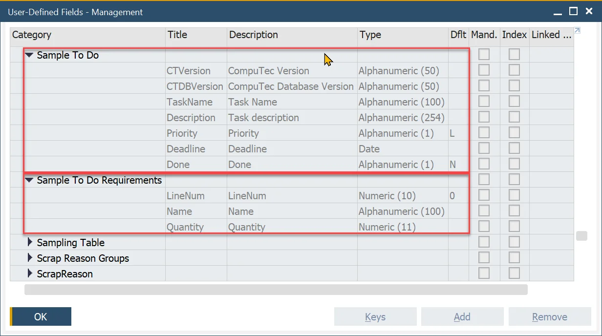

    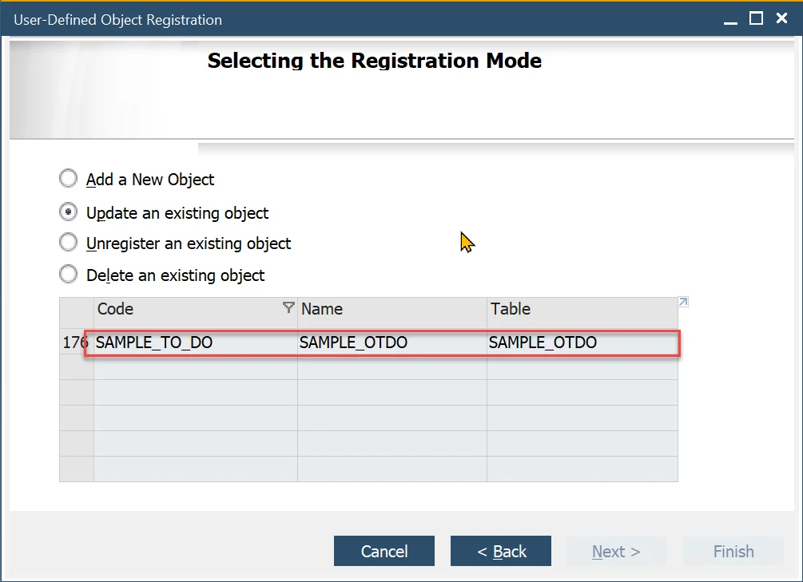

## Exposing Objects in API

[CompuTec AppEngine Plugin Code Generator](https://www.nuget.org/packages/CompuTec.AppEngine.PluginCodeGenerator/) can generate controllers, models and serializers based on defined interfaces. Below is a step-by-step description of how to achieve this.

### Adding and Configuring Generator

1. First, we need to add the Code Generator to our Plugin project. This can be done using the NuGet Package Manager.
2. Search for CompuTec.AppEngine.PluginCodeGenerator and install it.

    
3. After installation, ReadMe.txt file opens with description of how to configure T4 Text Template file.
4. Right-click on the plugin project and select Add New Item.
5. Search for T4 and select Text Template.
6. Set a name to it like RunCodeGenerator.tt.
7. Copy a template example from ReadMe.txt.

    
8. Paste the copied code to the newly created RunCodeGenerator.tt
9. Next, update the Generator Settings section to match your solution. Only this part of the template needs to be modified.

    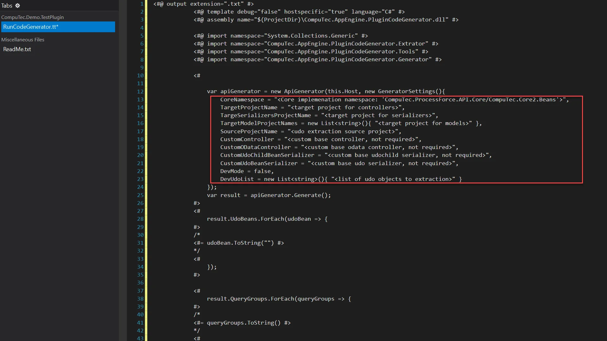
10. First, remove the elements that are not required:

    - CustomController,
    - CustomODataController,
    - CustomUdoChildBeanSerializer,
    - CustomUdoBeanSerializer,
    - DevUdoList.
11. Now we need to define:

    - CoreNamespace should be set to CompuTec.Core2.Beans,
    - TargetProjectName to CompuTec.AppEngine.FirstPlugin - project in which controllers will be created,
    - TargeSerializersProjectName to CompuTec.AppEngine.FirstPlugin.Serializer - project in which serializers will be created,
    - TargetModelProjectNames to CompuTec.AppEngine.FirstPlugin.Models - project in which models will be created,
    - SourceProjectName to CompuTec.AppEngine.FirstPlugin.API - project with objects definitions.
12. Finally this T4 file in case of our example will look like this:

    ```csharp
    <#@ output extension=".txt" #>
                <#@ template debug="false" hostspecific="true" language="C#" #>
                <#@ assembly name="$(ProjectDir)\CompuTec.AppEngine.PluginCodeGenerator.dll" #>

                <#@ import namespace="System.Collections.Generic" #>
                <#@ import namespace="CompuTec.AppEngine.PluginCodeGenerator.Extrator" #>
                <#@ import namespace="CompuTec.AppEngine.PluginCodeGenerator.Tools" #>
                <#@ import namespace="CompuTec.AppEngine.PluginCodeGenerator.Generator" #>

                <#

                    var apiGenerator = new ApiGenerator(this.Host, new GeneratorSettings(){
                        CoreNamespace = "CompuTec.Core2.Beans",
                        TargetProjectName = "CompuTec.AppEngine.FirstPlugin",
                        TargeSerializersProjectName = "CompuTec.AppEngine.FirstPlugin.Serializer",
                        TargetModelProjectNames = new List<string>(){ "CompuTec.AppEngine.FirstPlugin.Models" },
                        SourceProjectName = "CompuTec.AppEngine.FirstPlugin.API",

                        DevMode = false

                    });


                    var result = apiGenerator.Generate();
                #>
                <#
                    result.UdoBeans.ForEach(udoBean => {
                #>
                /*
                <#= udoBean.ToString("") #>
                */
                <#
                    });
                #>

                <#
                    result.QueryGroups.ForEach(queryGroups => {
                #>
                /*
                <#= queryGroups.ToString() #>
                */
                <#
                    });
                #>
    ```

    :::warning
    Saving T4 file will start generator.
    :::

13. If you created your plugin solution using the wizard, all required projects will already be in place—except for the Serializer project. You'll need to add it manually, just like you did for the Setup project:

    1. Right-click on the Solution and choose Add new project,
    2. Select Class Library (.NET Framework),
    3. Set a name to CompuTec.AppEngine.FirstPlugin.Serializer,
    4. Once added, configure it the same way as you did with the Setup project.

### Defining Interfaces

1. All Business Objects will be created in the FirstPlugin.API project.
2. Since the code generator relies on CompuTec.AppEngine.DataAnnotations, we need to add this library to the project. You can do this using the NuGet Package Manager, just like we did earlier.

    
3. In Business Object definition we will need Priority enumerator, so let's create it upfront.

    1. Add a new folder to the API project named Enum,
    2. In it, create a new class file ToDoPriority.cs with following code,
    3. The EnumType annotation enables Core2 to map the enum values to database values. For instance, saving the priority as Low will result in the corresponding column storing 'L'.EnumType annotation allows Core2 to bind Enum to database values. So for this example saving to database priority Low will set value in column appropriate column to 'L',

    ```csharp
    using CompuTec.Core2.DI.Attributes;

    namespace CompuTec.AppEngine.FirstPlugin.API.Enums
    {
        [EnumType(new int[] { 1, 2, 3 }, new string[] { "L", "M", "H" }, 2)]
        public enum ToDoPriority
        {
            Low = 1, Medium = 2, Huge = 3
        }
    }
    ```

4. The same way, create a YesNoType.cs enum type that will be used to mark the Done property of the ToDo task.

   1. Add a new file YesNoType.cs inside the Enum folder.
   2. Add the following code in it:

    ```csharp
    using CompuTec.Core2.DI.Attributes;

    namespace CompuTec.AppEngine.FirstPlugin.API.Enums
    {
        [EnumType(new int[] { 1, 2 }, new string[] { "Y", "N" }, 2)]
        public enum YesNoType { Yes = 1, No = 2 }
    }
    ```

5. For sake of order, create a new folder named BusinessObjects, and within it, add a subfolder called ToDo.
6. Inside the ToDo folder, create interfaces for both the ToDo item and the ToDo Requirement.
7. Add new interfaces files inside BussinessObject and call them IToDo.cs and IToDoRequirement.cs.
8. Below you can find the definitions of IToDo.cs:

    - The interface must implement CompuTec.Core2.Beans.IUDOBean - this is essential for Core2 to manage the object.
    - Annotate the interface with CompuTec.AppEngine.DataAnnotations.AppEngineUDOBean for AppEngine support.
    - The ObjectType attribute should match the one defined in the ToDoTable.cs class.
    - The TableName should also match the name in ToDoTable.cs, but with an @ prefix—this reflects the actual table name in the database.
    - [AppEngineProperty(IsMasterKey = true)] – this annotation should be specified on the key column (this will be key on all crud operations)

    IToDo.cs

    ```csharp
    using CompuTec.AppEngine.DataAnnotations;
    using CompuTec.AppEngine.FirstPlugin.API.Enums;
    using CompuTec.Core2.Beans;
    using System;
    using System.ComponentModel;

    namespace CompuTec.AppEngine.FirstPlugin.API.BusinessObjects.ToDo
    {
        /// <summary>
        /// Public interface that is exposed to 3rd party application - can be used in powershell import etc
        ///
        /// AppEngine Annonations are used to descripte REST and OData Modes and Serializers used in Plugin controlers
        /// </summary>
        [AppEngineUDOBean(Ignore = false, ObjectType = "SAMPLE_TO_DO", TableName = "@SAMPLE_OTDO")]
        public interface IToDo : IUDOBean
        {
            [AppEngineProperty(IsMasterKey = true)]
            String Code { get; set; }
            String Name { get; set; }
            DateTime UpdateDate { get; set; }
            DateTime U_Deadline { get; set; }
            string U_TaskName { get; set; }
            string U_Description { get; set; }
            [DefaultValue(ToDoPriority.Medium)]
            ToDoPriority U_Priority { get; set; }
            [DefaultValue(YesNoType.No)]
            YesNoType U_Done { get; set; }
            IToDoRequirement Requirements { get; set; }
        }
    }
    ```

9. Below you can find the definition of IToDoRequirement.cs:

    - Our child Interface must be based on CompuTec.Core2.Beans.IUDOChildBean - this is required by Core2 to manage our object
    - Child interface also need to be Enumberable
    - `[AppEngineUDOChildBean()]` – this annotation mark this interface as child (lines):

    IToDoRequirement

    ```csharp
    using CompuTec.AppEngine.DataAnnotations;
    using CompuTec.Core2.Beans;
    using System;
    using System.Collections.Generic;

    namespace CompuTec.AppEngine.FirstPlugin.API.BusinessObjects.ToDo
    {
        [AppEngineUDOChildBean()]
        public interface IToDoRequirement : IUDOChildBean, IEnumerable<IToDoRequirement>
        {
            String U_Name { get; set; }
            int U_Quantity { get; set; }
            new int U_LineNum { get; set; }
        }
    }
    ```

### Implementing Interfaces

1. We will implement a ToDo class as a partial class to keep logic and field getter and setters separately. We will also add BusinessObjects class in BusinessObjects.

    - BusinessObjects.cs

        ```csharp
        namespace CompuTec.AppEngine.FirstPlugin.API.BusinessObjects
        {
        public  class BusinessObjects
            {
                public const string ToDoObjectCode = "SAMPLE_TO_DO";

            }
        }
        ```

    - ToDo.cs – Business logic.

        - In constructor UDOCode and TableName needs to be set up accordingly to ToDoTable.cs properites
        - Children and ChildDictionaries needs to be initialized as shown below:

        ```csharp
        using CompuTec.Core2.Beans;
        using System;
        using System.Collections.Generic;

        namespace CompuTec.AppEngine.FirstPlugin.API.BusinessObjects.ToDo
        {
            public partial class ToDo
            {
                public ToDo()
                {
                    this.UDOCode = BusinessObjects.ToDoObjectCode;
                    this.TableName = "SAMPLE_OTDO";

                    this.Childs = new Dictionary<string, ChildBeans>();
                    this.ChildDictionary = new Dictionary<string, string>();

                    this.Childs.Add("Requirements", new ToDoRequirement(true, this));
                    this.ChildDictionary.Add("SAMPLE_TDO1", "Requirements");

                }

                protected override bool BeforeAdd()
                {

                    this.U_Deadline = DateTime.Today.AddDays(7);
                    this.Code = Guid.NewGuid().ToString();
                    return base.BeforeAdd();
                }

                protected override bool BeforeUpdate()
                {

                    return base.BeforeUpdate();
                }

            }
        }
        ```

    - ToDo.properties.cs – getters and setters for fields. FiledDictionary is maintained by Core2.

        ```csharp
        using CompuTec.AppEngine.FirstPlugin.API.Enums;
        using CompuTec.Core2.Beans;
        using System;

        namespace CompuTec.AppEngine.FirstPlugin.API.BusinessObjects.ToDo
        {
            public partial class ToDo : UDOBean, IToDo
            {
                public String Code
                {
                    get { return FieldDictionary["Code"].Value; }
                    set { FieldDictionary["Code"].Value = value; }
                }
                public String Name
                {
                    get { return FieldDictionary["Name"].Value; }
                    set { FieldDictionary["Name"].Value = value; }
                }
                public DateTime UpdateDate
                {
                    get { return FieldDictionary["UpdateDate"].Value; }
                    set { FieldDictionary["UpdateDate"].Value = value; }
                }
                public DateTime U_Deadline
                {
                    get { return FieldDictionary["U_Deadline"].Value; }
                    set { FieldDictionary["U_Deadline"].Value = value; }
                }
                public string U_TaskName
                {
                    get { return FieldDictionary["U_TaskName"].Value; }
                    set { FieldDictionary["U_TaskName"].Value = value; }
                }
                public string U_Description
                {
                    get { return FieldDictionary["U_Description"].Value; }
                    set { FieldDictionary["U_Description"].Value = value; }
                }
                public ToDoPriority U_Priority
                {
                    get { return FieldDictionary["U_Priority"].Value; }
                    set { FieldDictionary["U_Priority"].Value = value; }
                }
                public YesNoType U_Done
                {
                    get { return FieldDictionary["U_Done"].Value; }
                    set { FieldDictionary["U_Done"].Value = value; }
                }
                public IToDoRequirement Requirements
                {
                    get => this.Childs["Requirements"].CurrentChild as IToDoRequirement;
                    set { this.Childs["Requirements"].CurrentChild = value as IToDoRequirement; }
                }

            }
        }
        ```

    - ToDoRequirement.cs:

        ```csharp
        using CompuTec.Core2.Beans;
        using System;
        using System.Collections.Generic;
        using System.Collections;

        namespace CompuTec.AppEngine.FirstPlugin.API.BusinessObjects.ToDo
        {
            public class ToDoRequirement : ChildBeans, IToDoRequirement
            {
                public ToDoRequirement()
                {
                }
                public ToDoRequirement(ChildBeans childBeans) : base(childBeans) { }
                public ToDoRequirement(bool master, UDOBean baseUDO) : base(master, baseUDO) { }

                public String U_Name
                {
                    get { return FieldDictionary["U_Name"].Value; }
                    set { FieldDictionary["U_Name"].Value = value; }
                }
                public int U_Quantity
                {
                    get { return FieldDictionary["U_Quantity"].Value; }
                    set { FieldDictionary["U_Quantity"].Value = value; }
                }
                public IEnumerator<IToDoRequirement> GetEnumerator()
                {
                    return new ChildBeansEnum<IToDoRequirement>(this);
                }
                IEnumerator IEnumerable.GetEnumerator()
                {
                    return (IEnumerator<IToDoRequirement>)GetEnumerator();
                }
            }
        }
        ```

2. Having implementation of our Business Objects ready, we can add information about implemented objects to FirstPluginInfo.cs.

    - We will add entry to implemented object list with the Code of our object.

        ```csharp
        implementedObjects.Add(BusinessObjects.BusinessObjects.ToDoObjectCode);
        ```

    - Also we need to implement creating ToDo object in CreateObject method.

        ```csharp
        if (ObjectType.Equals(BusinessObjects.BusinessObjects.ToDoObjectCode))
        {
            IToDo x = CoreManager.GetUDO<ToDo>(Token) as IToDo;
            return x;
        }
        ```

    - After this changes FirstPluginInfo.cs will look like this:

        ```csharp
        using CompuTec.AppEngine.FirstPlugin.API.BusinessObjects.ToDo;
        using CompuTec.Core2;
        using System.Collections.Generic;
        namespace CompuTec.AppEngine.FirstPlugin.API {


            /// <summary>
            /// This is a CoreInfo Dependency loader.
            /// this class is responsible to register all custom UDO Object imlementation
            /// </summary>
            public class FirstPluginInfo : CoreInfo
            {
                public const string Name = "FirstPlugin";
                public const string NameVersion = "1.0.0.1";
                public const double DbVersion = 1.1d;
                //List of Busienss Object types that are implemented in this library
                private readonly List<string> implementedObjects = new List<string>();

                public FirstPluginInfo() : base(Name, NameVersion, DbVersion)
                {
                    ///Register UDO Object for Core2 repository
                    implementedObjects.Add(BusinessObjects.BusinessObjects.ToDoObjectCode);

                }

                /// <summary>
                /// Factory method that is used to create BusinessObjects based on type
                /// </summary>
                /// <param name="Token"></param>
                /// <param name="ObjectType"></param>
                /// <returns>returns null if this library does not implement this object
                /// returns new instance of object for specified type
                /// </returns>
                public override dynamic CreateObject(string Token, string ObjectType)
                {

                    if (ObjectType.Equals(BusinessObjects.BusinessObjects.ToDoObjectCode))
                    {
                        IToDo x = CoreManager.GetUDO<ToDo>(Token) as IToDo;
                        return x;
                    }
                    return null;
                }
                /// <summary>
                /// This Function is used to determine the current instation number is used in update to obatin if setup needs to be triggered
                /// </summary>
                /// <param name="Token"></param>
                /// <returns></returns>
                public override double GetCurrentDBVersion(string Token)
                {
                    return 1.0d;
                }

                /// <summary>
                /// Inidicates weather this library implements specific businessObject
                /// </summary>
                /// <param name="ObjectType"></param>
                /// <returns>true if implements</returns>
                public override bool ImplementObject(string ObjectType)
                {
                    bool implemented = implementedObjects.Contains(ObjectType);
                    return implemented;
                }
            }
        }
        ```

### Generating API

Finally we can run CompuTec AppEngine Plugin Code Generator. Base on defined interafaces, it will create Controllers, Models and Serializers.

1. Before running generator, we suggest to remove Controllers/TodoController.cs from Plugin project. That file was added from the Template and we don't need it.
2. Save all changes – during generation process projects files are changed.
3. Right-click on RunCodeGenerator.tt and select Run Custom Tool.

    
4. Depending on number of Interfaces this process can tak a while. After generation, choose Reload All.

    
5. All newly created files should be now included in our project.

    
6. We need to add Microsoft.AspNet.OData lib to CompuTec.AppEngine.FirstPlugin.Models. We can do this using NuGet Manager as in previous examples.
7. CompuTec.AppEngine.FirstPlugin.Serializer uses Models and API so we need to add references to these projects.

    
8. Once everything is in place, rebuild the entire solution.

:::warning
It is important to add to   set correct assemblies in manifest.json. Below you can see example manifest.json with added assemblies:

```json
"CompuTec.AppEngine.FirstPlugin",
"CompuTec.AppEngine.FirstPlugin.Models",
"CompuTec.AppEngine.FirstPlugin.Serializer",
"CompuTec.AppEngine.FirstPlugin.API",
"CompuTec.AppEngine.FirstPlugin.Setup"


{
"version": "1.0.0",
"id": "FirstPlugin",
"name": "FirstPlugin",
"icon": "sap-icon://activate",

"company": "",
"api": {
    "routePrefix": "FirstPlugin",
    "setupAssembly": "CompuTec.AppEngine.FirstPlugin",
    "assemblies": [
    "CompuTec.AppEngine.FirstPlugin",
    "CompuTec.AppEngine.FirstPlugin.Models",
    "CompuTec.AppEngine.FirstPlugin.Serializer",
    "CompuTec.AppEngine.FirstPlugin.API",
    "CompuTec.AppEngine.FirstPlugin.Setup"
    ],
    "dependencies": {
    }
},
"ui": {
    "apps": [
    {
        "icon": "sap-icon://example",
        "namespace": "computec.appengine.firstplugin",
        "tile": "FirstPlugin",
        "target": "home",
        "type": "User",
        "sapForms": [
        {
            "uniqueId": "firstplugin_salesorder",
            "formMode": false,
            "url": "salesorder",
            "fatherUID": "2048",
            "menuItem": true,
            "menuCaption": "FP Sales Orders"
        }
        ]
    }
    ]
}
}
```

:::

### Results

To check if our API is exposed, we can open WebAPI:

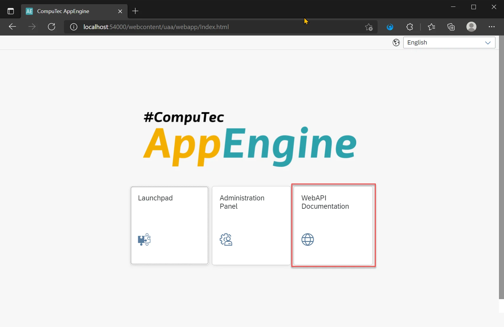

In the swagger we can see API and OData ToDo controllers exposed:


There are also oData metadata provided of our ToDo object.

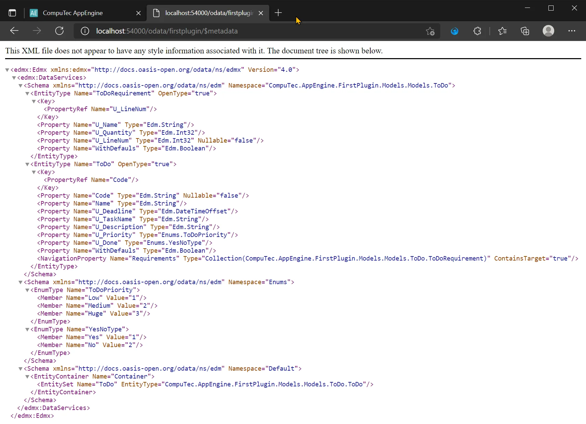

---
