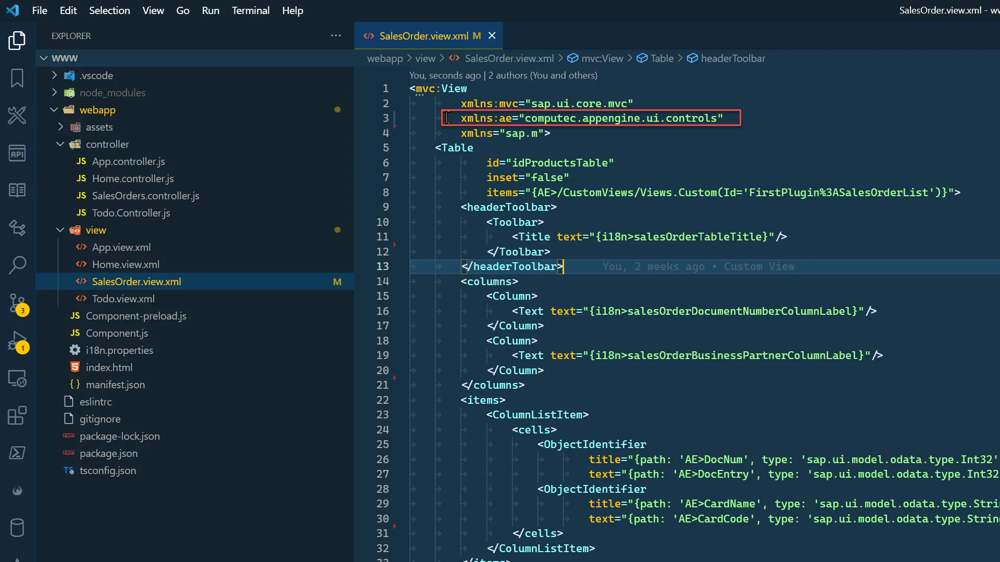
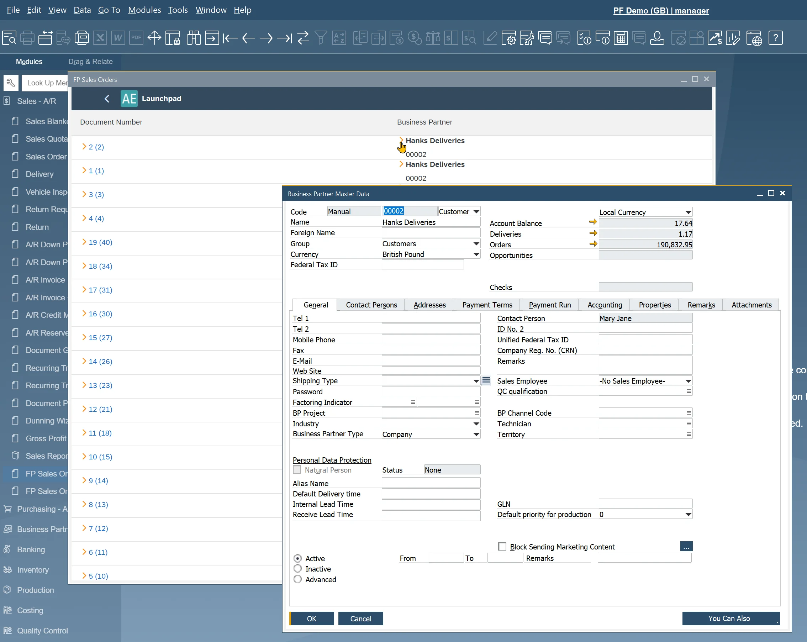

# Using ae:Link's

This guide walks you through how to integrate the ae:Link control into your CompuTec AppEngine plugin for navigating between Sales Orders and Business Partners.

---

## Description

CompuTec AppEngine enhances this experience by providing a custom control - computec.appengine.ui.controls.link - which replicates the functionality of the familiar "yellow arrow" links. These links allow users to directly open related documents or master data records, saving time and simplifying workflows.

:::warning
    The CompuTec AppEngine Link control only functions when the plugin is launched from within SAP Business One.
:::

## Adding Link to Sales Orders and Business Partners

1. Open SalesOrder.view.xml:

    
2. Add a namespace for CompuTec AppEngine controls:

    `xmlns:ae="computec.appengine.ui.controls"`

    
3. Add a Link control to the Document Number column by replacing the ObjectIdentifier with CompuTec CompuTec AppEngine ae:Link. Configure it with the following properties:

    - **text**: The value to be displayed. Use DocNum, and include DocEntry in parentheses using curly brackets.
    - **objectType**: For SAP object, this needs to be BoFormObjectEnum (or ObjectType). BoFormObjectEnum can be found in SAP Business ne SDK. In this case this will be fo_Order:

        
    - **objectSubType**: Required only for ProcessForce objects. Leave it empty in this case.
    - **key**: The unique identifier of the object to open. Here, use the DocEntry of the Sales Order.

            ```xml
            <ae:Link
            text="{path: 'AE>DocNum', type: 'sap.ui.model.odata.type.Int32'} ({path: 'AE>DocEntry', type: 'sap.ui.model.odata.type.Int32'})"
            objectType="fo_Order"
            objectSubType=""
            key="{path: 'AE>DocEntry', type: 'sap.ui.model.odata.type.Int32'}"/>
            ```

4. For the Business Partner field, instead of replacing the existing ObjectIdentifier, wrap it inside an HBox and place the ae:Link control alongside it. In this case, leave the text property of the link blank.

        ```xml
        <HBox>
            <ae:Link
                text=""
                objectType="fo_BusinessPartner"
                objectSubType=""
                key="{path: 'AE>CardCode', type: 'sap.ui.model.odata.type.String'}"/>
            <ObjectIdentifier
                title="{path: 'AE>CardName', type: 'sap.ui.model.odata.type.String'}"
                text="{path: 'AE>CardCode', type: 'sap.ui.model.odata.type.String'}"/>
        </HBox>
        ```

5. SalesOrder.view.xml should look like this.

    SalesOrder.view.xml

        ```xml
        <mvc:View
                xmlns:mvc="sap.ui.core.mvc"
                xmlns:ae="computec.appengine.ui.controls"
                xmlns="sap.m">
            <Table
                    inset="false"
                    items="{AE>/CustomViews/Views.Custom(Id='FirstPlugin%3ASalesOrderList')}">
                <headerToolbar>
                    <Toolbar>
                        <Title text="{i18n>salesOrderTableTitle}"/>
                    </Toolbar>
                </headerToolbar>
                <columns>
                    <Column>
                        <Text text="{i18n>salesOrderDocumentNumberColumnLabel}"/>
                    </Column>
                    <Column>
                        <Text text="{i18n>salesOrderBusinessPartnerColumnLabel}"/>
                    </Column>
                </columns>
                <items>
                    <ColumnListItem>
                        <cells>
                            <ae:Link
                                    text="{path: 'AE>DocNum', type: 'sap.ui.model.odata.type.Int32'} ({path: 'AE>DocEntry', type: 'sap.ui.model.odata.type.Int32'})"
                                    objectType="fo_Order"
                                    objectSubType=""
                                    key="{path: 'AE>DocEntry', type: 'sap.ui.model.odata.type.Int32'}"/>
                            <HBox>
                                <ae:Link
                                        text=""
                                        objectType="fo_BusinessPartner"
                                        objectSubType=""
                                        key="{path: 'AE>CardCode', type: 'sap.ui.model.odata.type.String'}"/>
                                <ObjectIdentifier
                                        title="{path: 'AE>CardName', type: 'sap.ui.model.odata.type.String'}"
                                        text="{path: 'AE>CardCode', type: 'sap.ui.model.odata.type.String'}"/>
                            </HBox>
                        </cells>
                    </ColumnListItem>
                </items>
            </Table>
        </mvc:View>
        ```

## Results

After restarting SAP Business One and reloading your plugin, the links will be active. Users can click the document number or business partner link to jump directly to the relevant form, enhancing workflow efficiency.



---
