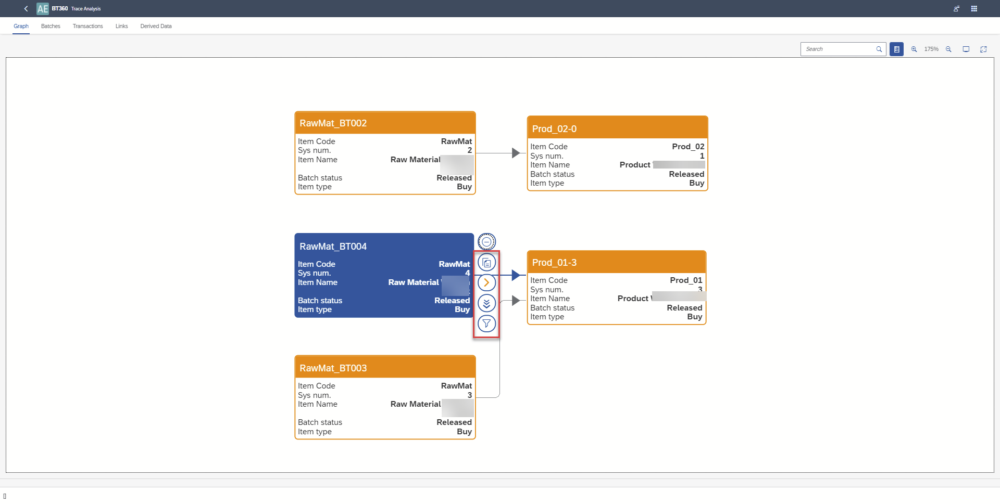

# Multi-Batch Analysis

This functionality enables users to analyze relationships between batches at the transaction (document) level.

Users can export the data used in the trace graph to an .xlsx file. The export includes three sets of raw data taken directly from the graph:used in the graph as a xlsx file. There are three sets of underlying data directly from the trace graph:

    - Batches with their attributes
    - Transactions (documents) associated with each Batch
    - Links between Batches

Additionally, one set of derived data is available:

- (Direct → Indirect Batch) - Transactions. For each direct batch, all related indirect batches influencing it are listed, along with the associated transactions of the direct batch.

This data can be used to create custom pivot tables for insights such as:

1. Are there any Batches affected by a raw material Batch with Country of Origin = Pakistan for selected delivery notes?
2. Display all delivery notes affected by batches from selected GRPO.

Within BT360, users can:

1. Filter Batches associated with the selected transaction - Document Type → Doc entry and switching to Trace Analysis on the list of Batches
2. Display Transaction Analysis for selected Batches with the following information:
    a. multi batches graph  b. grid of batches with attributes  c. grid of transactions  d. grid of links  e. grid of derived data.

3. Export data from each of the above grids into separate tabs in an .xlsx file.
4. Select a batch in the multi-batch graph to navigate directly to the single batch trace graph view.

---

## Batches Selection for Trace Analysis

You can directly select multiple batches from the batch list, or you can first choose documents to narrow down the batches to those related to the selected documents.

### To narrow down batches, click the "Select Documents" button

Click [here](https://www.youtube.com/watch?v=rr60g-PGttY) to know more about Filtering Batches.

### Batch selection and run of Trace Analysis

Click [here](https://www.youtube.com/watch?v=8Q4GkChEFqw) to know more about Batch Selection

## Trace Analysis

### Graph

On a graph, you can:

- Show related documents.
- Access related batch details in SAP Business One by clicking the yellow arrow (note: BT360 must be opened from within SAP Business One).
- Navigate to a single batch analysis, which opens in a new browser tab.
- view only related nodes.

Click [here](https://www.youtube.com/watch?v=-A73RG9ynzw) to know more about Trace Analysis.

### Export Data

Each grid—Batches, Transactions, Links, and Derived Data - allows data sorting. When exporting, all grid data is saved into a single Excel file, with each data type organized into a separate sheet.

Click [here](https://www.youtube.com/watch?v=GXQlY4yV2rA) to know more about exporting data.

---
