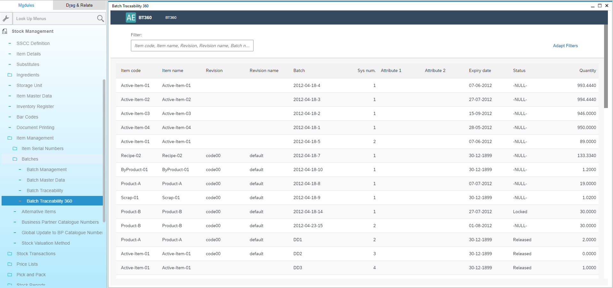

# Overview

The Batch Traceability 360 plug-in enables complete batch tracking throughout the entire product lifecycle within your organization - from production or purchase, through use in manufacturing processes, to final delivery. This provides rapid access to batch records, which is especially valuable in scenarios such as complaint handling or product recalls.

Watch the Guided Tour of [Batch Traceability](https://youtu.be/ZHUswSIKTu0)

## Installation and Configuration

### Prerequisites

Ensure that ProcessForce and the CompuTec License Server are properly installed and configured. For guidance, refer to the [overview](https://learn.computec.one/docs/processforce/administrator-guide/licensing/license-server/overview).

### AppEngine and Plug-in Installation and Configuration

- For AppEngine installation please follow this link: [Installation](../../administrators-guide/installation.md)
- For Plug-in installation please follow this link: [Configuration and Administration](../../administrators-guide/configuration-and-administration/overview.md).

### ProcessForce

Optionally, you can call the Serialization plug-in directly from within ProcessForce:

To do this, check the following checkbox:

Enter AppEngine url, e.g. `http://{host}:54000`, click "Update" and restart SAP Business One.

## Start Points for Function Opening

You can reach ProcessForce Batch Traceability 360 by:

- AppEngine launchpad
- Modules Menu (check the path below)

:::info Path
        Inventory > Item Management > Batches > Batch Traceability 360
:::

- Transaction tab on Complaint form:

Click [here](/docs/processforce/user-guide/complaint-management/complaint/) to find out more about Complaint function.

- Batch Master Data form context menu

Click [here](/docs/processforce/user-guide/inventory/batch-control/batch-master-data/overview/) to find out more about Batch Master Data.

## Batch List

You can compose filter using Adapt Filters:

Select a Batch line and you will be redirected to its Overview.

## Overview

On this screen, several tiles display analytical insights based on the Selected Batch, which acts as the starting point for the analysis. The data shown pertains to the selected batch and all related products (batches) affected by it - specifically, all nodes positioned to the right of the selected node in the trace graph.

>Note:  When you open Batch Traceability in SAP Business One, you can use the yellow arrow functionality, just like in other parts of the system.

To see extended view of header please select 

Select button  and you will be redirected to Batch Trace graph.

## Batch Trace Graph

In this graph, individual batches are represented as boxes (nodes) containing their details. You can zoom in and out using the mouse scroll wheel or by clicking the  and . To manage the legend display, use the . You can expand view by using .

### Going Forward and Backward

The Batch Trace visualization form displays the composition of a specific item by tracing its production process backward—through each batch involved—up to the selected batch.

You can also trace forward from a specific batch to see where the items from that batch were used. To do this, hold Shift and left-click on the desired batch:

In the history list, you can find your tracing history. You can switch to another batch from the list at any time in any form: Overview, Trace, Action.

### Transactions

Left-click on a specific box to select it and than select  button to see all activities and transactions connected to the Batch:

Click the yellow arrow in a specific document row to get more information about it.

## Action

To navigate to Action view, please select  button. In Action view, you can manage Batches' statuses. To change batch status, choose the line in the list and then select checkbox in the first column and finally select button 

---
