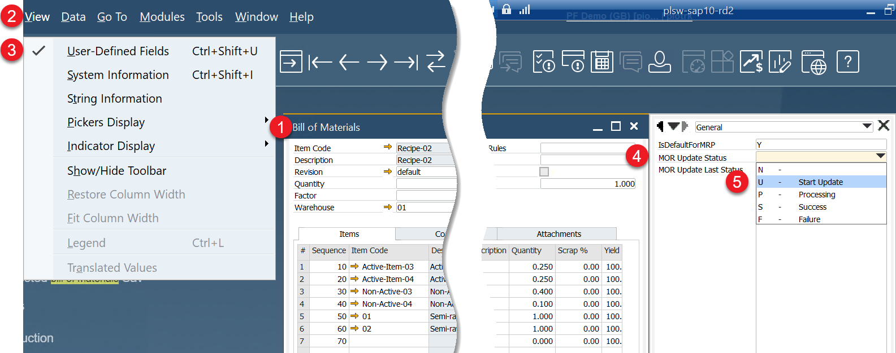

# BOM to MOR Update

Managing consistency between your Bill of Materials (BOM) and Manufacturing Orders (MOR) is crucial in manufacturing environments. The BOM to MOR Update function ensures that changes made to a BOM can be automatically and selectively propagated to existing Manufacturing Orders based on your configuration settings. This helps maintain data accuracy and reduces the risk of production issues caused by outdated BOMs.

---

## Installation

This feature is available through an CompuTec AppEngine job that is automatically installed during the [BulkChange plugin installation](../bulk-changes-on-bills-of-materials/installation-and-configuration.md).

To function properly:

- The Send Events Job must be active for the target company. Learn how to activate it [here](../../administrators-guide/configuration-and-administration/overview.md).
- Background processing must also be configured for the same company. Setup details are available [here](../../administrators-guide/configuration-and-administration/overview.md#activation).

## Configuration

:::info Path
CompuTec AppEngine → Administration Panel → Plugins → CompuTec BulkChange Plugin → Settings
:::

There are additional settings that allow to filter which related Manufacturing Order are to be updated. Set a true or false value to activate or deactivate any option. The default values are used when no System values are set by a user.

| Option | Description |
|--- | --- |
| <u>AllUpdatesInOneTransaction</u> |When it is set to true, all of the related updates have to be successful (otherwise no update is performed).  If it is set to false, in case of failure on one of the Manufacturing Orders, the rest of them will be still updated.|
| <u>IncludeChanges</u>: <li>Items</li> <li>Coproducts</li> <li>Scraps</li> | These elements are taken under consideration during an update (each of the element can be switched off) |
| <u>ManufacturingOrdersStatuses</u>: <li>NotScheduled</li> <li>Scheduled</li> <li>Released</li> | Define Manufacturing Orders in which status are taken under consideration during an update (each of the element can be switched off).  Other Manufacturing Order statuses are not available because of being not editable, e.g. the Closed status. |
| <u>Subproducts</u> | In this section, you can configure the plugin to work for cases when the Manufacturing Order for the subproduct already exists (meaning, there are Items that are BOMs and there can have related Manufacturing Orders).   <u>**ManufacturingOrdersAlreadyExists**</u>  If there are related Manufacturing Orders, then there are two options:  <u>Replace for Statuses</u> – a BOM Item line with related Manufacturing Orders in specific status is replaced in the Final Good Manufacturing Order  <u>AddForStatuses</u> – a new BOM Item line with related Manufacturing Orders in specific status is added in the Final Good Manufacturing Order   <u>ReplacedManufacturingSubOrders</u> – related to the Replace for Statuses option; defines what happens upon the replace.  FinishforStatuses – set status to Finish for the replaced Manufacturing Orders in specific statuses |
| <u>Alerts</u> | You can define whether user will get alerts upon successful or failed updates. |

## Usage

Make some changes to the Bill of Materials:

:::info Path
Production → Bill of Materials → Bill of Materials
:::

Set the MOR Update Status User-Defined Field to the U - Start Update option:

:::info Path
the upper menu → View → User-Defined Fields
:::

Click the Update button in the Bill of Materials form. The status of the update will be reflected in the MOR Update Status Field:

- **Processing**: While updating (the time of processing depends on the data structure and volume).
- **Success**: Update completed successfully.
- **Failure** – Update encountered an issue.

---
