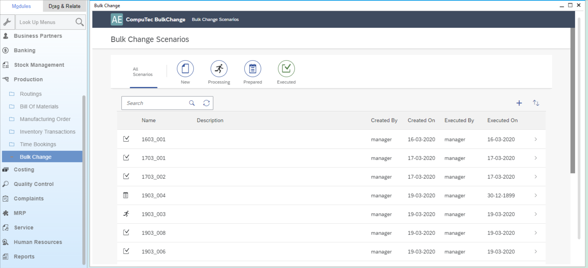

# Installation and Configuration

The Bulk Change Plugin for CompuTec ProcessForce simplifies the mass updating of Bills of Materials (BoMs) by allowing centralized modifications to production processes. This guide provides step-by-step instructions for installing and configuring the plugin, ensuring seamless integration with your existing ProcessForce environment.

---

## Prerequisites

Before proceeding, ensure the following components are installed and properly configured:

    - ProcessForce
    - CompuTec License Server

For detailed guidance on licensing setup, refer [here](/docs/processforce/administrator-guide/licensing/license-server/overview/).

## AppEngine and Plugin Installation and Configuration

To use the Bulk Change plugin, you’ll need to install both the AppEngine and the plugin itself.

- AppEngine Installation: Follow the instructions available [here](../../administrators-guide/installation.md).
- Plugin Installation and Configuration: Detailed steps can be found [here](../../../version-2.0/administrators-guide/configuration-and-administration/overview.md).

## ProcessForce

Optionally, you can access the Bulk Change plugin directly from within the ProcessForce interface.

To do this, check the following checkbox:

Enter AppEngine url, e.g. `http://{host}:54000`, click "Update" and restart SAP Business One.

---
