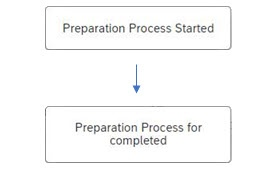

# Scenario Management View

The Scenario Management View in the Bulk Change plugin provides a centralized interface for creating, editing, managing, and monitoring bulk change scenarios for Bills of Materials (BoMs). This view enables users to track the status of each scenario and take appropriate actions at different stages of the change process.

From this screen, you can:

- Create new scenarios
- Edit existing ones
- Filter scenarios by their current status

---

## Scenario statuses

Each scenario progresses through different statuses during its lifecycle:

- **New**: Indicates that the scenario is in edit mode. Any time an existing scenario is modified, its status reverts to New.
- **Processing**: This is a temporary status that appears while the system processes the scenario. When a scenario transitions from New to Prepared, it briefly enters Processing. Users are notified via system messages during this step:

    

- **Prepared**: A Prepared status means the scenario is ready for review and execution. You can view the proposed changes by navigating to the Proposed Changes tab within the scenario details.

    

- **Executed**: Once a scenario has been applied to the system, its status changes to Executed. The Proposed Changes tab in the scenario details will show whether the execution was successful or if any issues occurred.

    

---
