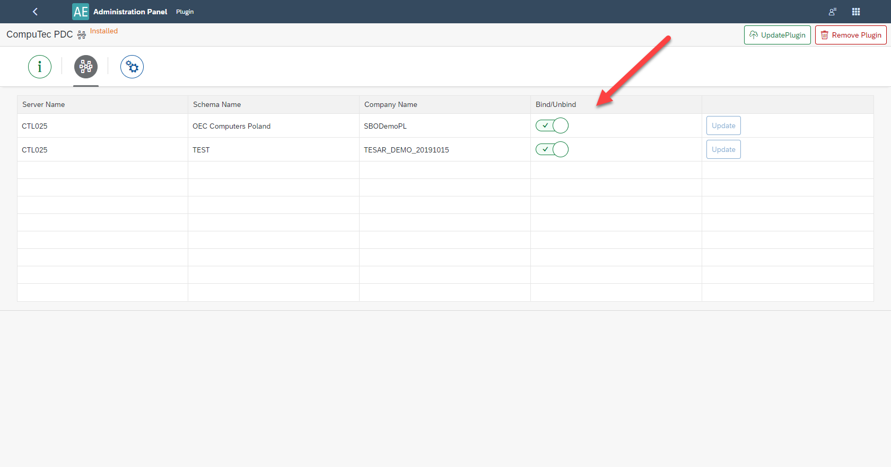
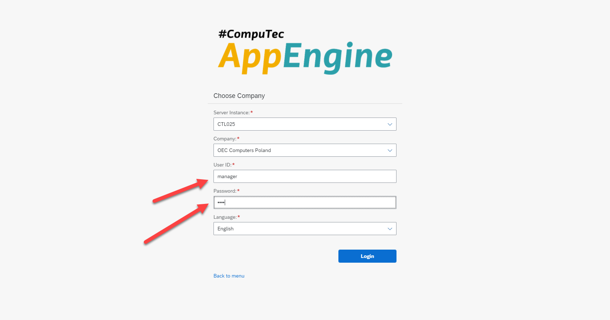

# CompuTec PDC Plugin

:::info
This manual presents how to work with CompuTec PDC and CompuTec AppEngine. It is not a manual for CompuTec PDC application (which is available [here](/docs/pdc/)).
:::

PDC stands for Plant Data Capture: the application allows to record production task by using CompuTec ProcessForce Time Bookings documents directly from production floor via mobile touchscreen devices. It records time spent on specific tasks or operations, allows you to oversee the precise details about any given operation such as machine data, features, operational history and item details and using the management panel you can supervise your entire machine park and its operations as well as check resource status.

---

## Prerequisites

CompuTec ProcessForce and CompuTec License Server is installed and configured.

CompuTec PDC requirements have been fulfilled, for more information click [here](../administrators-guide/requirements.md).

:::caution
CompuTec PDC plugin works only with CompuTec PDC, 64bit version.
:::

## CompuTec AppEngine and Plugin Installation and Configuration

Click each link for the specific component installation manual:

- [CompuTec AppEngine installation](../administrators-guide/installation.md)
- [CompuTec PDC plugin](/docs/pdc/administrators-guide/installation/overview)
- [CompuTec ProcessForce plugin](../releases/plugins/processforce/download.md)
- [CompuTec ProcessForce API (on the same server as appengine)](/docs/processforce/releases/download#computec-processforce-api)
- [CompuTec PDC application](/docs/pdc/administrators-guide/installation/overview)

:::caution
CompuTec ProcessForce API needs to be installed on the same server as CompuTec AppEngine.
:::

## Setting up the Application

After installation, launch the CompuTec AppEngine Console and bind the desired database:

Then open the CompuTec PDC application and fill in Settings with data (default CompuTec AppEngine server is `https://localhost:54000`). Complete the fields in the sequence shown in the screenshot below. This will refresh the application and fetch necessary data.

Filling in the fields marked with the red arrows automatically fills in the fields marked with the purple arrows (then, choose one option from the drop-down list).

## Upgrade of the Application

To successfully upgrade the application, follow the steps:

    1. Update plugin in the CompuTec AppEngine console (you can do it by choosing the plugin package) and restart the plugin.

        

        

        

    2. Install the corresponding CompuTec PDC application (before that, you have to remove the already installed CompuTec PDC application)

:::caution
Verify whether the CompuTec ProcessForce API also requires an upgrade. If so, uninstall the existing version and install the updated corresponding version.
:::

    3. Start CompuTec PDC application.

## Additional Information

1. For more details about the CompuTec PDC system, refer [here](/docs/pdc/).
2. CompuTec AppEngine for PDC is accessed via a web browser. There are no direct links from SAP Business One or CompuTec ProcessForce functional objects.
3.To install the correct CompuTec PDC application version that matches your plugin, follow the instructions below:

    a. Open Launchpad in Appengine Console:

        

    b. Enter login credentials (same as SAP Business One credentials).

        

    c. Open CompuTec PDC, download the file and complete the installation process.

        

        

---
