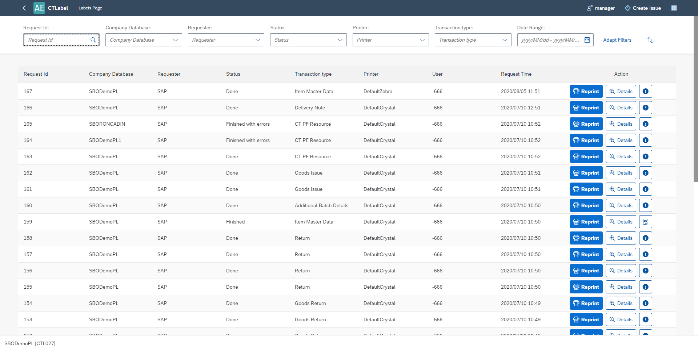
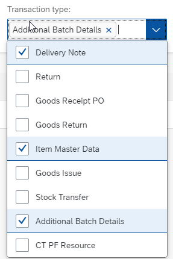
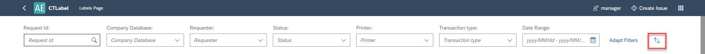
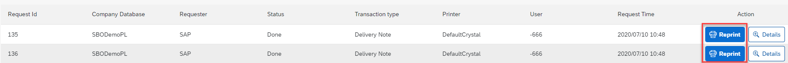
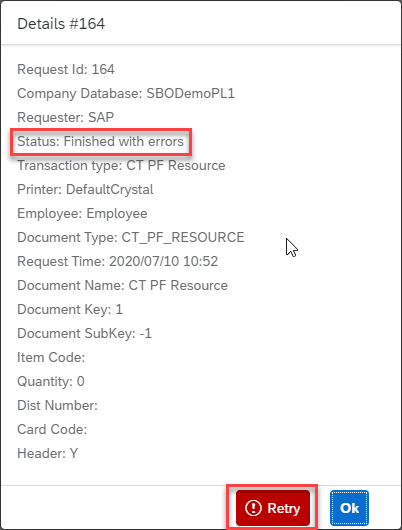

# CTLabel

The CTLabel plugin is a powerful extension of the [CompuTec Labels](/docs/labels/) module that enhances label management capabilities within your system. It offers users a streamlined interface to monitor, filter, and manage label printing requests - including reprinting, printer switching, and troubleshooting — all while enabling filter-based URL sharing for enhanced navigation and collaboration.

The CTLabel plugin allows users to:

- list all requests
- list all requests based on multiple filters
- reprint a label
- reprint a label on a different printer
- show printing details of a request
- save filters in the URL
- load filters from the URL

---

---

## CompuTec AppEngine and Plug-in Installation and Configuration

For the CompuTec AppEngine installation manual, click [here](../administrators-guide/installation.md).

For the plugin installation manual, click [here](../../version-2.0/administrators-guide/configuration-and-administration/overview.md).

## Filters and Sorters

The filter bar at the top of the CTLabel screen enables dynamic filtering and sorting of label requests:

        - **Request Id Filter**: 

                

                - This filter enables you to search for requests using a specific Request ID.
                - It functions as a Search Field, allowing you to enter any value.
                - To perform a search, simply type the Request ID and press Enter.

        - **Company Database Filter**

                

                - This filter allows you to search for requests associated with a specific Company Database.
                - It uses a MultiComboBox, enabling you to select one or more companies.
                - The list of available companies is derived from all requests, based on distinct CompanyDatabase values in the Requests view.

        - **Requester Filter**

                

                - This filter enables you to search for requests submitted by specific Requesters.
                - It uses a MultiComboBox, allowing you to select one or more requesters.
                - The list of requesters is fixed, with the available options being: **SAP, CompuTec WMS, CompuTec PDC, CompuTec ProcessForce**.

        - **Status Filter**

                

                - This filter lets you search for requests based on their status.
                - It uses a MultiComboBox, allowing selection of one or more statuses.
                - The list of statuses is fixed, with the available options being: Started, Modified, Stopped, Finished, Done, Finished with errors. 

        - **Printer Filter**

                

                - This filter enables you to search for requests assigned to specific printers.
                - It uses a MultiComboBox, allowing you to select one or more printers.
                - The list of printers is derived from the **CompuTec Label Printing Manager**.

        -- **Transaction Type Filter**

                

                - This filter allows you to search for requests based on specific transaction types.
                - It uses a MultiComboBox, enabling you to select one or more transaction types.
                - The available transaction types are derived from all requests, based on distinct TransactionTypes values in the Requests view.

        - **Date Range Filter**

                

                - This filter allows you to search for requests within a specific date range.
                - It is a DateRange filter, requiring you to select two dates.
                - If you're looking for requests from a single day, simply select the same date for both fields.        

        - **Adapt Filters**

                - At the end of the filter bar, you'll find the Adapt Filters button.
                - Clicking it opens a new dialog window containing all available filters.

                        

                - Any changes made in the "Adapt Filters Dialog" will only be applied if you close the dialog using the "Go" button.
                - If you close the dialog with the "Cancel" button, all filter changes will be discarded and revert to their previous state.
                - The "Clear" button resets all filters.
                - Additionally, you can use checkboxes on the right to hide/show various filters on the filter bar.

        - **Sorting**

                

                - At the end of the filter bar, you'll find a Sorting button.
                - Clicking it will open a new dialog displaying all available sorting options.

                

                In this form, you can select the column you want to sort by and the sort order.

## Reprinting

1. To use the reprint function, you need to click on the **Reprint** button on the selected request.

        

2. This will open the **Reprint** form.

        

3. At the top of the form, you’ll see the request ID. By default, the Printer field is set to the printer originally used for the request. However, you can select a different printer from the dropdown list if needed.

        

4. The available printer list is retrieved from the **CompuTec Label Printing Manager**.

5. Clicking the "Reprint" button will send a new request to print the label using the selected printer. If successful, a confirmation pop-up will appear stating that a new request has been created, and the request list will automatically refresh.

        

6. If there is an error during the process, a pop-up message will notify you that the reprint attempt was unsuccessful.

        

## Request Details

1. To view the details of a specific request, click the "Details" button on the selected row.

        

2. This will open the Details form.

        

3. At the top of the dialog, the request ID is displayed. Below, you can review all relevant information associated with the selected request. If the status of the request is "Finished with errors", a "Retry" button will be available within the details form.

        

4. Clicking the "Retry" button will initiate an attempt to reprocess the print request. If successful, a confirmation pop-up will notify you that the retry operation was completed, and the request list will refresh automatically. The request status will be updated to Started.

        

5. If there was an error we will get a pop-up telling us that there was an error trying to retry printing the label.

        

## Request Run Parameters

To check the run parameters of a given request, click the corresponding button on the **selected** row.

## Request Errors

To view the errors of a given request, click on the **selected** button on the selected row.

## URL Parameters

The CompuTec Labels plugin offers functionality to save and load filters directly through the URL.
Whenever a filter is changed, the URL is dynamically updated, and the corresponding data is reloaded automatically.

To add parameters manually, add **?** sign at the end of the URL and then list all parameters like **parameterName=parameterValue1,parameterValue2**.

E.g. `http://localhost:54000/webcontent/launchpad/webapp/Index.html#/plugin/computec.appengine.ctlabel.plugin&labels`**?companyDatabase=SBODemoPL,SBODemoPL2**

We separate parameters using the **&** sign e.g. `http://localhost:54000/webcontent/launchpad/webapp/Index.html#/plugin/computec.appengine.ctlabel.plugin&labels`**?**
companyDatabase=SBODemoPL**&**status=E,F,C**&**transactionType=15,4

### List of URL Parameters

        - **requestId=sampleRequestId**  Full request Id or part of it.  E.g. requestId=12

        - **companyDatabase=companyName1,companyName2,...**  Company names are the names of the databases.  E.g. companyDatabase=SBODemoPL,SBODemoPL2

        - **requester=requester1,requester2,...**  Requester values are constant.  Possible requester values: **SAP, WMS, PDC, PF**.E.g. requester=SAP,PF

        - **status=status1,status2,status3,...**  Status values are constant. Possible status values: **C** (Started), **M** (Modified), **S** (Stopped), **F** (Finished), **D** (Done), **E** (Finished with errors).  E.g. status=E,F,C
        
        - **printer=printer1,printer2,..**
        Printer values (printer codes) are based on the list of printers from **Computec Label Printing Manager**.  E.g. printer=DefaultCrystal,DefaultZebra

        - **transactionType=transactionType1,transactionType2,...**  Transaction type values are based on the values from the **"@CT_PF_TSTS"** table.  The key for each transaction type is **"@CT_PF_TSTS"**.U_Name.  SAP types are numbers, other ones are strings.  E.g. transactionType=4,15,CT_PF_ADDITONALBATCH

        - **dateRange=date1-date2**  Date1 and date2 are saved in a yyyyMMdd format.  Date1 is the starting date, date2 is the ending date.  E.g. dateRange=20200701-20200731

        - **dateRange=date1-date2**  Date1 and date2 are saved in a yyyyMMdd format.  Date1 is the starting date, date2 is the ending date.  E.g. dateRange=20200701-20200731
        
        - **sorter=sorterKey**  Sorter key is a key for a given sorter option.  Possible values:  **R - Request Id - Ascending,**  **RD - Request Id - Descending,**  **C - Company Database - Ascending,**  **CD - Company Database - Descending,**  **T - Requester - Ascending,**  **TD - Requester - Descending,**  **P - Printer - Ascending,**  **PD - Printer - Descending,**  **N - Transaction Type - Ascending,**  **ND - Transaction Type - Descending**

Sample link with all filters:

`http://localhost:54000/webcontent/launchpad/webapp/Index.html#/plugin/computec.appengine.ctlabel.plugin&labels**?**`
**requestId**=12**&companyDatabase**=SBODemoPL**&requester**=SAP**&status**=E,F,C**&printer**=DefaultCrystal**&transactionType**=15,4,CT_PF_ADDITONALBATCH**&dateRange**=20200701-20200731**&sorter**=PD

---
