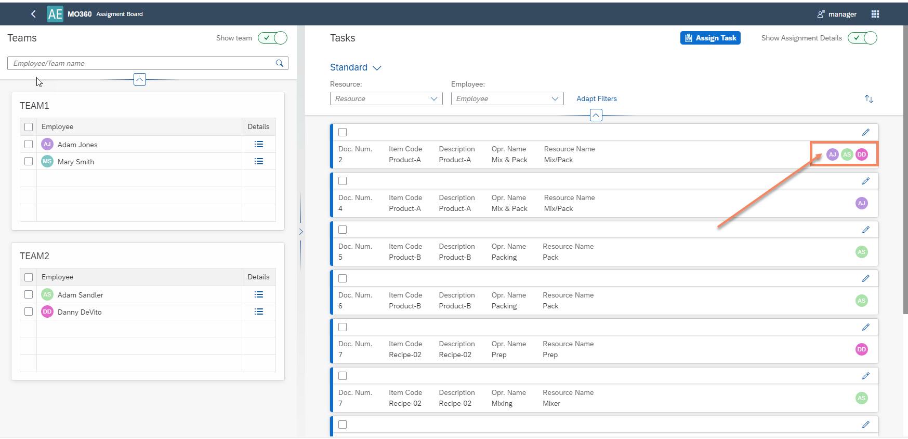
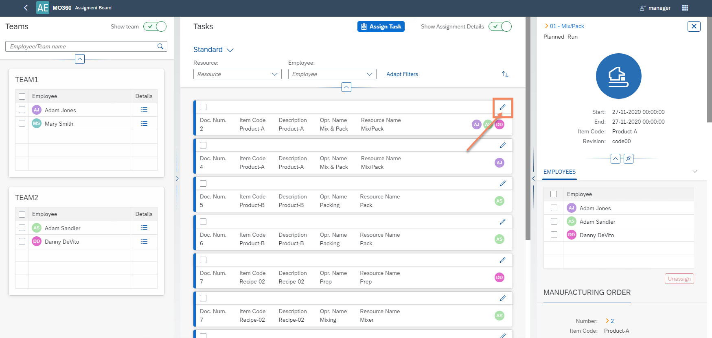
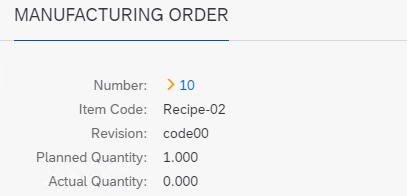
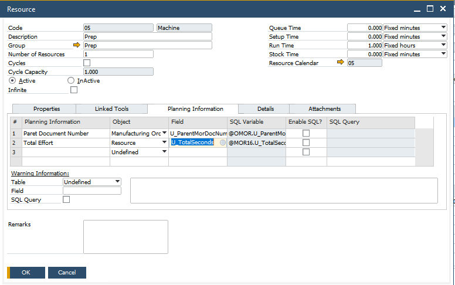

# Assignment Board

The Assignment Board is a powerful feature in SAP Business One, particularly when used with CompuTec ProcessForce and CompuTec PDC. It offers a real-time, visual interface to help production planners easily assign manufacturing tasks to teams or individual employees and manage their workload effectively.

This guide will walk you through the key components of the Assignment Board, including how to configure teams, assign and unassign tasks, filter views, and explore manufacturing order details.

Here you can find information on scenario definition.

---

## Assignment Board

### Teams

``Production → Time Booking → Team``

To begin using the Assignment Board, you must first define Teams in SAP Business One. These teams will be displayed on the Assignment Board interface.

- When you open the Assignment Board, all available teams are shown.

    

- At the bottom of the board, you’ll also see unassigned employees.

    

- You can choose to view all employees (irrespective of their team) by unchecking the 'Show team' option.

    

- The list includes both active and inactive employees; to view only active ones, adjust the settings accordingly.

    

### Tasks

#### My Views

You can create custom filter views tailored to different roles or departments. These saved views help streamline the task assignment process by focusing only on relevant operations.

Click [here](https://www.youtube.com/watch?v=jQF-vpgacSI) to know more about filtering tasks.

#### Assign a Task to Employees

You can select tasks manually or filter them with preconfigured filters. Tasks typically include Manufacturing Orders (MOs) that are in "Released" or "Started" status. Each MO is broken down into Operations and Resources, such as Machines, Tools, or Subcontracting work. The list shows the same Tasks that can also be assigned from the CompuTec PDC level.

Click [here](https://www.youtube.com/watch?v=35TLLMNabNE) to know more about assigning tasks.

Once you have selected a atsk,

- Choose one or more Employees or the whole Team from the left panel.
- Assigned tasks will then appear in the taskbar, with a corresponding tile in CompuTec PDC for each assigned Employee.

    

The effect of the assigning of a Task is the creation of a CompuTec PDC tile assigned to a specific Employee.

#### Unassigning Task from Employees

- In edit mode, the task's details become available through a side panel on the right side of the screen, allowing you to verify the task information and remove an employee assignment.

    

- Once in edit mode, select the employees you wish to remove and unassign them.

    

- Alternatively, you can select the employee(s) and the corresponding task(s), and then use the Unassign button available at the top of the screen.

    

### Manufacturing Order Details

In this section, you can find the following information about the Manufacturing Order:

- Operation
- Planned Start Date and End Date
- Header Item Code and Revision

#### Manufacturing Order

The Assignment Board provides detailed visibility into Manufacturing Order details such as (Number, Item Code, Revision, Planned and Actual Quantity, Required Date)

    

#### Operation

    - Operation details (Code, Name, Sequence, Status)

        

#### Resource

    - Resource details (Code, Name, Type)
    - Time details (start and end time of all time types)

        

#### Additional information

    - Additional data specific to the Resource can also be accessed.

        
        

---
