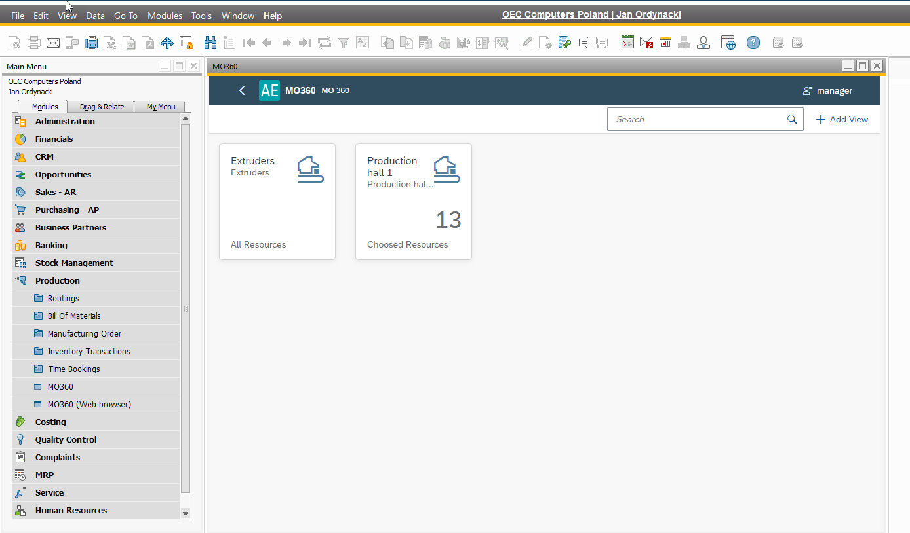

# Plugin Installation and Configuration

This guide provides step-by-step instructions for installing and configuring the necessary plugins to extend the capabilities of CompuTec ProcessForce and CompuTec AppEngine. By following this guide, you will ensure that the MO360 and PPF plugins are correctly deployed and integrated with your SAP Business One environment. Additionally, this document outlines how to optionally enable MO360 directly within CompuTec ProcessForce for streamlined manufacturing order management.

---

## Prerequisites

CompuTec ProcessForce and CompuTec Licence Server is installed and configured. For more information, click [here](/docs/processforce/administrator-guide/licensing/license-server/overview/).

## CompuTec AppEngine and Plugin Installation and Configuration

Follow the respective guides below for installing and configuring CompuTec AppEngine and the required plugins:

- CompuTec AppEngine [Installation](/docs/appengine/administrators-guide/configuration-and-administration/installation/).
- Plugin [Configuration and Administration](../../administrators-guide/configuration-and-administration/overview.md).

Two plugins need to be installed: **MO360** and **PPF**.

## CompuTec ProcessForce

You can optionally access the MO360 plugin directly within the CompuTec ProcessForce interface.

To do this, check the following checkbox:

Enter the CompuTec AppEngine URL, e.g. `http://{host}:54000`, click "Update" and restart SAP Business One.

---
