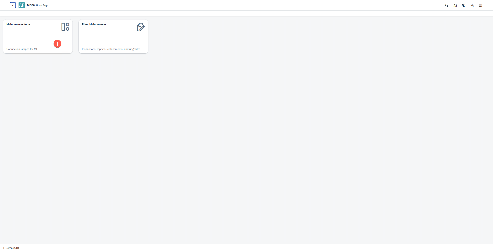
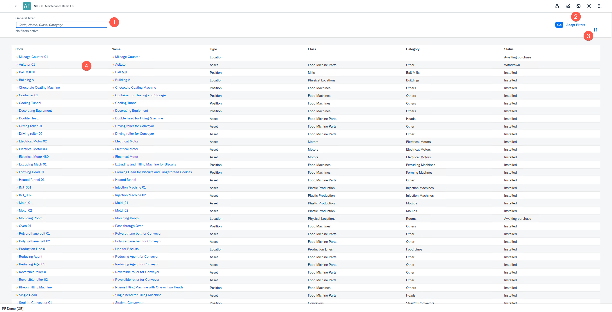
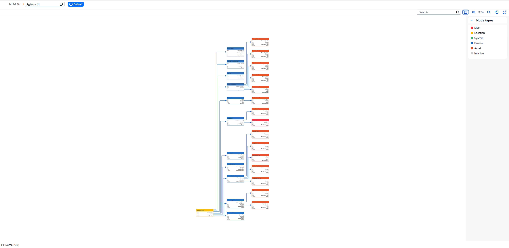
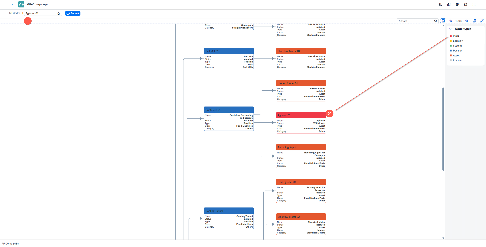
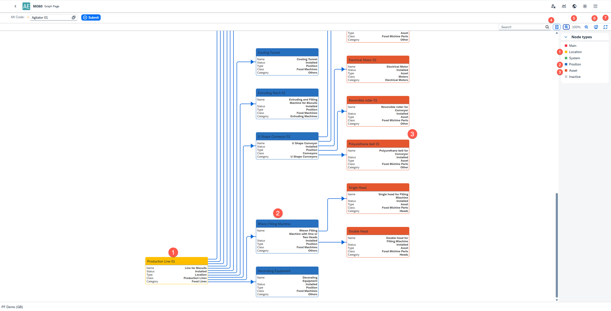
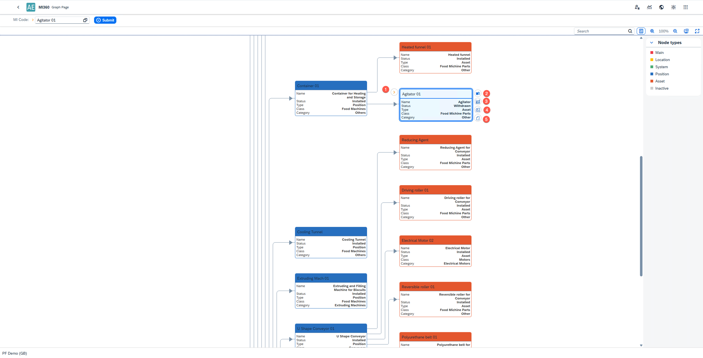

# Maintainable Items - MI360 Graph

The Maintainable Items module in MI360 provides a comprehensive view of all Maintainable Items (MIs) defined in the system. It allows users to explore the hierarchical and relational structure between MIs through an interactive graph.

You can access the Maintainable Items module from the MI360 Launchpad.

**Key Features**:

- **Filter Maintainable Items**: Use filters to refine the displayed list of MIs.
- **Customize Filters**: Add or remove filter fields as per your requirement.
- **Change Sorting Order**: Adjust order conditions for easier data navigation.
- **Graph Navigation**: Click any Maintainable Item in the list to open its detailed relationship graph.

    

The graph displays the complete relationship hierarchy from child to parent level for the selected Maintainable Item.

1. **Base MI**: You can change the base MI from this view.
2. The main/base MI is highlighted in **red** for easy identification.

**Graph Visualization Options**

- Color Coding by Asset Type: Each box (node) is color-coded based on its asset type. The legend for node types appears in the right panel.
- Hide/Show Node Types Panel: Toggle visibility of the node types panel as needed.
- Zoom Controls: Zoom in or out to adjust your view of the graph.
- Fit-to-Screen: Automatically fits the entire graph to your screen and adjusts the zoom level.
- Full-Screen Mode: Expands the graph view to full screen for better visualization.

    

MI360 provides several interactive options within the graph:

- **Golden Arrow Navigation**: Opens the selected Maintainable Item directly in SAP Business One UI (available only in SAP B1).
- **Show Related Nodes**: Highlights only nodes that are linked to the selected Maintainable Item, dimming unrelated ones.
- **Show Related Effective Meters**: Displays a list of effective meters associated with the selected MI.
- **Show Related Maintenance Orders (MOs)**: Lists all Maintenance Orders linked to the selected MI.
- **Show Aspect Points**: Displays the related aspect points for deeper analysis.

---
