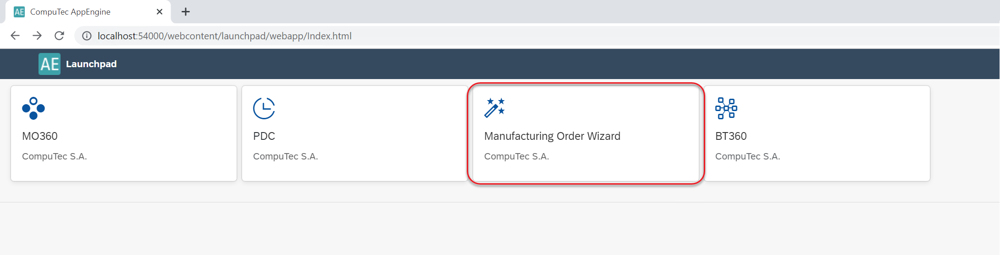
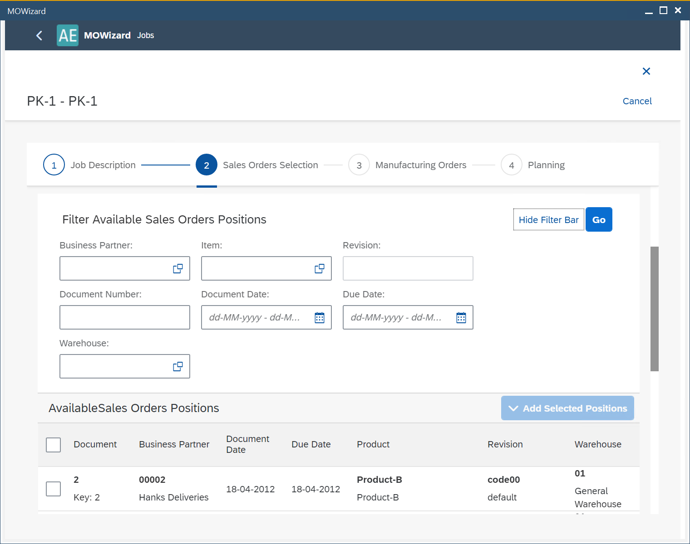
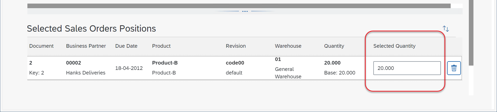
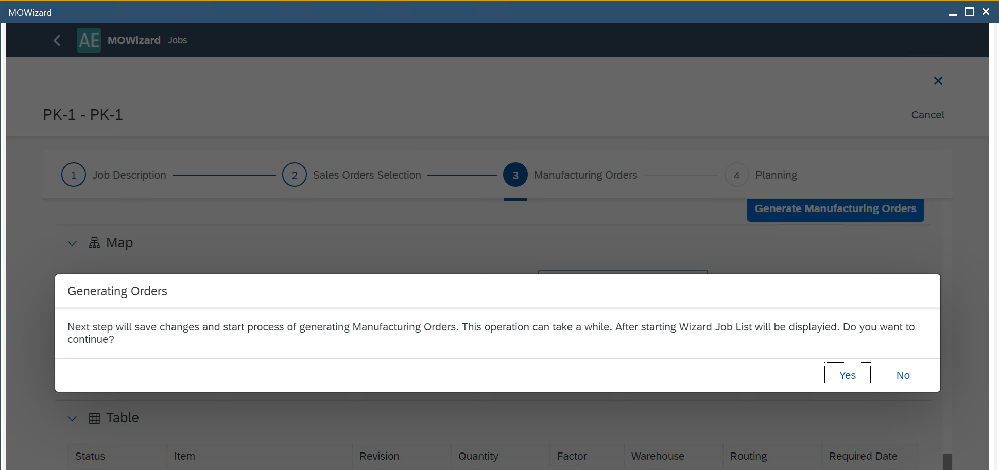

# MOWizard

MOWizard is a powerful plugin designed to streamline the creation of Manufacturing Orders (MOs) based on selected Sales Order lines. It is especially useful for businesses managing complex, multi-level product structures, complex product trees swiftly. Creation of this plugin was inspired by cases of companies that have large numbers of Manufacturing Orders related to a single line on a Sales Order. This tool enables faster processing and better visibility, reducing manual work and improving production efficiency.

---

## Installation

1. Get the installation file from [here](../releases/plugins/mowizard/download.md).
2. Follow the plugin installation instructions from [here](../administrators-guide/configuration-and-administration/overview.md#plugins).
3. Once installed, go to Launchpad and select the MOWizard plugin to begin.

    
4. Alternatively, access it via the SAP Business One main menu: Production → MOWizard.

## Usage

Click the plus (+) icon to create a new job. You can create multiple jobs as needed.

    1. Job Description: Choose any name (mandatory) and description (optional) and then proceed to the next step by clicking the Step 2 icon:

        

    2. Sales Orders lines selection: Use filters as needed to narrow down the Sales Order lines, or skip filtering to view all available lines.

        

        The Available Sales Orders Positions table holds Sales Orders lines that can be filtered by many conditions (the Filter Available Sales Orders Positions section).

        Checking the required checkboxes and clicking Add Selected Positions moves them to the Selected Sales Orders Positions table (click the checkbox in the first row to mark all of the lines in the list). These Sales Orders' lines will be further processed.
        You can modify quantities if needed.

        
        Click Step 3. to continue.

    3. Manufacturing Orders: Click "Generate Manufacturing Orders". Click "Yes" in the system message form:

        

        Click Yes to proceed. Please note that the creation process is not instantaneous - it may take some time to complete, depending on the number and complexity of the Manufacturing Orders involved. Once initiated, the job appears under the Running tab (refer to the second screenshot on this page).

        At this stage, the system generates the manufacturing tree, which you can view in both map and table formats. However, no Manufacturing Orders have been created yet - this step is purely for structure generation and review.

    4. Once the manufacturing tree is created, the related job is moved from the Running tab to the Prepared tab. Once the job is generated, it is not possible to change any data in it. Click the required job line in the Prepared tab to see the related data.
        - Here, you can see the chosen data in form of a manufacturing tree (the Map tab, showing relations between linked Manufacturing Orders) or a table (the Table tab).
        - The map view shows the manufacturing tree divided by material groups.
        - This section is for data preview only.

    5. Click Step 5 to enter the Planning section. Here, you can see information on the planned Manufacturing Orders. If you want to choose specific Manufacturing Orders, click the Edit button at the top of the form. 
        - You may change the numbering series or manufacturing dates.
            - Click Reschedule if you change any dates.
            - Click Summary to proceed.

    6. Here, you can see the Manufacturing Orders that are about to be created. The Link child MOR's option is checked by default.

    7. Click Save and Run to initiate the job.
        - The job is moved back to the Running tab.
        - Once all Manufacturing Orders are successfully created, the job moves to the Completed tab.
        - If some Manufacturing Orders are not created (e.g., due to parent-child dependency issues), the job returns to the Prepared tab.
        - Click the job to view details. For failed Manufacturing Orders, select the line with Failure status to see the reason.

**Example usage**

Click [here](https://www.youtube.com/watch?v=HdCU7PtdwPA) to know more about Example Usage.

---
