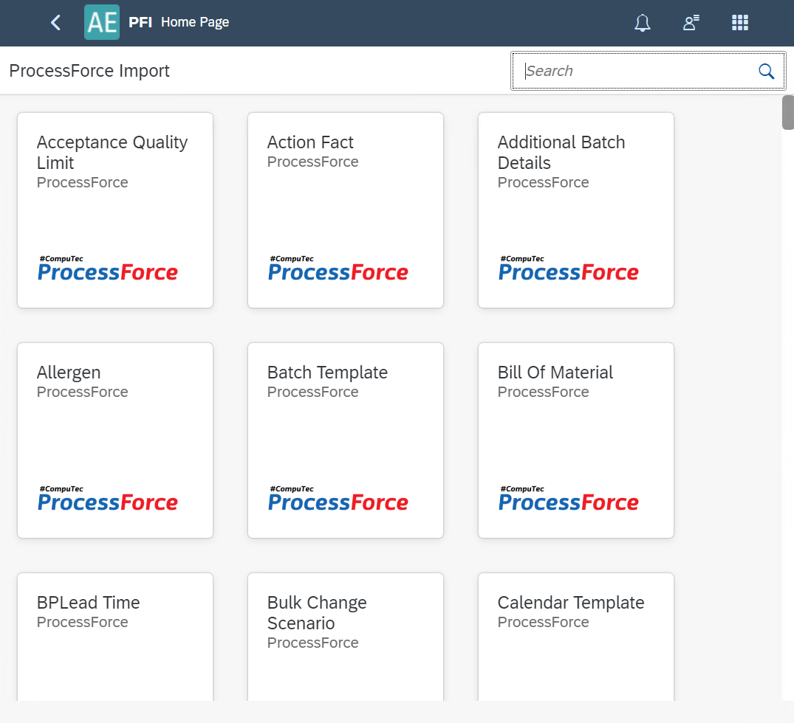

# PFI

The CompuTec ProcessForce Import (PFI) plugin is a powerful and user-friendly tool designed to simplify and accelerate the process of importing and updating data within CompuTec ProcessForce objects in SAP Business One. Developed as a more flexible and efficient alternative to traditional PowerShell scripts, PFI enables users to manage large data volumes with ease through Excel and CSV files. The idea behind this plugin is to be a simplifier, swifter, and more adjustable alternative for PowerShell updates.

Click [here](https://www.youtube.com/watch?v=MSreLSZC8DU) to know more about CompuTec ProcessForce Import.

>Note: video features a pre-release version; final interface may vary slightly.

---

## Start

### Prerequisites

- The CompuTec ProcessForce plugin has to be installed and enabled for the company you want to use CompuTec ProcessForce Import with.
- If new UDFs (User Defined Fields) are added to CompuTec ProcessForce objects, restart the CompuTec AppEngine service to ensure they appear in the PFI template.

### Installation

Click [here](../administrators-guide/configuration-and-administration/overview.md#plugins) to get to know more about CompuTec AppEngine Plugin Installation.

## Usage

Once the plugin is installed, its tile is available in the [Launchpad](/docs/appengine/appengine-users-guide/launchpad/) Upon opening the plugin you can see CompuTec ProcessForce objects represented by tiles. Choose the one you want to work with (scroll to get to other objects):

    

The example view (Bill of Materials in this case):

### Header

In the upper-left corner, you'll see the name of the selected object. To the right, all related objects connected to the main one are displayed. Click on the name of either the main object or any related object to view its columns (i.e., database table properties) in the table below. The numbers in brackets indicate the object’s hierarchy level — for example: Bill of Materials (0) > Routing (1) > Routing Operations (2) > Routing Operations Properties (3).

- **Download Excel**: This option lets you download the table content, including column headers, as a Microsoft Excel file. If no sample data has been loaded (see the Load Sample option), the downloaded file will contain only the column names. You can then fill in or update the data in Excel, save the file, and upload it back into the plugin using the Import from Excel feature.
- **Download with Advanced Settings**: Option available from the arrow down next to Download Excel option:

    

- **Include Error Messages**: When enabled, this option allows users to download the import results along with detailed error descriptions for any failed entries after the import process is completed.
- **Upload Data from Excel**: Use this option to import a Microsoft Excel file that was previously downloaded and updated with data. A blank cell in the Excel file will not overwrite the corresponding field in the system - it will be ignored during import. If you want to clear a field’s value, use a forward slash ( / ). Blank cells are skipped by the system (retaining existing values or filling them automatically for new entries) and are indicated with a specific symbol in the table.
- **Load Sample**: This option allows you to load existing data from the database into the table for review or bulk updates. After loading, you can download the data as an Excel template, make necessary changes, and re-upload it using the Import from Excel option. To use this feature, click Load Sample, optionally apply filters based on form-specific fields, select the number of records to retrieve, and click Load. The selected object will be loaded along with all its related sub-level objects (e.g., Bill of Materials with Items, CoProducts, Scraps, etc.).
- **Import to SAP**: This option imports data from the matrix to a database
- **Download Template CSV**: Downloads a template for a specific, currently displayed object, e.g. Bill of Materials' Items (unlike the Download with advanced settings, Export data to CSV file which exports templates for the displayed object and all the lower level objects).
- **Upload Data from CSV**: This option is similar to the Upload data from Excel, but for CSV files use.

### Filters

You can filter the result table by putting values in specific fields. You can also adapt the filters section: choose which fields are displayed to be used.

**Read-only fields**: When unchecked, only fields that can be updated will be displayed. When checked, displays all fields, with read-only ones marked by a padlock icon. Example: 

### Table

This section displays a data table for the object selected in the header, showing all standard columns along with any User Defined Fields (UDFs) positioned on the far right. Before importing this data into SAP (using the import option in the header), the table must first be populated using one of the available data-loading options.

- **Import Key**: hIt is the first column in the PFI matrix. It is a link column for the template (e.g. links Bill of Materials with its lower level objects).
- **The key icon**: Marks the primary field for this object. If you leave this field empty during edit, it will be considered as adding a record. If there is any value here, this record will be updated.
- **Action**: After uploading an Excel, the Action column determines manipulation type: Add/Update.
- **Import Status**: Indicator of successful/failed import of a specific line to SAP Business One.

---
