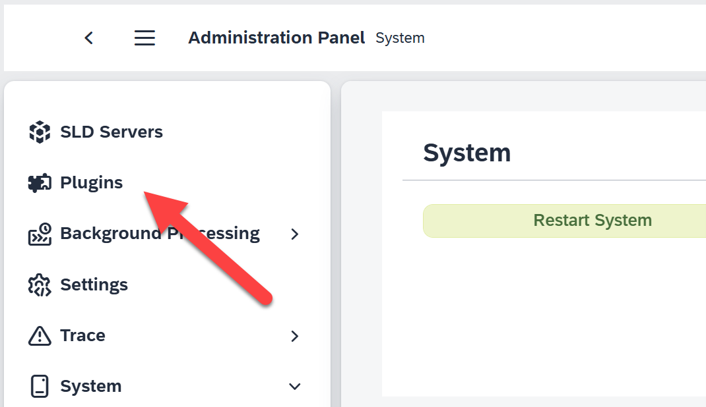
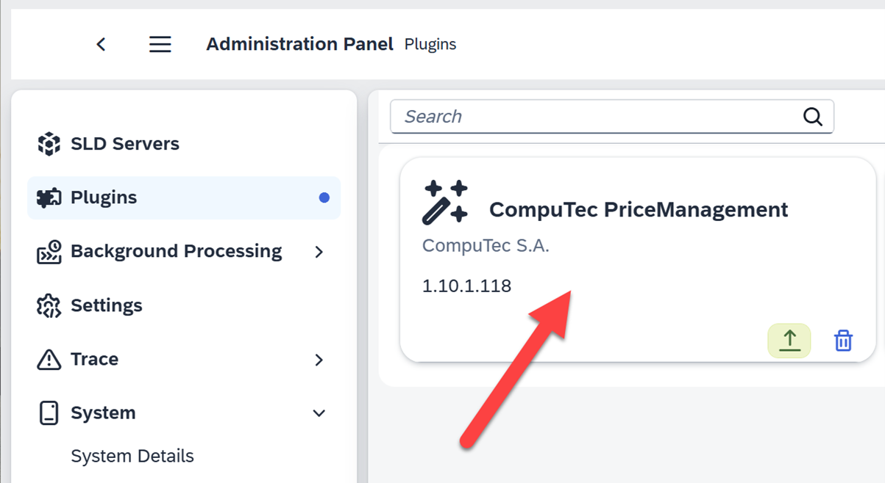
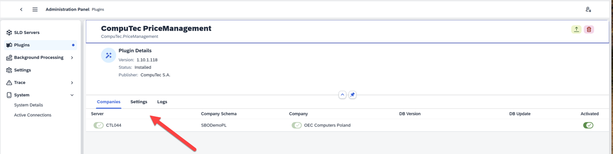
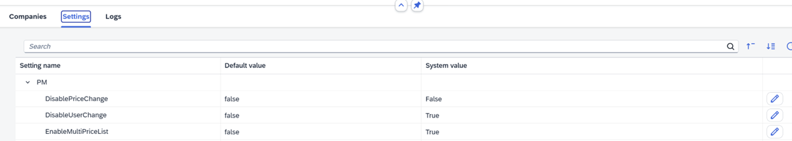
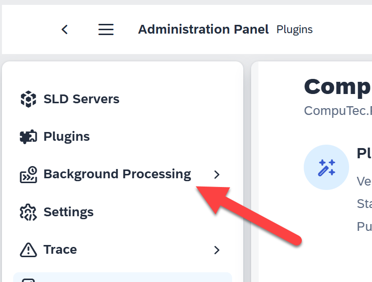
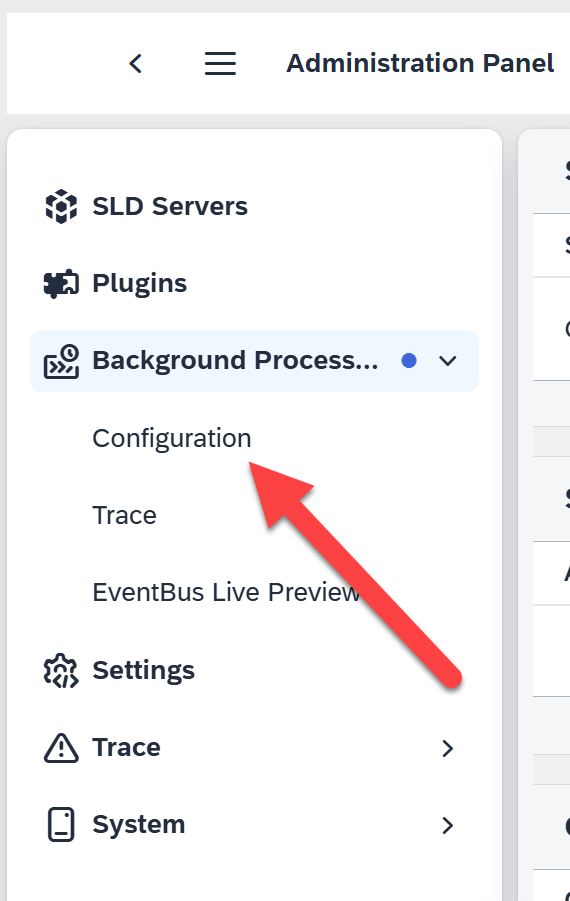
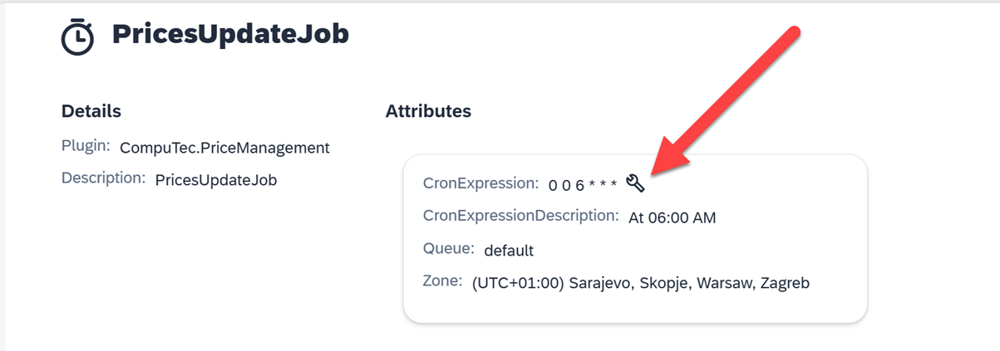
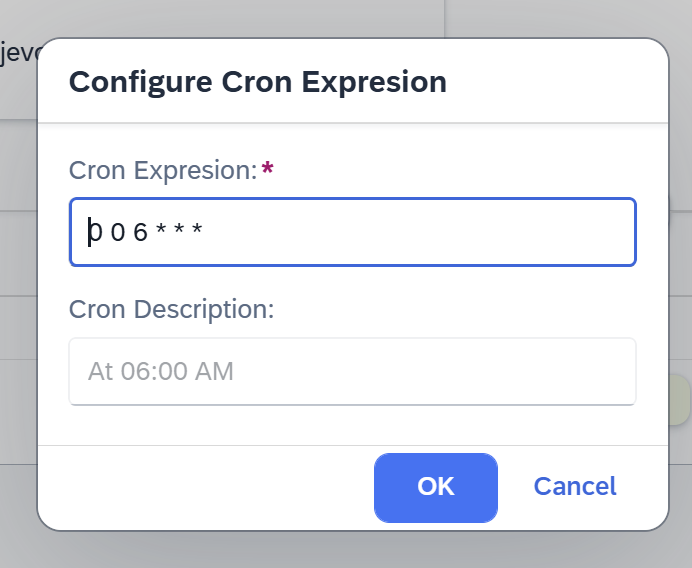

# Configuration

Configuration settings are accessible in the Administration Panel, which is available to selected users through the AppEngine. These settings enable you to define specific functionalities for the plugin.

    

---

## Plugins Settings

To configure plugin functionalities:

1. Navigate to the Plugins menu option.

    

2. Select the desired plugin.

    

3. Click on the Settings option.

    

4. A list of plugin-specific settings will be displayed.

    

### Available Plugin Settings

- **Disable Price Change** - Prevents editing the price in the document via the plugin. Prices imported from an Excel file will be displayed but cannot be modified.
- **Disable User Change** - Prevents users from editing the name of the document creator.
- **Enable Multi Price List** - Allows price updates across multiple price lists simultaneously. If disabled, exporting prices from SAP Business One to an Excel file will only be possible for one selected price list at a time. Similarly, new prices can only be added for a single price list when creating a document.
- **Multi Price Column Separator** - Defines the character used in the Excel file to separate the price list name and the "NewPrice" value in the first row of the column for entering new prices. For example, if the price list is named "Base Prices 2024" and the separator is set to "_", the column header in the Excel file will appear as "Base Prices 2024_NewPrice" for clarity.

## Background Processing Settings

To configure background processing:

1. Select the Background Processing menu option.

    

2. Navigate to Configuration.

    

3. Choose the Price Update Job option.

    
    

4. Specify the desired time for the background job. Optionally, enter a name for the job.

    

---
These settings ensure seamless price updates and efficient management of plugin functionalities, empower businesses to customize workflows and optimize performance for specific needs.  Proper configuration is key to achieving seamless integrations and smooth operational performance across platforms.
