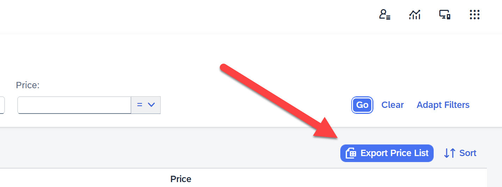
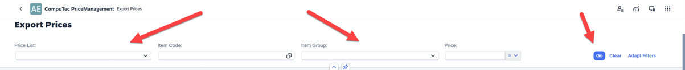
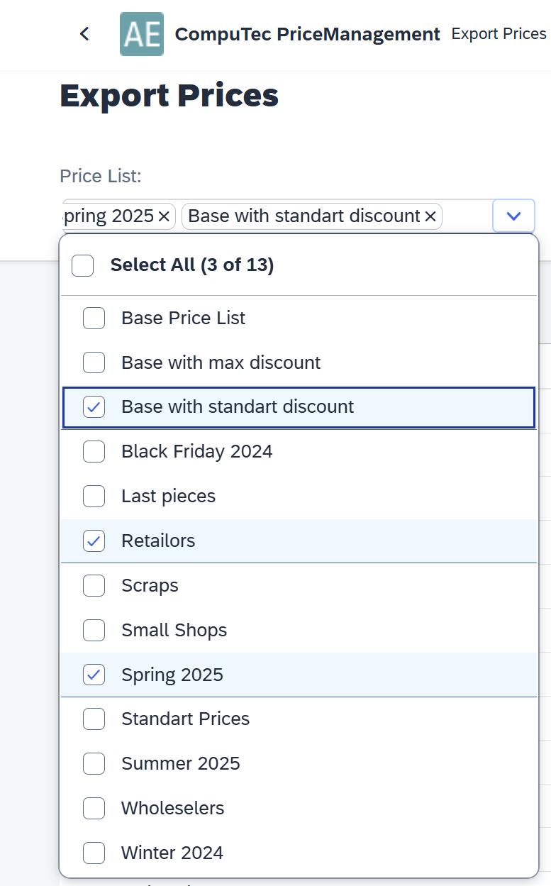
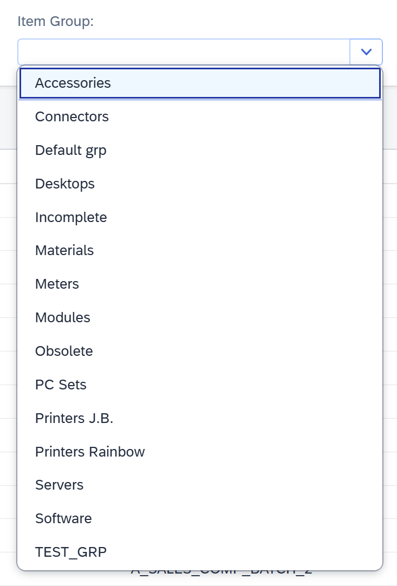
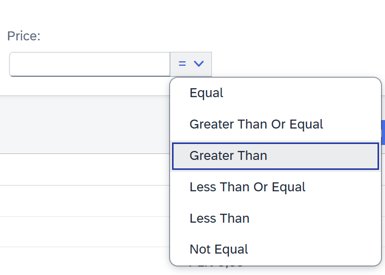
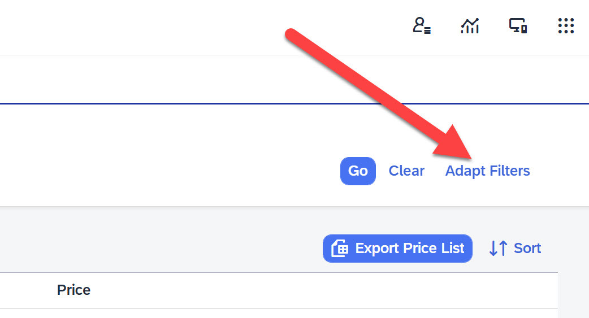
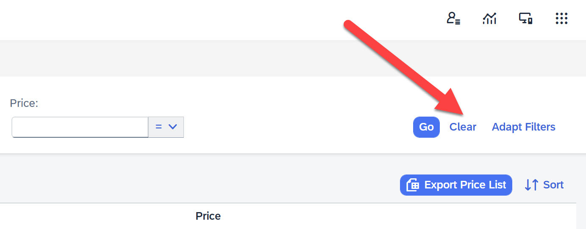
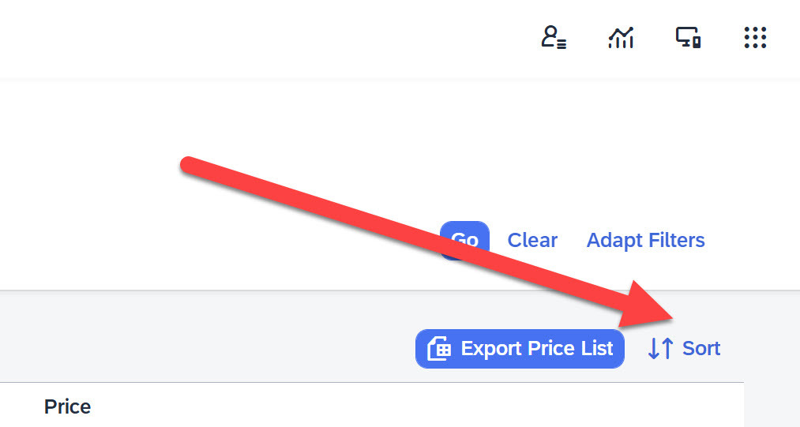
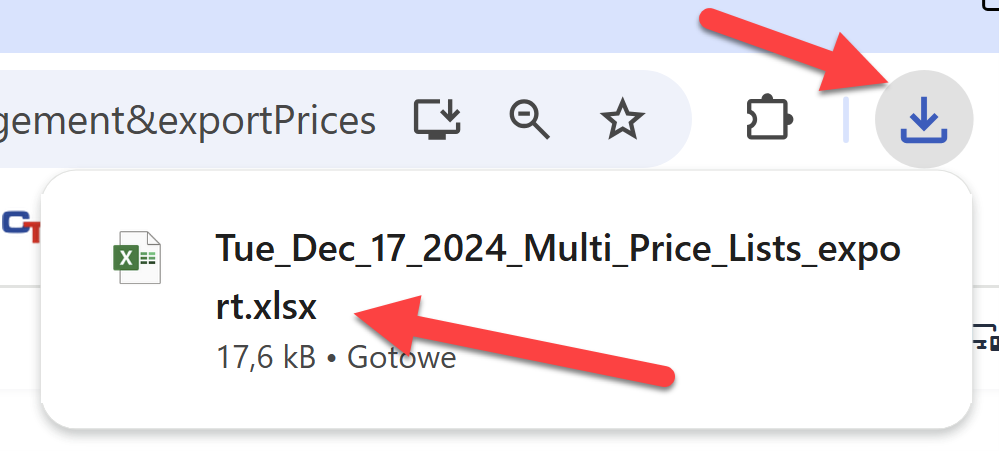
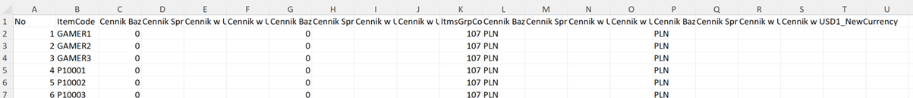

# Export Price Lists from SAP Business One

Exporting price lists from SAP Business One is a crucial task for businesses that need to manage and modify pricing data across multiple price lists. Whether you're handling pricing for thousands of items or just a few, the process of exporting this data to Excel offers flexibility and ease in making adjustments. In this guide we will walk you through the steps to export price lists from SAP Business One, customize the data and edit prices efficiently. By the end of this process you will be equipped to manage your price list updates seamlessly.

---

## Preparing the Dataset for Export

The main screen displays a list of Item Master Data along with their associated price lists, including the Item Master Data name and the current price from the respective price list. This data can be exported to an Excel file. On this screen you define the conditions for the dataset to be exported. These criteria determine how the plugin will generate an Excel file and populate it with SAP data.

The number of Item Master Data visible on the screen at any given time is limited. For example, if the dataset contains 10,000 Item Master Data, only the first few dozen Item Master Data will be displayed initially. Additional Item Master Data will load dynamically as you scroll down.

    

At the top of the screen there is a set of filters that allow you to define the criteria for selecting the data displayed. Once the filters are configured, clicking the GO button generates a dataset based on the specified criteria, which is then shown on the screen. This dataset can subsequently be exported to an Excel file.

    

You can choose which price lists to edit in the Excel file. This includes selecting a single price list, multiple specific price lists or all available price lists.

    

You can refine the selection to a specific group of Item Master Data or even to individual Item Master Data.

    

We can also define the price range for which the data of each Item Master Data will be downloaded.

    

The set of filters visible on the screen can be customized by clicking the Adapt Filters button.

    

You can reset all filters to start building the dataset from scratch.

    

## Export Data to Excel file

Once the dataset is prepared it can be exported to an Excel file. Simply click the button and after a moment, a confirmation message will appear in the upper right corner of the browser indicating the file has been downloaded.

    
    

## Editing Data in an Excel File

The file can be opened in Excel, displaying data similar to the example shown in the picture.

    

The file is structured as follows:

`Number, ItemCode, <PriceList>_NewPrice, <PriceList>_Price, ItmsGrpCod, <PriceList_NewCurrency>, <PriceList_Currency>`

If the dataset includes multiple price lists, each price list will have two associated columns:

1. The first column records the new prices for each item.
2. The second column displays the current prices for each item.

For example, if you are modifying prices in two price lists the file structure will appear as:
`Number, ItemCode, <PriceList_1>_NewPrice, <PriceList_1>_Price, <PriceList_2>_NewPrice, <PriceList_2>_Price, ItmsGrpCod, <PriceList_NewCurrency>, <PriceList_Currency>`

### Editing Instructions

Enter the updated prices in the appropriate NewPrice column for each price list. Pay close attention to the decimal separator (e.g., a period vs. a comma) to ensure accurate data entry. To completely remove the price of a specific item input the slash character "\ "in the corresponding field. This action will leave the price field empty after the update, which is the expected result.

After making the necessary changes:

- Save the file with the updated data.
- Proceed to the second step (Update Price Lists) of the plugin to apply the changes.

---
