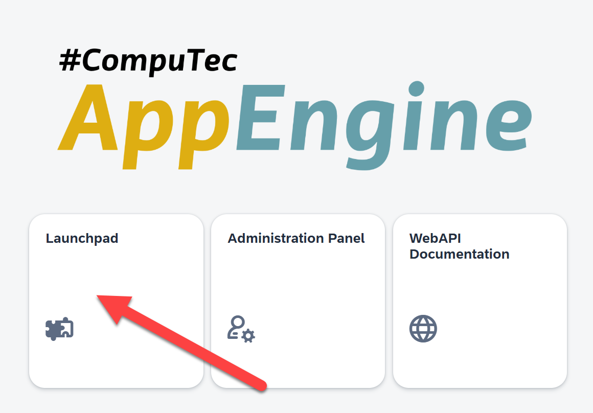

# Overview

The PriceManagement Plugin is a browser-based application designed to enhance the functionality of SAP Business One by enabling bulk price management for indexed items. This powerful tool operates seamlessly via the AppEngine and allows authorized users to log in using their SAP Business One credentials.

    

---

The plugin is a comprehensive solution for managing and updating index prices across multiple price lists with efficiency and precision. It supports advanced scheduling, error-handling mechanisms, and real-time data import and export functionalities. By leveraging this plugin, businesses can streamline their pricing strategies and achieve greater operational control.

## Key Benefits

1. **Bulk Price Management** - Easily change prices for numerous indexes across multiple price lists simultaneously.
2. **Planned Updates** - Prepare and schedule price changes in advance for seamless implementation.
3. **Error Resilience** - Automatically continues the update process even if errors occur for specific indexes.
4. **Data Integration** - Instant data imports and exports between SAP Business One and Excel.

## Core Features

Below are the features that make the PriceManagement Plugin indispensable for SAP Business One users:

- Modify or delete prices of selected indexes across multiple price lists.
- Export price data from SAP Business One into Excel for easier editing.
- Import updated price data back into SAP Business One.
- View and address errors during price updates.
- Display planned percentage changes for individual indexes.
- Customize filters and settings for precise data management.

---
This plugin's robust functionality makes it an indispensable tool for businesses aiming to streamline their price management processes within SAP Business One.
