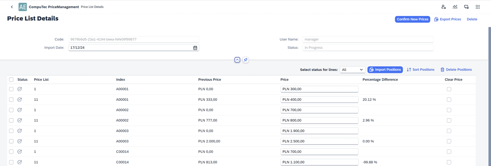

# Update Price Lists

Managing price updates within SAP Business One can be a complex and time-consuming task, especially when handling multiple Item Master Data price lists. This guide provides a comprehensive overview of the Update Price Lists plugin, designed to streamline the process of updating prices across multiple price lists. By automating the integration with SAP, businesses can ensure that pricing changes are accurate, timely, and easily managed.

---

## List of Documents

The main screen displays a list of documents, each representing a collection of prices for individual Item Master Data. These documents serve as processed versions of Excel files, with their data stored in the plugin and presented in a table format. Essentially, each document is a refined copy of an Excel file, prepared for seamless integration with SAP. Data from any document can be sent to SAP Business One to update the prices of the individual Item Master Data it contains.

    

Documents can have various statuses to indicate their current stage:

- **In Progress** Documents still being worked on.
- **To Complete** - Documents finalized and marked for sending to SAP.
- **Processing** - Documents with data currently being sent to SAP.
- **Done** - Documents where the data has been successfully sent to SAP.
- **Error** - Documents where an attempt to send data to SAP failed.

You can filter the document list by status. Selecting the icon for a specific status will display only the documents corresponding to that status.

    

Each document includes an effective date, indicating when the changes should take effect. For example, if a document is created with an effective date of May 20, 2025, it signifies that the changes are intended to take effect on that date. The effective date for each document is displayed in the list, and the list can also be filtered based on the effective date of the changes.

    

The document list can also be filtered based on the specific price list associated with the documents.

    

Documents can apply to multiple price lists if you intend to update the prices of a given Item Master Data across several price lists. Alternatively, they can apply to a single price list if the changes are limited to one. The process of selecting one or multiple price lists will be detailed later in this description.

If a document has been in processing for a while and you suspect the processing might be complete, meaning the document’s status may have changed, you can click Refresh to update the document list and display the most current information.

    

## Adding a Document

To update prices for selected Item Master Data using a prepared Excel file, you need to create a new document within the plugin. This can be done by clicking the "Add Price List" button.

    

An additional window will open, allowing you to specify the effective date for the changes. This window may also display other fields, which will be explained later.

    

Initially, the newly created document will not contain any Item Master Data or price data. It will include only some basic information:

- A unique code assigned to the document
- The effective date, which can still be modified if needed
- The name of the user who created the document (using credentials from SAP Business One)
- The document's status

By default, the new document is assigned the status "In Progress," indicating that it is currently being worked on.

    

## Import

To enrich the document with data on Item Master Data and their prices, begin by retrieving the necessary information from the prepared Excel file. Click the "Import" button.

    

Select the appropriate file.

    

Once the data is loaded, the document becomes more comprehensive as it now includes details on planned price changes. You can view the current prices of individual indices in specific price lists, as well as the prices intended for entry into SAP.

    

## Editing the Document

When editing a document, we have the option to delete specific rows. To do this, simply select the row(s) you wish to remove and click the "Delete Positions" button. Multiple rows can be deleted simultaneously.

    

Additionally, you can add more rows from another Excel file. If this new file contains the same Item Master Data and planned price changes as the original, the plugin will flag these rows with an Error status and provide an explanation for the error. Any invalid rows will not be sent to SAP.

    

At this stage, prices can also be modified, depending on the plugin's configuration settings, which will be explained later.

    

The item list can be filtered by the item status, which may currently be "Pending" or "Error". Pending items are still being worked on, and errors may arise during the import of individual items. Since the document is still in progress, no items can be sent to SAP at this stage, meaning no item will have a "Done" status.

    

In case the document contains a large number of items (e.g., 10,000), and we cannot view all items on screen, we can filter the list to show only those items with an Error status. This allows us to investigate the cause of the error, delete the affected items, correct them in Excel, and then re-import them.

    
    

The list can also be sorted based on a selected order:

    !

The list also shows the percentage difference between the current price and the planned price.

    

## Approval of Price Changes

Once editing is complete and the document is ready—meaning the data is finalized and can be sent to SAP Business One—click the "Confirm New Prices" button.

    

This action updates the document status to "To Complete" and grays out certain data fields, indicating they are no longer editable.

    

Data from a document with the "To Complete" status will be transmitted to SAP Business One through a dedicated processing procedure, detailed later in this guide.

## Reversing Price Changes

To reverse the price changes before processing starts, simply click the "Cancel Changes" button to withdraw the document.

    

## Deleting the Document

In certain situations, you may need to completely delete a document. This action is possible only if the document has not been approved or if the approval has been withdrawn. In other words, a document can be deleted when its status is "In Progress."

To delete a document:

- Ensure the document is in the "In Progress" status.
- Click the "Delete" button.

This action will permanently remove the document from the system.

    

## Backgroud Processing

When creating a document and confirming new prices by clicking the "Confirm New Prices" button, the document status changes to "To Complete." At this point, the system begins the process of entering these new prices into SAP Business One. This operation is managed by a plugin with a background mechanism programmed to automate the price update process.

### Scheduled Execution

The mechanism runs automatically once per day at a scheduled time—for instance, at 1:00 a.m. This schedule, along with other configuration settings, can be adjusted as needed (details provided later in this guide). During each scheduled run, the mechanism checks all plugin-generated documents with the "To Complete" status. It evaluates the document date, comparing it to the current date. If the dates match, the mechanism initiates the price update process in SAP Business One. When multiple documents meet the criteria, they are processed sequentially, not simultaneously.

### Processing Large Documents

If a browser window has been open for an extended period, it's recommended to press the "Refresh" button to view the current status of the process, as the status bar does not refresh automatically. The current status is updated only when you access the Document List view.

    
    

Prices for individual Item Master Data are updated sequentially, with changes becoming immediately visible in SAP Business One. If a document includes new prices for 1,000 Item Master Data and the update process has started but is not yet complete, some items may already display the updated prices in SAP Business One, while others may still show the previous prices. This depends on whether the specific Item Master Data in the document has been processed.

### Document and Item Statuses

Each document and its items undergo status changes during processing:

- **Pending** - Items that have not yet been processed. These changes are not yet reflected in SAP Business One.

- **Done**- Items that have been successfully processed. These changes are visible in SAP Business One.
Until all items are processed, the entire document retains the "In Progress" status. Once the last item is updated, the document status changes to "Done." At this stage, all items are processed, and all price updates are reflected in SAP Business One.

### Handling Errors

If an item encounters an issue during processing, it is assigned the "Error" status. These exceptions will not affect the status progression of successfully updated items. However, further attention is required to resolve the errors before the updates can be completed.

---
The Update Price Lists plugin for SAP Business One simplifies the process of managing price updates. By leveraging this plugin, companies can enhance their pricing management processes, reduce manual errors, and improve overall operational efficiency. Whether handling small adjustments or large-scale updates, this tool provides the necessary functionality for successful price management within SAP Business One.
