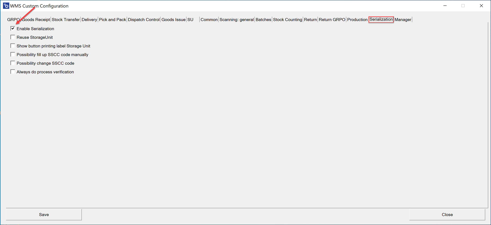
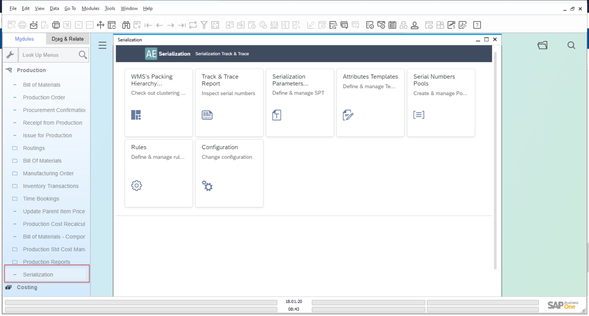

# Serialization Plugin Installation and Configuration

The Serialization Plugin is a powerful extension that enhances traceability and compliance by enabling detailed serialization workflows within CompuTec WMS and CompuTec ProcessForce. To ensure a successful deployment and seamless functionality, follow this guide, which outlines both the standard installation process and additional steps specific to Serialization Plugin setup.

:::info
The standard plugin installation and configuration is described in the CompuTec AppEngine documentation [here](../../administrators-guide/configuration-and-administration/overview.md).
:::

>**Note**: Please remember to install versions of the components according to the version table available [here](../../releases/appengine/download.md).

---

## Prerequisites

Before configuring the Serialization Plugin, make sure the following components are properly installed and configured:

- Ensure that CompuTec ProcessForce and the CompuTec License Server are installed and configured correctly.
For details, click [here](/docs/processforce/administrators-guide/licensing/license-server/overview).
- Ensure that CompuTec WMS is installed and configured

        - For installation please follow this link: [Installation](/docs/wms/administrator-guide/installation/overview/).
        - For configuration please follow this link: [Custom Configuration](/docs/wms/administrator-guide/custom-configuration/overview/).

## CompuTec AppEngine and Serialization Plugin Installation and Configuration

For CompuTec AppEngine installation please follow this link: [Installation](../../administrators-guide/installation.md).

For plugin installation please follow this link: [Configuration and Administration](../../administrators-guide/configuration-and-administration/overview.md).

>**Important**: After updating the Serialization Plugin and restarting CompuTec AppEngine, make sure to update the schema according to the documented procedure to apply changes correctly.

## Enabling Serialization

Once the core components are set up, follow these steps to enable Serialization features in both CompuTec WMS and CompuTec ProcessForce.

### CompuTec WMS

    1. Enter (10) Computec AppEngine address in [WMS Server](/docs/wms/administrator-guide/installation/wms-server/overview/) settings:

        

    2. Enable Serialization in [Custom Configuration](/docs/wms/administrator-guide/custom-configuration/overview/):

        

    3. Remember to customize main menu options to prepare and set menu with Serialization workflow. For this purpose please follow Custom Config Function: [Manager](/docs/wms/administrator-guide/custom-configuration/custom-configuration-functions/manager/overview/) and sub-function: [Interface Design Manager](/docs/wms/administrator-guide/custom-configuration/custom-configuration-functions/manager/interface-design-manager):

        

### CompuTec ProcessForce

Serialization Plugin can also be accessed directly from within CompuTec ProcessForce.

To do this, check the following checkbox:

Enter CompuTec AppEngine URL, e.g. `http://{host}:54000`, click "Update" and restart SAP Business One to apply the changes.

---
