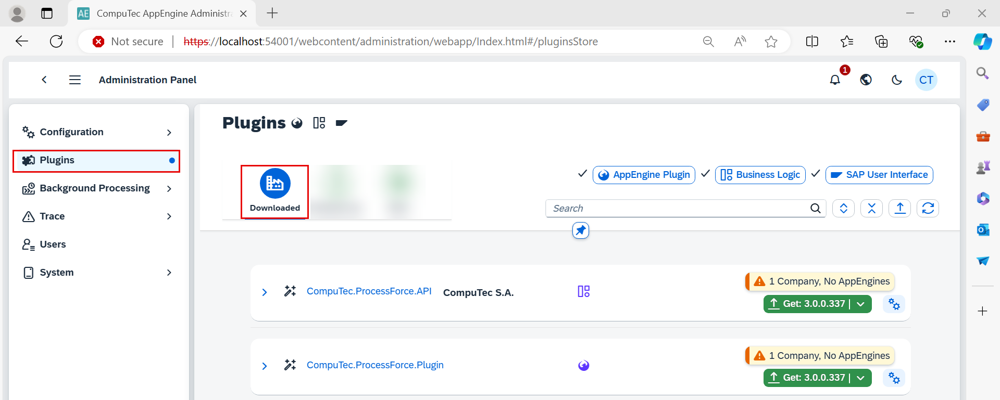
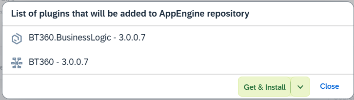

# Plugins

When you navigate to the "Plugins" section from the left-hand menu, you're presented with a interface that offers the following options:

- **Downloaded**: View and manage the plugins that are already added in your system.

    

- **Releases**: Indicates if new versions are available for your added plugins.

    

- **Store**: Enables you to browse through a catalog of available plugins for installation.

    

## Step-by-Step Process for Adding and Installing Plugins to AppEngine

1. Navigate to the desired plugin in the AppEngine interface. Click on the plugin you wish to add.

    

2. Click “Show Details” to view additional information about the plugin. Here, you can see the Dependencies and other available versions of the plugin.

    

    When you add a plugin to AppEngine, it might rely on certain versions of other plugins to work properly. These dependencies ensure that all necessary elements are present and compatible so that the plugin can perform its tasks without errors.

    

    Other versions refer to the different iterations or releases of a plugin or software that may have been developed over time. These versions often include updates, bug fixes, new features, or improvements compared to previous versions. Selecting the appropriate version ensures that the plugin integrates seamlessly with your environment.

    

3. Click the “Get” button. Alternatively, you can directly click “Get” from the store.

    

4. A list of plugins that will be added to the AppEngine repository will appear. Click “Get” to confirm and add the plugins.

    

5. The Plugins are now added to AppEngine repository.

    

6. Once the plugins are added, the Dependencies will turn green, indicating successful addition.

    

7. Navigate to Installation Tabs. You should now see the following tabs: Companies, AE Installations, and Installation History.

    

8. Click on the "Companies" tab. Select “Assigning to Company.” Choose the company for which the installation will be performed and click “Accept.”

    

9. The installation item details will be displayed. Click on "Perform Installation."

    

10. Select SAP user that will be used for installation and click "Install".

    

11. Enter the required credentials and click “Install” again.

    

12. The installation process will begin, and you can monitor its progress.

    

    Once the installation is in progress, click “Close.”

13. AppEngine needs to be restarted in order for all changes to be applied. Click "Yes" to restart.

    

    You can now see the assigned company.

14. Click on the "AE Instance" tab. Select the assigned company and assign it to AppEngine.

    

15. Select the AppEngine Instance for installation. The installation item details will show “Activation in Progress.” Click on "Perform Installation."

    

    

16. Click *“Yes”* to initiate the AppEngine restart.The AppEngine restart will be in progress, completing the installation.

    
