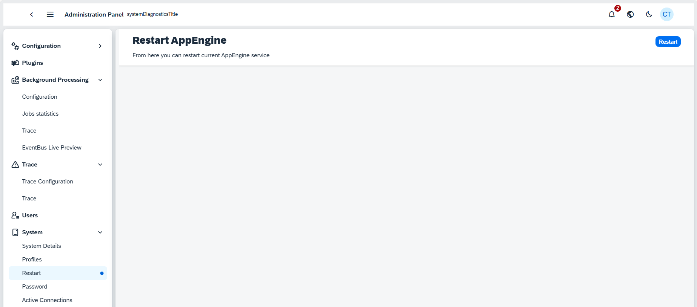

# System

## System Details

The AppEngine Version shows the current software engine in operation, ensuring that the system is up-to-date with the latest vesrion. This version provides the latest features and security patches for optimal system performance.

The AppEngine GUID is a unique identifier assigned to this specific instance, allowing precise tracking and support for system diagnostics and troubleshooting.

## Profiles

The panel displays various system profiles related to OpenTelemetry and file logging configurations. Each profile contains its name, description, and an editable "Content" field.

| Profile Names | Descriptions |
| --- | --- |
| OpenTelemetry_All |This configuration handles the OpenTelemetry Exporter settings (OTLP Exporter). It sends logs, metrics, and traces to an OLTP server. Replace the endpoint and header for correct values. For more information, refer to OpenTelemetrySupport. |
| OpenTelemetry_logs | This profile manages the OpenTelemetry Exporter settings for logs. It sends logs to the OLTP server. Replace the endpoint and header for correct values. More details are available at OpenTelemetrySupport. |
| OpenTelemetry_traces | This profile is designed for OpenTelemetry Exporter settings, focusing on traces. Traces are sent to the OLTP server. As with other profiles, replace the endpoint and header for correct configuration values. Refer to OpenTelemetrySupport. |
| OpenTelemetry_metrics | Manages the OpenTelemetry Exporter settings for metrics. Metrics are sent to the OLTP server, and the endpoint and header need to be updated for accuracy. Additional information can be found on the same documentation page as the others. |
| File_Information | Configures the system to send all logs categorized as information-level to a file for storage. The content field appears to contain logging settings. |
| File_Debug | This configuration is set to store all logs with a debug type into a file, providing more detailed information for troubleshooting and debugging purposes. |

## Restart

From here, you can restart current AppEngine service

## Password

From here, you can reset the administration password:

## Active Connections

A list of currently active sessions are displayed. Click a connection in the Active sessions table to see the Details of it. You can log out any session by clicking the Log Out button.

