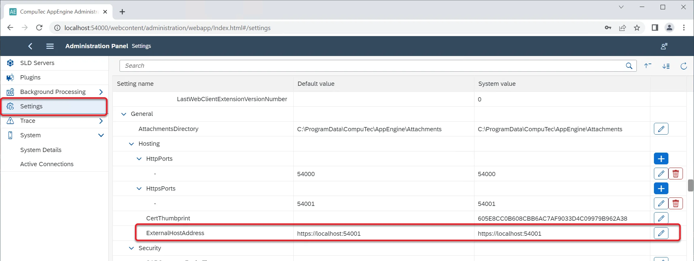
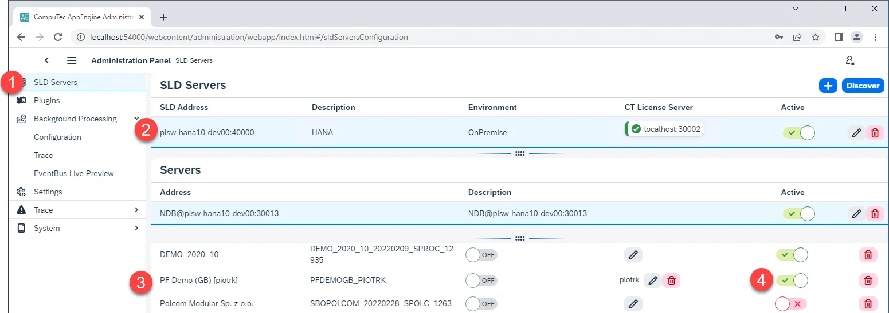
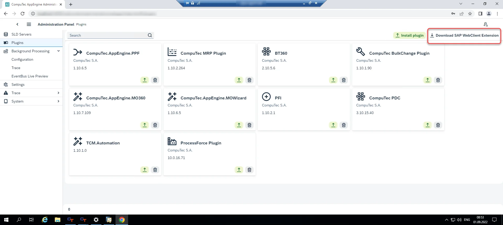
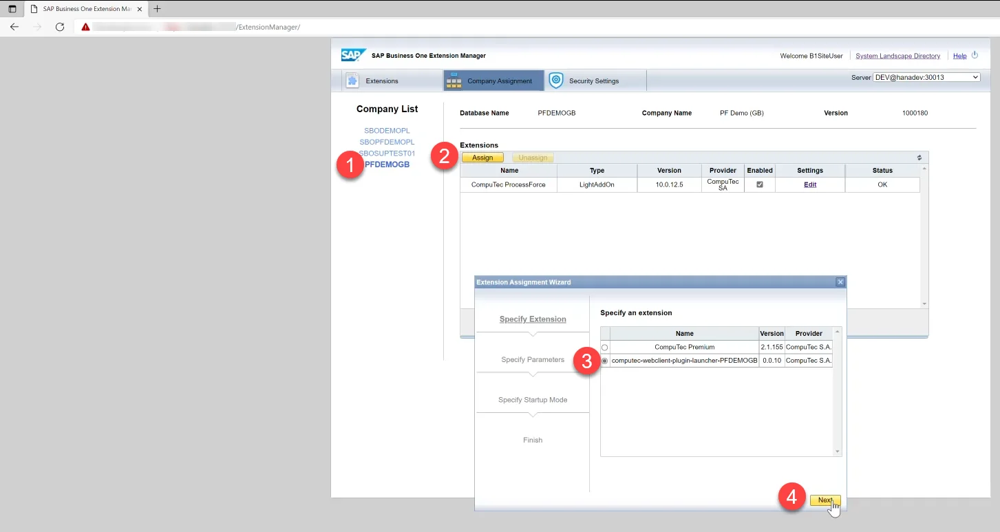
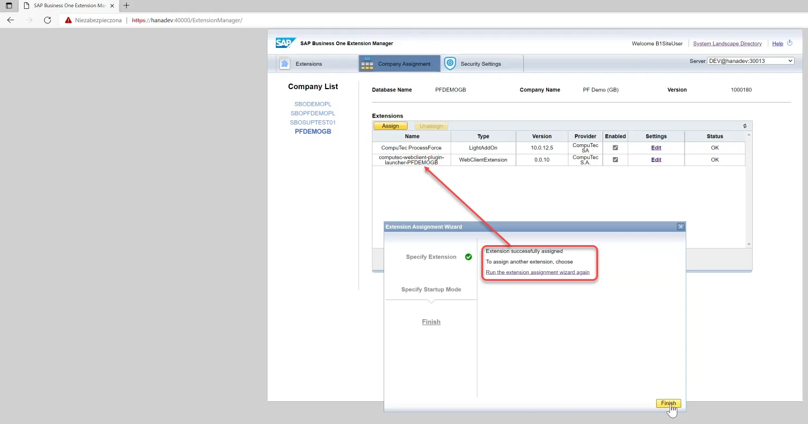
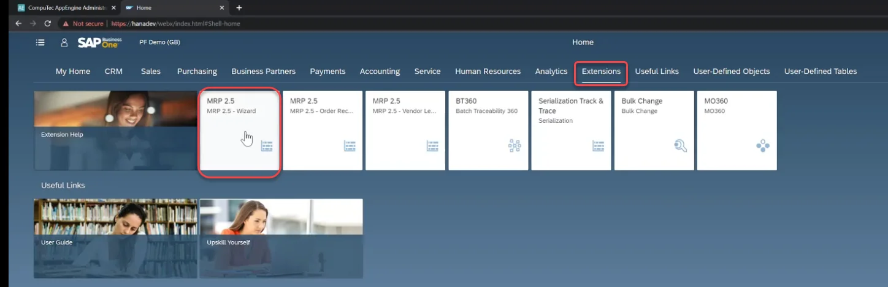
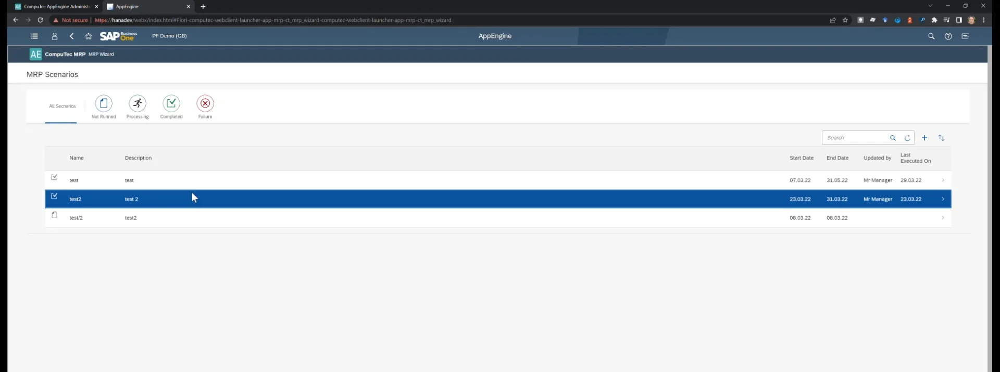

# Working with SAP Business One Web Client

Here, you can find information about configuration for using AppEngine plugins within SAP Business One Web Client.

---

## Configuration

### External Host Address

:::info Path
    Administration Panel → Settings → General → Hosting → HttpsPorts
:::

This address directs the Web Client to the AppEngine installation and must be an HTTPS address. By default, the address is set to localhost with the default port. If the address is different from localhost, it must be updated accordingly.

It is also necessary to direct the Web Client to the AppEngine installation. This address is stored in an AppEngine configuration table within a database. To update this address, you need to activate a Company or deactivate and reactivate it if the AppEngine installation has been upgraded to version 2.0.7.0 (SLD Servers → Companies).

## Installation Package

### Download

First, you must download an installation package for all the plugins activated for a specific company. To do this, go to Administration Panel → Plugins and click the Download SAP WebClient Extension button in the window's upper-right corner. Now, choose a required company.

Clicking it causes an installer to download, in this example: computec_appengine_webclient_plugins_PFDEMOGB_PIOTRK_0_0_1.mtar.

### Upload

Use SAP Business One Extension Manager to load the installation package:

### SAP Business One Extension Manager

Choose one of the extensions:

Log in using SAP Business User ID. A plugin is now available in SAP Business One Web Client.

