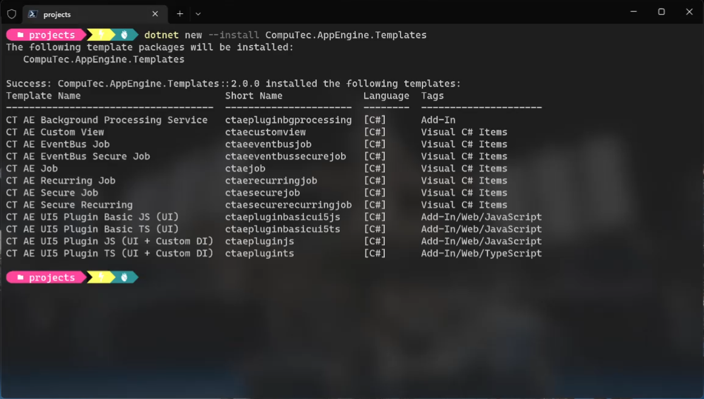

# Plugin Templates

Here, you can find information on how to use ready AppEngine plugin and plugin item templates that serve as a frame for custom plugins.

---

## Download

Go to the following address: [https://www.nuget.org/packages?q=computec](https://www.nuget.org/packages?q=computec), and download the CompuTec.AppEngine.Templates package.

## Usage

In the following example, we will use a template for AppEngine plugin with UI5 and Javascript on the frontend.

To install the package, go to Windows Terminal and run the following command:

```dotnet
dotnet new --install CompuTec.AppEngine.Templates
```

You will get a message about successful installation, along with the list of installed elements. For now, five of them are ready plugin solution templates (tagged 'Add-In',  'Add-In/Web/Javascript', you can also recognize them by the word 'plugin' in their names and short names) and seven plugin items (tagged "Visual C# Items'):



Once the package is installed, you can check the list again using the following command:

```dotnet
dotnet new --list AE
```

Use the following command to create a folder (named FirstPlugin in this example):

Create a new folder - named named FirstPlugin in this example (mkdir FirstPlugin).

Go to the folder (cd .\FirstPlugin).

Use the following command to create a new template to work on it later (ctaepluginjs in this example). It has to be created along with two mandatory parameters: RoutePrefix (testPlugin in this example) and PluginID (Compu:Tec.AppEngine.Plugin.Test) in this example:

```dotnet
dotnet new ctaepluginjs --RoutePrefix testPlugin --PluginId CompuTec.AppEngine.Plugin.Test
```
