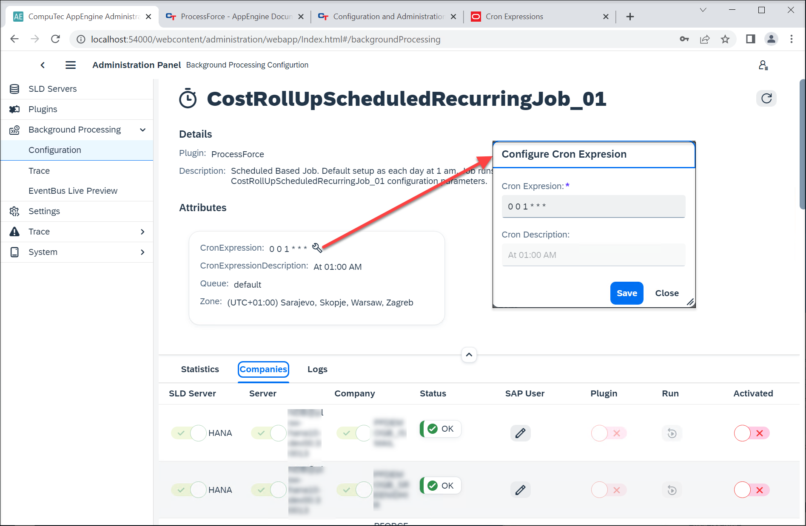

# ProcessForce

## ProcessForce plugin related jobs

:::info
To use these jobs, it is required to activate Background Processing for a specific company.
:::

### CostRollUpScheduledRecurringJob_01, CostRollUpScheduledRecurringJob_02, CostRollUpScheduledRecurringJob_03

    
Details

    

       Default Cron Expression = "0 0 1 * * *" – each day at 1 am. Job runs Cost Roll-Up according to CostRollUpScheduledRecurringJob_01 (02, 03) configuration parameters.
    

Automatically runs Cost Roll-Up upon selected Item/s based on pre-defined parameters in specific time (defined in Cron Expressions)

Go to Plugins → ProcessForce Plugin → Settings to define parameters (that reflects options available in the Cost Roll-Up form).

:::caution
    Please note that four checkboxes on the Cost Roll-Up form (from “Use final-goods’s batch[…]” to “Calculate and Save Costed BOM data”) are available to use after checking the Perform the roll-up over structure checkbox. They should be used in the same matter in AppEngine, even though they are available even when the Perform the roll-up over structure checkbox is not checked in AppEngine Settings (due to AppEngine limitations).
:::

You can set up the occurance of the automatic Roll-Up by using [Cron Expressions](https://docs.oracle.com/cd/E12058_01/doc/doc.1014/e12030/cron_expressions.htm) in the job's details: Background Processing → Configuration → [name of a job]:

You can configure three different automation of this kind by using CostRollUpScheduledRecurringJob_01, CostRollUpScheduledRecurringJob_02, and CostRollUpScheduledRecurringJob_03 job.

### QCRefillBatchesAndSerialNumbersJob

    
Details

    

        ContentType = "59"
     ActionType = "A"
   

Fills in Batches and Serial Numbers in appropriate Quality Control Tests. After adding a Goods Receipt, Batches and Serial Numbers are created in a database and can be added to Quality Control Tests, which were created when the related Batches and Serial Numbers were still not present in a database.

**This job improves ProcessForce performance**.

### QCTestDocumentsGeneratorJob

    
Details

    

ContentType = "*",
 ActionType = "A",
 Publisher = "AppEngine",
 PublisherApp = "SAPB1",
 EventType = "SAPB1Object"

Based on specific settings, automatically generates Quality Control Test when adding documents.

**This job improves ProcessForce performance**.

### RestoreAditionalBatchDetails

    
Details

    

Every second hour it calls a method that Creates Batch Master Data for all missing Batches in system.

    Default Cron Expression Description = "0 */2 * * *"

Every second hour it calls a method that Creates Batch Master Data for all missing Batches in system.

### RestoreItemDetailsJob

    
Details

    

Editable = true,
 ContentType = "4", // OITM,
 ActionType = "U".

This job synchronizes data in ItemDetails object upon updating data in the OITM table.

**This job improves ProcessForce performance**.

### SynchronizeBillOfMaterialsJob

    
Details

    

Editable = true,
 ContentType = "CT_PF_OBOMCode",
 ActionType = "*".

This job synchronizes data with SAP Business One Bill of Materials upon updating ProcessForce Bill of Materials

**This job improves ProcessForce performance**.

### SynchronizeManufacturingOrderJob

    
Details

    

    Editable = true,
 ContentType = "CT_PF_ManufacOrd",
 ActionType = "*".

This job synchronizes data with Production Order upon updating Manufacturing Order

**This job improves ProcessForce performance**.

### SynchronizeManufacturingOrdersRecursiveJob

    
Details

    

Default Cron Expression = "0 */12 * * *"

This job synchronizes data between Manufacturing Order and Production Order every twelve hours.

### AdditionalBatchDetailsSynchronizerEB

    
Details

    

        ContentType = "CT_PF_AdditonalBatch",
     ActionType = "U",
     Publisher = "AppEngine", PublisherApp = "SAPB1", EventType = "SAPB1Object".
       

This job synchronizes data to SAP Business One Additional Batch details upon updating Batch Master Data

**This job improves ProcessForce performance**.

### AdditionalBatchDetailsCreatorEB

    
Details

    

        ContentType = "10000044",
     ActionType = "*", Publisher = "AppEngine",
     PublisherApp = "SAPB1",
     EventType = "SAPB1Object"
   

This job creates a related Batch Master Data upon creation of a Batch in SAP Business One.

to synchronizacja Batch Synchronization jest uruchamiana przez AppEngine, w innym przypadku działa jak wcześniej tzn. synchronizacja wykonywana jest po stronie serwisu WMS

If this job is turned on, the Batch Synchronization is performed by AppEngine (otherwise, the synchronization is performed by CompuTec WMS service, in contect of using CompuTec WMS).

**This job improves ProcessForce and CompuTec WMS performance**.

### ManufacturingOrderWizardRecoverJob

This job is started upon a start of AppEngine and checks if there are any unfinished Manufacturing Order Wizard tasks to process.
