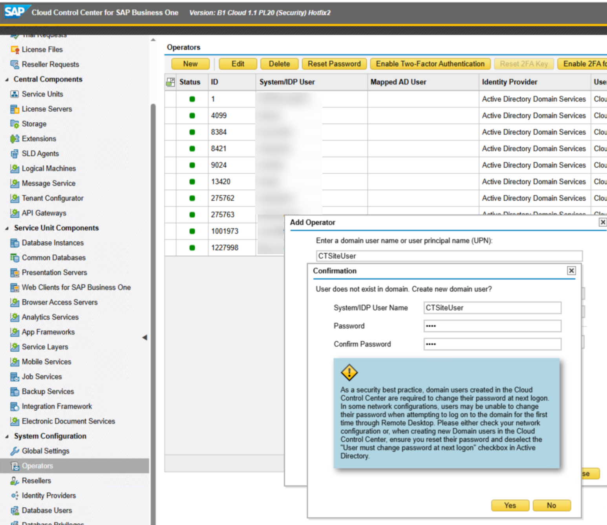
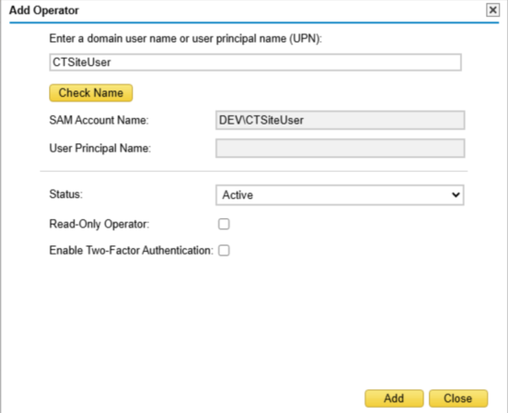
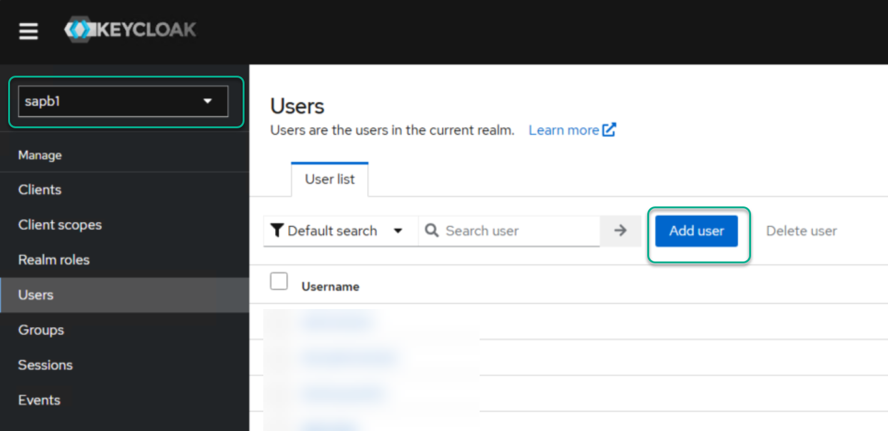
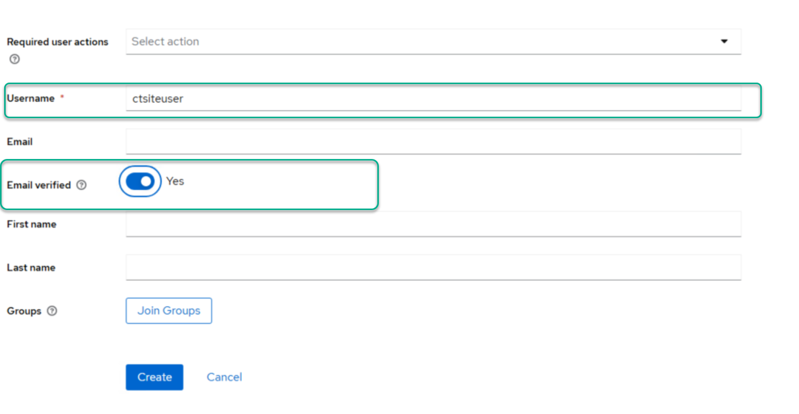
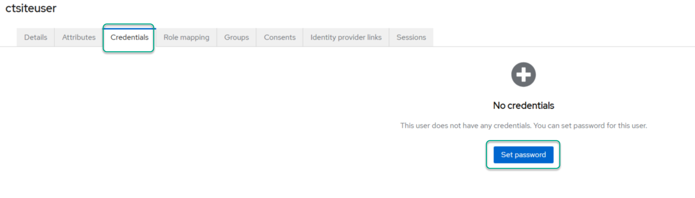
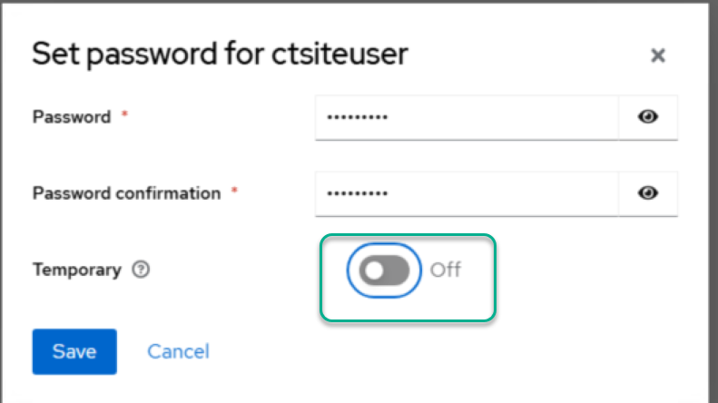
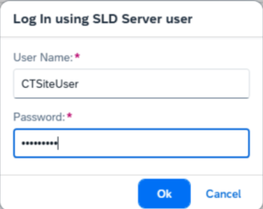

# Create Cloud COntrol Center Operator and Assign to IAM Server
To enable the discovery of SAP companies and other required SAP environment settings, the system needs Cloud Control Center (CCC) operator credentials. These credentials allow AppEngine to retrieve all necessary information. Follow the steps below to create a CCC operator and assign them a password.
## Create an Operator
1. Login To CCC portal.
2. Navigate to System Configuration → Operator and create a new operator.

3.Add the operator to the CCC.

4. Log in to the Keycloak server. In the sapb1 realm, create a user that matches the operator's name (excluding the domain).

5.Set a password for the newly created user.

## AppEngine Discovery
Now you can use this acount in AppEngine to discover servers and in the company Activation Process.
