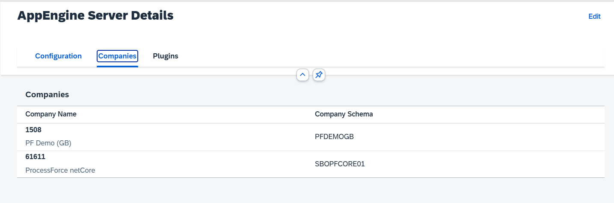

# CompuTec AppEngine Instances

CompuTec AppEngine Instances are integral components of CompuTec AppEngine Server, which serves as a platform for hosting web-based plugins, executing jobs, and more. By deploying multiple CompuTec AppEngine Instances, you can distribute the workload across servers, ensuring optimal performance and reliability. These instances may also be configured as pre-release or development servers to suit specific operational needs. While load balancing for instances will be supported in future software updates/versions, the current version allows for detailed instance configuration and management.

---

## Instance Configurations

To view the list of CompuTec AppEngine instances, follow the below path:

:::info Path
Administration Panel → Configurations → AppEngine Servers
:::

By selecting CompuTec AppEngine, you can see:

## Configuration Tab

Here, you can configure all Instance specific settings such as :

### Details

    - **Instance Name** - The unique name assigned to the CompuTec AppEngine instance
    - **Guid- Instance Guid** - The globally unique identifier for the instance
    - **Profile** - The configuration profile associated with the CompuTec AppEngine instance. For more information, refer to the Profiles section

### Advanced Settings

The following settings can be configured for CompuTec AppEngine instance:

    - **AttachmentsDirectory** -  Specifies the temporary storage location for uploaded attachments
    - **HTTPS Ports** - A comma-separated list of ports on which the server will listen. The default port is 54001
    - **External Host Address** - The external address used for accessing the CompuTec AppEngine instance (refer to OIDC Settings for additional details)
    - **Temporary Download Path** - The directory used to temporarily store downloaded plugins. This same location is utilized by the Plugin Installer for installing plugins on the database
    - **SAP Company Expiry Time** - Defines the duration (in minutes) that the connection with an SAP company is maintained by the CompuTec AppEngine instance (default: 60 minutes)
    - **Token Expiry Time** - Sets the expiration timeline (in seconds) for administrative session tokens
    - **Refresh Token Expiry Time** - Currently not in use
    - **Session Data Lifetime** -  Specifies the duration (in minutes) for which the session data is retained by the CompuTec AppEngine instance

### Certificates

There are two options to get specify the certificate used in SSL protocol:

**By File or using**
    - PFX Certificate File Path - Path to the certificate file
    - Certificate Password - Password to access the certificate file

**By Certificate Store**
    - Store Name - The name of the certificate store. Common options include:
        - My - Personal certificates
        - Root - Trusted root certification authorities
        - CA - Intermediate certification authorities
        - AddressBook - Other people
        - AuthRoot - Third-party root certification authorities
        - TrustedPublisher - Trusted publishers
        - Disallowed - Untrusted certificates
        - Find Type - The criteria for locating the desired certificate
        - Store Value - The specific value used to identify the certificate
        - Store Location - Defines where the certificate is stored, with options being:
            - LocalMachine - Certificates stored for all users on the machine
            - CurrentUser - Certificates specific to the logged-in user

## Companies Tab

The Companies tab lists all SAP companies assigned to the selected CompuTec AppEngine Instance. You can view and manage these assignments to ensure proper instance-company mapping.

    

## Plugins

The Plugins tab provides a list of plugins hosted on the instance. This is where you can monitor and manage plugins for optimal functionality and deployment.

    

---
