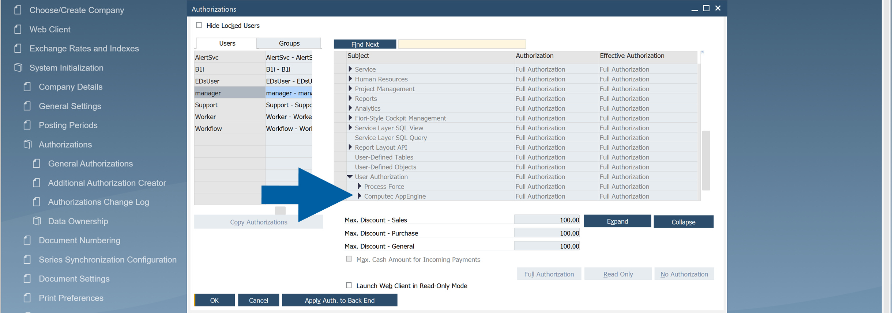
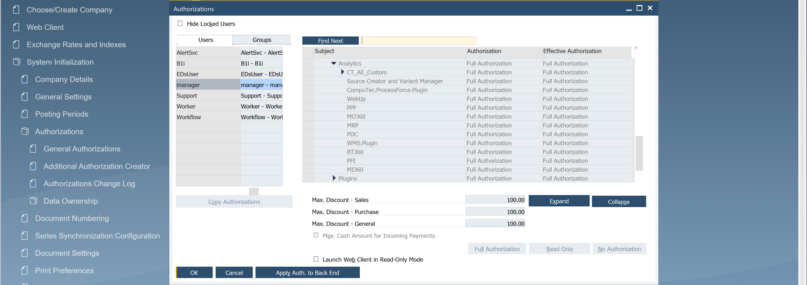

# CompuTec AppEngine Authorizations

Starting with **CompuTec AppEngine 3.0**, all CompuTec AppEngine authorizations are available under the **CompuTec AppEngine** authorization node.

:::warning[important]
The authorization structure used in **CompuTec AppEngine 2.0** has been deprecated and is no longer used in **Computec AppEngine 3.0**.
:::

## Authorization structure in CompuTec AppEngine 3.0

In **CompuTec AppEngine 3.0**, the root authorization node is:

| Root Authorization Node ID | Root Authorization Node Name |
| --- | --- |
| `AppEngine` | CompuTec AppEngine |

All **CompuTec AppEngine 3.0** authorizations are located under this node.

The following authorization groups are available:

| Authorization Group Name | Authorization Group ID |
| --- | --- |
| Analytics | `AE_Analytics` |
| Plugins | `AE_Plugins` |
| Custom | `CT_AE_Custom` |

Additional permissions are created under these groups as needed. For example:

- Analytics permissions use the `CTAN_` prefix.
- Plugin permissions use the `CTPL_` prefix.

## Set the authorizations

If you want to set the authorizations, follow these steps:

1. Log in to **SAP Business One**.
2. In menu, go to **Administration** > **System Initialization** > **Authorizations**.

    

3. Navigate to **General Authorizations**.

    

4. Choose the user you want to grant the authorizations to, and choose **AppEngine** from the list.

    

5. Here you can choose the authorizations for each CompuTec AppEngine authorization group.

    

## Deprecated authorization structure

In **CompuTec AppEngine 2.0**, the root authorization node was:

| Root Authorization Node ID | Root Authorization Node Name |
| --- | --- |
| `CT_AppEngine` | AppEngine |

Starting with **CompuTec AppEngine 3.0**:

- The legacy authorization structure is no longer created.
- Existing authorizations under the **AppEngine** node are deprecated.
- **CompuTec AppEngine 3.0** does not use permissions assigned under the `CT_AppEngine` node.

## Important upgrade information

When reviewing existing authorizations, note that the term **AppEngine** is used differently in the two authorization structures:

| CopuTec AppEngine Version | Root Authorization Node ID | Root Authorization Node Name |
| --- | --- | --- |
| CompuTec AppEngine 2.0 (deprecated) | `CT_AppEngine` | AppEngine |
| CompuTec AppEngine 3.0 | `AppEngine` | CompuTec AppEngine |

This difference can be confusing when searching for authorization nodes or comparing configurations between versions.

If you are upgrading from **CompuTec AppEngine 2.0**, verify that user permissions are assigned under the **CompuTec AppEngine** authorization node used by **CompuTec AppEngine 3.0**.
