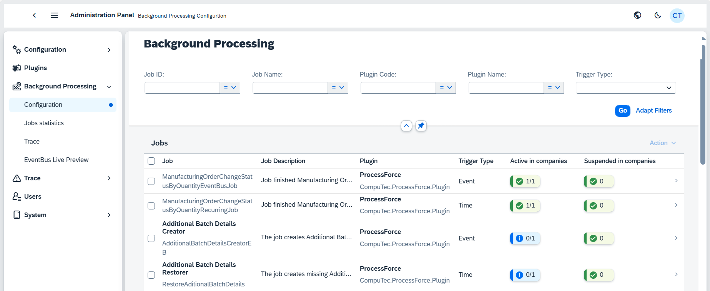
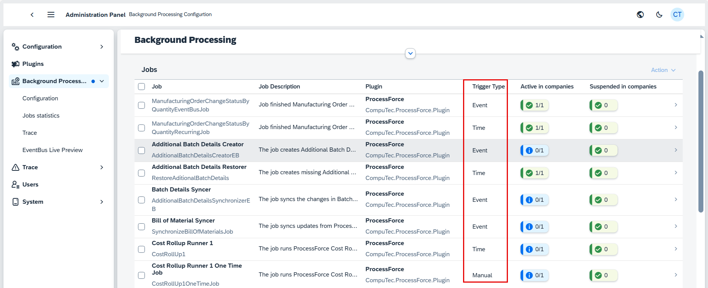
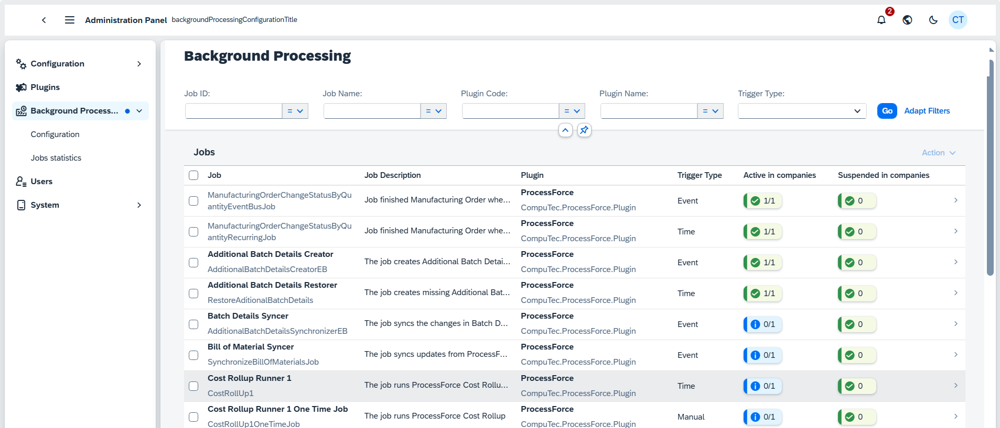
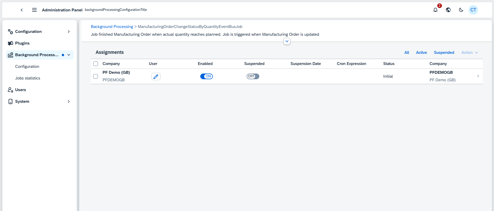
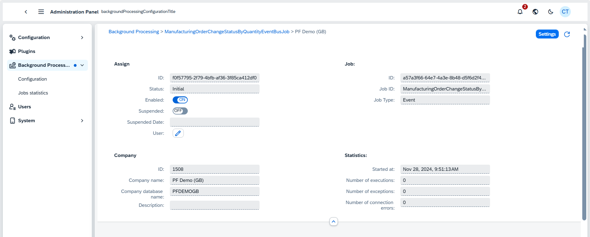
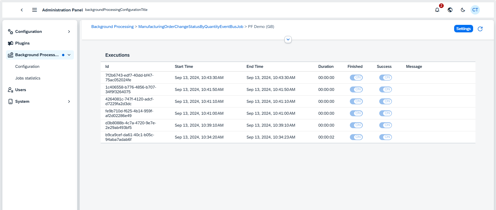

# Background Processing

Background processing in AppEngine is a crucial mechanism that automates tasks and processes, ensuring that critical operations are executed efficiently without manual intervention. This process is driven by a series of triggers and tasks, which can range from simple data updates to complex workflows involving external systems.

## The Role of Jobs and Logic

At the core of background processing are jobs, each of which is governed by specific logic. These jobs can perform a variety of functions, such as adding data within SAP Business One, interacting with external systems, or executing predefined workflows. The flexibility of this system is immense — essentially, the only limit to what these tasks can accomplish is the code written to define them. A single plugin within AppEngine can contain numerous jobs, each designed to handle different aspects of the background process.

## Trigger Types

To initiate these jobs, the AppEngine relies on three primary types of triggers: event, time, and manual.

**Event-Based Trigger**: This trigger is particularly powerful in SAP Business One, as it responds to specific actions within the system. Whenever a user adds, updates, or deletes something in SAP Business One, certain procedures are automatically run in asynchornonous manner.

**Time-Based Trigger**: This trigger operates on a predefined schedule, defined using cron expression. These triggers ensure that jobs are executed at specific intervals or at particular times, such as every two minutes or at a specific hour.

A cron expression specifies when the job should be executed (e.g., every day at 7 a.m. and 7 p.m.). Users can modify this schedule within the assignment settings to fit specific requirements, such as running resource-intensive jobs during off-peak hours. You can adjust the cron expression for each company to change the job's schedule. This is particularly important for managing system resources, as some jobs may need to run during specific times to avoid overloading the system. The cron expression can be modified directly from the assignment details, allowing you to set precise schedules.

**Manual Trigger**: This is the most straightforward type of trigger, allowing users to manually start a job. While useful, it is less interesting in the context of automated background processing.

## Background Processing Jobs

The image shows a configuration screen from the CompuTec ProcessForce Plugin in an administration panel. Below is anexplanation of each section of this configuration, focusing on the background processing job that is being displayed. The example given below is related to Manufacturing Order. This job is responsible for updating the status of the MO when the actual quantity produced reaches the planned quantity. The job operates based on certain filters and plugins.

### Job Details

**ID**: The unique identifier of this background job is a57a3f66-64e7-4a3e-8b48-d5f6d2f436ee. This ensures that the job can be traced and managed uniquely within the system.

**Job ID**: ManufacturingOrderChangeStatusByQuantityEventBusJob. This ID describes the specific job, which focuses on updating the status of manufacturing orders when certain quantity-based events occur.

**Job Type**: Event. This indicates that the job is event-driven, meaning it is triggered when a certain event (in this case, an update to the MO) takes place.

### Filters

Filters are used to ensure that the job is only triggered under specific conditions. Here are the configured filters:

**Publisher**: Set to *, indicating that the job will be triggered regardless of the publisher. In the event system, a publisher is the source of the event, but in this case, it seems that all sources are allowed.

**Use Regex**: Not enabled. If this was enabled, it would allow for pattern matching in the publisher field, filtering only events that match a certain pattern.

**Action Type**: U. This means that the job is triggered when an update occurs to the Manufacturing Order (U stands for Update).

**Content Type**: CT_PF_ManufacOrd. This filter ensures that the job only applies to content related to ProcessForce Manufacturing Orders.

**Content Subtype**: *, meaning that all subtypes of manufacturing orders are included.

### Plugin

The job is executed using a specific plugin within the system:

**Plugin Code**: CompuTec.ProcessForce.Plugin. This indicates that the plugin used is part of the ProcessForce suite by CompuTec.

**Plugin Name**: ProcessForce, which is the product handling manufacturing-related operations in this case.

**Plugin Version**: 3.0.0.351. This version information ensures compatibility and may be needed when troubleshooting or updating the system.

### Enabling and Managing Jobs

To manage jobs within the App Engine, follow these steps:

**Enabling a Job**:

To activate a job, simply click the "Enable" button. Once enabled, the job will start running according to its configured triggers.

**Suspending a Job**:

If you need to stop a job temporarily without disabling it entirely, you can suspend it. This option is for scenarios where you want to pause job execution but keep it in the active state for later use.

## Assignment Details

Each job assignment includes details about the company it’s assigned to, the specific job, and related statistics. This information helps administrators understand how and where jobs are running. You can view the execution history of a job by navigating to its assignment.

### Assign

**Job ID**: A unique identifier used by the system to track and manage this specific background job.

**Status**: Indicates the current state of the job, such as "Initial," which means it hasn't started yet.

**Enabled**: Shows whether the job is currently active and ready to run.

**Suspended**: Indicates whether the job is paused or stopped temporarily. If set to OFF, the job is not suspended.

**User**: Allows assignment of a specific user to oversee or manage this job.

### Job Information

**ID**: A secondary unique identifier used to track this job within the system.

**Job Type**: Defines the type of job (in this case, "Event"), meaning it is triggered by specific system events.

**Job ID**: A unique identifier for the specific background process (in this case, ManufacturingOrderChangeStatusByQuantityEventBusJob).

### Company Information

**Company ID**: A unique identifier for the company associated with this job.

**Company Name**: Displays the name of the company that owns or operates the job.

**Company Database Name**: The name of the database that stores data for the company's background job operations.

### Statistics

**Started at**: This field is intended to display the date and time when the background job was last started.

**Number of executions**: This field would typically display the total number of times this background job has been executed.

Click here to know more about Executions

The Executions section provides a detailed overview of the background job instances executed within the system.

    - **ID** - A unique identifier for each execution instance.
    - **Start Time** - Indicates when the job started.
    - **End Time** - Indicates when the job ended.
    - **Duration** - Shows how long the job took to execute.
    - **Finished** - Indicates whether the execution is complete.
    - **Success** - Indicates whether the job executed successfully.
    - **Message**

**Number of exceptions**: This field is meant to capture how many errors or exceptions have occurred during job execution.

**Number of connection errors**: This field would report on any connection failures between the job and the relevant system or database.
