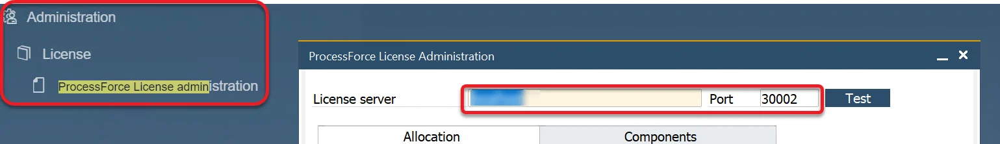

# Configuration

:::caution
    After upgrading from version 2.00 to version 3.00, please use the "Empty Cache and Hard Reload" option in the browser where you use AppEngine.
:::

    
Click here to find out more

        

        **Here is an example for Google Chrome or Microsoft Edge (Chromium)**
            1. Open Google Chrome or Microsoft Edge (Chromium) browser
            2. Click F12 to open Developers Tools (1.)
            3. Right-click on the refresh button (2.) and,
            4. Choose the Empty Cach and Hard Reload option (3.):

            
    

---

This section provides a description of the Administration features of AppEngine, along with instructions on how to configure the application to begin using it.

1. Run installation process described [here](../installation.md).

2. Entering the following web address in a browser `https://localhost:54001` - 54001 is a default port set for connection; it can be changed in the [Settings section]

3. After page is opened, click the Administration Panel button

    

4. If this is the first installation login using the default credentials:

    Administrator ID: CTSiteUser

    Password: 1234

    

You can change password for CTSiteUser in the System Details section.

## Initial Configuration

System Landscape Directory (SLD) is a service that SAP uses to maintain an inventory of all the companies and systems within the SAP landscape. The SLD helps in managing system configurations, ensuring that the SAP environment is optimized and up-to-date with the necessary settings for each entity. Here are the steps to configure connection to the SLD server and activate associated companies.

You can find the SLD Server Address in SAP Business One, License Administration.

    

        
Click here to find more

        

          
        

    

You can check the CompuTec License Server Address in SAP Business One with ProcessForce installed, ProcesForce License administration form.

    
Click here to find more

    

### Steps to Perform Initial Configuration

1. Begin by configuring connection to the SLD server by specifying the **SLD ServerAddress** and connection to **CompuTec License Server**.

    

2. After entering the details, Click **Save and Discover**

    

3. After connecting to the SLD server, you will be presented with a **list of companies** configured within the SAP landscape. You can run Dicover at any time to refresh the list of avaiable companies.

    

4. Each Company that is activated for use in AppEngine needs credentials to Database Server. You can specify credentials for each company separately or provide default Database User in Server Details section.

    

5. In Companies section you can see statuses of companies used within AppEngine. To activate Company simply click on Active Switch as shown below. This process will guide you through the activation process asking for all required information's.

    

6. Choose a user for the installation process. If a suitable user does not already exist, specify a new SAP B1 user account. **This process do not create user in SAP. It is just creating user in the AppEngine**. This user needs to have the necessary permissions in SAP Business One to handle installation and configuration tasks. This user will be also used as default for future installations and background processing tasks.

    

7. Log in using **SLD Server user** to activate the company within the SAP system. This step ensures that the selected company is properly activated and integrated with the SLD server. This process also includes installation of the necessary SAP extensions like CompuTec Start. In Case of Cloud Control Center manual installation of CompuTec Start is required.

    

    This will show the **Activation Progress**.

    

8. Assign a **default user** to the company, which will be used for background processing tasks.

    

    If a suitable user does not already exist, create a **new user** account.

9. Set up and configure **background processing** within the SAP environment. AppEngine allows to create plugins with jobs that reacts on various event from SAP Business One. To be able to achieve this procedure needs to be added into SBO_SP_POSTTRANSACTIONNOTICE. This procedure is responsible for storing events that will be consumed by AppEngine to trigger jobs.

    

    Perform the procedure described in the message:

    

    
Click here to find out more

    

    <u>For HANA</u>
    - Go to HANA Studio.
    - Choose the required database.
    - Find the SBO_SP_POSTTRANSACTIONNOTICE procedure (right-click on the Procedures under the database, choose- Filters... and put SBO_SP_POSTTRANSACTIONNOTICE there).
    - Right-click on the found procedure and choose Open Definition.
    - In the right window go to the Create Statement tab.
    - Copy to clipboard the whole content of the tab.
    - Click the 'Open SQL console for selected system' icon in the left window.
    - Paste the content from the clipboard.
    - Change CREATE to ALTER and add the code under the – ADD YOUR CODE HERE line (if there are other pieces of- code there, please put this piece at the end of the section).
    - Click the Execute icon in the right window (or click F8).
    - Click OK in the message window.
    

    

10. Finally, assign an AppEngine instance to the configured environment. This step integrates the application engine with the SAP landscape, enabling the necessary application services and functionalities.

Once the configuration is completed, you can log in to the [Launchpad](../.././appengine-users-guide/launchpad.md)

### Advanced Configuration

Once the initial configuration is complete, the advanced configuration stage allows for deeper customization and fine-tuning of the system. The following system configurations can be edited:

1. **SAP Services** - The user has the option to edit the SLD ServerAddress.
2. **CompuTec Services** - The user has the option to CT License Server
3. **OpenId Settings** - The user can also edit the AppEngine External Address.
4. **OIDC** - The OpenID Connect (OIDC) integration ensures secure authentication.
5. **Eventbus** - Facilitates real-time communication between services.
6. **Jobs** - Manages scheduled tasks efficiently.
7. **Plugin Repository** -  Allows for easy installation and management of additional functionalities within the system

### AppEngine Servers

1. **ID** - A unique numeric identifier for each server instance.
2. **Instance Name** - The name assigned to the server instance (e.g., default).
3. **GUID** - A globally unique identifier for each server instance.
4. **Address** - Indicates the network address or hostname of the server.
5. **Status** - Displays the operational status of the server (e.g., active/inactive).
6. **Restart Required** - Indicates whether a server restart is necessary to apply any recent changes.
7. **Profile** - Provides access to server-specific configuration or settings through an editable profile link.
