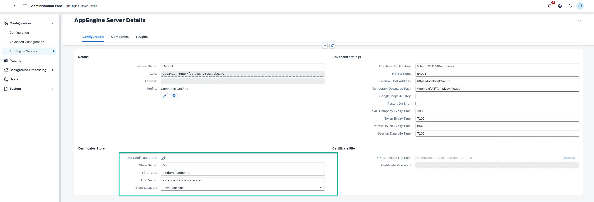

# HTTPS Configuration

This document provides detailed instructions on configuring CompuTec AppEngine for HTTPS communication and related settings. It includes guidance on using certificates, app configuration, and troubleshooting.

---

## Overview

To enable HTTPS for CompuTec AppEngine, you must:

1. Import a valid certificate into the Local Machine store.
2. Configure HTTPS settings through the Administration Panel or the `App.config.json` file.

## Configuring Certificates

### Importing Certificates

1. Import a valid certificate to the Local Machine store on the Windows server running CompuTec AppEngine.
   - Open the Local Machine certificate console using the command: `certlm.msc`.
2. Place the certificate in the **Personal → Certificates** store.


### Obtaining Certificate Thumbprint

1. Open the certificate and navigate to the **Details** tab.
2. Copy the Thumbprint property for use in the configuration.


## Configuration

### Configuring the Certificate in AppEngine

#### Using the Certificate Store

1. In the AppEngine Configuration for the selected AppEngine instance:
   - Enable the **Use Certificate Store** option.
   - Set the store name to `My` (Personal).
   - Paste the Thumbprint into the **Find Value** field.
   - Ensure the **Find Type** is set to `FindByThumbprint`.
2. Save the configuration and restart the AppEngine instance.



#### Using a Certificate File

1. Specify the `.pfx` certificate file in the **Certificate File** section of the configuration.
2. Provide an absolute or relative path to the certificate file from the AppEngine installation directory.
3. Save the configuration and restart the AppEngine instance.

## Configuring HTTPS in `App.config.json`

You can define SSL settings directly in the `App.config.json` file. Below is an example configuration:

```json
{
  "Hosting": {
    "OwnUrls": true,
    "Urls": ["54001"],
    "PfxCertFilePath": "CompuTec.AppEngine.DefaultCert.pfx",
    "CertPassword": "1q2w3e4r",
    "UseCertificateStore": false,
    "FindType": "FindByThumbprint",
    "FindValue": "",
    "StoreLocation": "LocalMachine",
    "StoreName": "My"
  }
}
```

### Key Properties

- **`OwnUrls`**: Indicates if this section overrides the AppEngine instance configuration. Setting this to `true` applies these settings during Kestrel initialization.
- **`Urls`**: Specifies the ports that AppEngine will listen on.
- **`PfxCertFilePath`**: Path to the `.pfx` certificate file.
- **`CertPassword`**: Password for the `.pfx` certificate file.
- **`UseCertificateStore`**: Boolean indicating whether to use the certificate store.
- **`FindType`**: Defines the type of search for the certificate. Supported values include:
  - `FindByThumbprint`: Search by the certificate's thumbprint.
  - `FindBySubjectName`: Search by the certificate's subject name.
  - `FindBySerialNumber`: Search by the certificate's serial number.
- **`FindValue`**: Specifies the search value (e.g., Thumbprint).
- **`StoreLocation`**: Location of the certificate store (e.g., `LocalMachine`).
- **`StoreName`**: Name of the certificate store. Supported values include:
  - `My`: The Personal store.
  - `Root`: The Trusted Root Certification Authorities store.
  - `CA`: The Intermediate Certification Authorities store.
  - `AuthRoot`: The Third-Party Root Certification Authorities store.

### Rescue Configuration

If the configuration does not work and AppEngine becomes unreachable, add the following minimal `Hosting` configuration to your `App.config.json` file:

```json
{
  "Hosting": {
    "OwnUrls": true,
    "Urls": ["54001"],
    "PfxCertFilePath": "CompuTec.AppEngine.DefaultCert.pfx",
    "CertPassword": "1q2w3e4r",
    "UseCertificateStore": false
  }
}
```

## CORS Settings

---
To specify Cross-Origin Resource Sharing (CORS) policies, use the `AllowedOrigins` element in the `App.config.json` file or the assigned profile configuration. Below is an example:

```json
{
  "AllowedOrigins": ["www.yoursite.com", "www.anothersite.com"],
  ...rest of the configuration
}
```
### Key Points

- **`AllowedOrigins`**: A list of domains allowed for CORS requests.
- Ensure this setting aligns with your web application’s requirements to prevent unauthorized cross-origin requests.

By following these steps and configurations, you can ensure secure HTTPS communication and proper CORS handling for your CompuTec AppEngine setup.
## Regenerate Default Certificate 
You can generate a new self-signed certificate when the certificate is corrupted or expired.
1. Remove/rename `C:\Program Files\CompuTec\AppEngine\CompuTec.AppEngine.DefaultCert.pfx` file
2. Run the script below
```powershell
# Define the parameters for the certificate and export
$dnsName    = "CompuTec.AppEngine.DefaultCertificate"                     # Replace with your desired DNS name
$outputPath = "C:\Program Files\CompuTec\AppEngine\CompuTec.AppEngine.DefaultCert.pfx"  # Replace with your desired file path and name
$password   = "1q2w3e4r"             

if (Test-Path $outputPath) {
    Write-Output "Certificate file already exists at $outputPath. No new certificate generated."
    return
}else{
Write-Output "Certificate Creating $outputPath"
# Convert the plain text password to a secure string
$securePassword = ConvertTo-SecureString -String $password -Force -AsPlainText

# Create the self-signed certificate in the CurrentUser's Personal store
$cert = New-SelfSignedCertificate -DnsName $dnsName -CertStoreLocation "cert:\CurrentUser\My"

# Export the certificate with the private key to a .pfx file
Export-PfxCertificate -Cert $cert -FilePath $outputPath -Password $securePassword

Write-Output "Certificate created and exported successfully to $outputPath"
}
```

