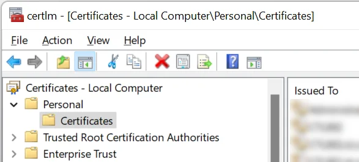
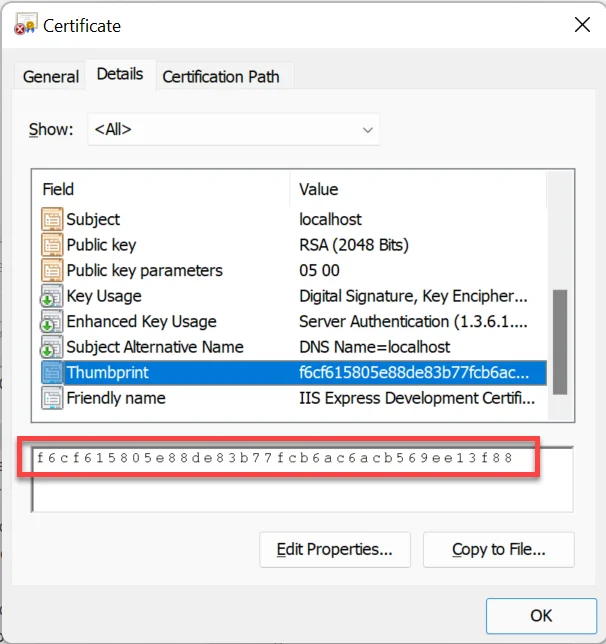

# HTTPS Configuration

Here, you can find information on configuring CompuTec AppEngine for HTTPS communication.

---

## Overview

To configure HTTPS, it's needed to import a valid certificate to the Local Machine store on the server where CompuTec AppEngine service runs and configure its properties in the Administration Panel.

## Certificate

Import a certificate used in the HTTPS communication to the Local Machine store on the Windows machine where the CompuTec AppEngine service will run. Start the Local Machine certificate console with the command: **certlm.msc**.

The certificate must be placed in the Personal → Certificates store:

After importing, copy its Thumbprint property from the certificate Details tab, as it must be entered into the configuration file:

## Configuration

CompuTec AppEngine port and certificate thumbprint can be defined in the CompuTec AppEngine Administration Panel → Settings → General → Hosting → HttpsPorts:

In the configuration, set the port and enter your copied thumbprint into the CertThumbprint field.

After making this change, restart the CompuTec AppEngine service.

## How to check if the configuration works

You can open this URL in a web browser and see if the login screen is displayed:

`https://<your_server>:<your_port_from_the_configuration>`
